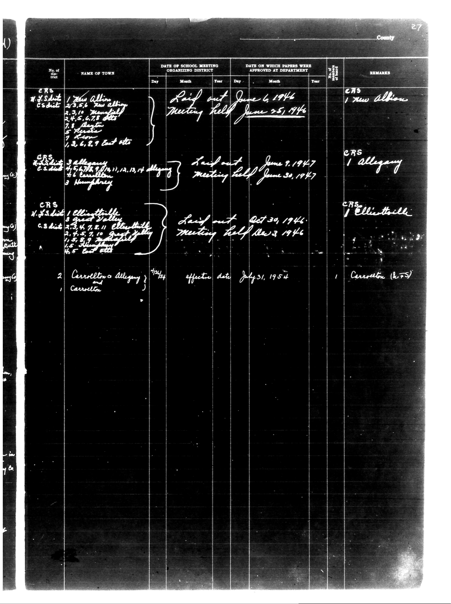

# | No. of District | NAME OF TOWN | DATE OF SCHOOL MEETING ORGANIZING DISTRICT | 

**Document Type:** Document

**Collection:** CS Archive

**Source:** District-Consolidation-Data_100-116_page_10.jpg

**Model:** qwen/qwen-vl-plus

**Confidence:** 1.0

**Processed:** 2025-12-19T01:29:56.598152

**Source Image:** [📄 District-Consolidation-Data_100-116_page_10.jpg](../tables/images/District-Consolidation-Data_100-116_page_10.jpg)

---

## Source Document



---

## Transcription

```
| No. of District | NAME OF TOWN | DATE OF SCHOOL MEETING ORGANIZING DISTRICT | DATE ON WHICH PAPERS WERE APPROVED AT DEPARTMENT | REMARKS |
|-----------------|--------------|--------------------------------------------|--------------------------------------------------|---------|
|                 |              | Day | Month | Year | Day | Month | Year |        |
| CRS H.S. District | 1. New Albany | Laid out June 6, 1946 | Meeting held June 25, 1946 | CRS 1 New Albany |
|                 |              | 2.3,5,6 New Albany |  |  |  |  |  |  |
|                 |              | 3,3,10 Montpelier |  |  |  |  |  |  |
|                 |              | 4,4,5,6,7,8 etc. |  |  |  |  |  |  |
|                 |              | 7.1.1.1.1.1.1.1.1 |  |  |  |  |  |  |
|                 |              | 1,2,6,8,9 East etc. |  |  |  |  |  |  |
| CRS B.S. District | 3 Allegany | Laid out June 9, 1947 | Meeting held June 30, 1947 | CRS 1 Allegany |
|                 |              | 4,5,6,7,8,9,11,12,13,14 Allegany |  |  |  |  |  |  |
|                 |              | 3.1.1.1.1.1.1.1.1.1.1.1.1.1.1.1.1.1.1.1.1.1.1.1.1.1.1.1.1.1.1.1.1.1.1.1.1.1.1.1.1.1.1.1.1.1.1.1.1.1.1.1.1.1.1.1.1.1.1.1.1.1.1.1.1.1.1.1.1.1.1.1.1.1.1.1.1.1.1.1.1.1.1.1.1.1.1.1.1.1.1.1.1.1.1.1.1.1.1.1.1.1.1.1.1.1.1.1.1.1.1.1.1.1.1.1.1.1.1.1.1.1.1.1.1.1.1.1.1.1.1.1.1.1.1.1.1.1.1.1.1.1.1.1.1.1.1.1.1.1.1.1.1.1.1.1.1.1.1.1.1.1.1.1.1.1.1.1.1.1.1.1.1.1.1.1.1.1.1.1.1.1.1.1.1.1.1.1.1.1.1.1.1.1.1.1.1.1.1.1.1.1.1.1.1.1.1.1.1.1.1.1.1.1.1.1.1.1.1.1.1.1.1.1.1.1.1.1.1.1.1.1.1.1.1.1.1.1.1.1.1.1.1.1.1.1.1.1.1.1.1.1.1.1.1.1.1.1.1.1.1.1.1.1.1.1.1.1.1.1.1.1.1.1.1.1.1.1.1.1.1.1.1.1.1.1.1.1.1.1.1.1.1.1.1.1.1.1.1.1.1.1.1.1.1.1.1.1.1.1.1.1.1.1.1.1.1.1.1.1.1.1.1.1.1.1.1.1.1.1.1.1.1.1.1.1.1.1.1.1.1.1.1.1.1.1.1.1.1.1.1.1.1.1.1.1.1.1.1.1.1.1.1.1.1.1.1.1.1.1.1.1.1.1.1.1.1.1.1.1.1.1.1.1.1.1.1.1.1.1.1.1.1.1.1.1.1.1.1.1.1.1.1.1.1.1.1.1.1.1.1.1.1.1.1.1.1.1.1.1.1.1.1.1.1.1.1.1.1.1.1.1.1.1.1.1.1.1.1.1.1.1.1.1.1.1.1.1.1.1.1.1.1.1.1.1.1.1.1.1.1.1.1.1.1.1.1.1.1.1.1.1.1.1.1.1.1.1.1.1.1.1.1.1.1.1.1.1.1.1.1.1.1.1.1.1.1.1.1.1.1.1.1.1.1.1.1.1.1.1.1.1.1.1.1.1.1.1.1.1.1.1.1.1.1.1.1.1.1.1.1.1.1.1.1.1.1.1.1.1.1.1.1.1.1.1.1.1.1.1.1.1.1.1.1.1.1.1.1.1.1.1.1.1.1.
