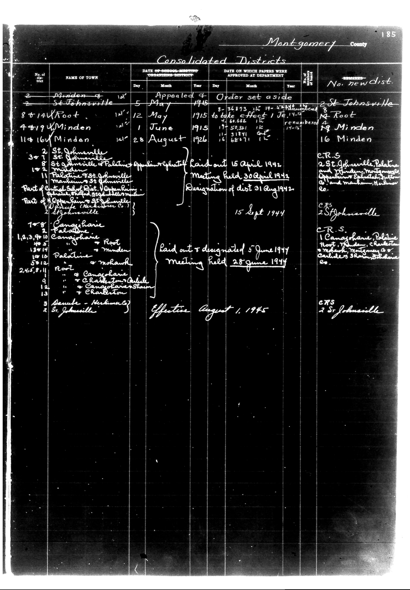

# Montgomery County

**Document Type:** Document

**Collection:** CS Archive

**Source:** District-Consolidation-Data_100-116_page_100.jpg

**Model:** qwen/qwen-vl-plus

**Confidence:** 1.0

**Processed:** 2025-12-19T01:49:51.385379

**Source Image:** [📄 District-Consolidation-Data_100-116_page_100.jpg](../tables/images/District-Consolidation-Data_100-116_page_100.jpg)

---

## Source Document

---

## Transcription

Montgomery County
185

Consolidated Districts

| No. of district | NAME OF TOWN | DATE OF SCHOOL-MEETING ORGANIZING DISTRICT | DATE ON WHICH PAPERS WERE APPROVED AT DEPARTMENT | REMARKS | No. new dist. |
|------------------|--------------|---------------------------------------------|--------------------------------------------------|---------|---------------|
|                  |              | Day Month Year                              | Day Month Year                                   |         |               |
| 2                | Minden       | 10 May 1915                                 | 8-36893 19-51000                                 | 2 St. Johnsville |               |
| 2                | St. Johnsville | 5 May 1915                                 | 14-60662 19-51000                                | 14 Root |               |
| 8+14             | Root         | 12 May 1915                                 | to take effect 1 June 1915                        | 19 Minden |               |
| 4+19             | Minden       | 1 June 1915                                 | 17-50321 19-51000                                | 16 Minden |               |
| 11+16            | Minden       | 28 August 1926                              | 16-68971 19-51000                                | [blank] |               |
| 2                | St. Johnsville | 10 April 1942                               | Laid out 15 April 1942                           | C.R.S. 2 St. Johnsville, Palatine and Minden, Montgomery County |               |
| 3                | St. Johnsville | 10 April 1942                               | Meeting held 30 April 1942                       | C.R.S. 2 St. Johnsville |               |
| 11               | Palatine     | 10 April 1942                               | Resignation of district 31 August 1942           | C.R.S. 1 Canaigharrie, Palatine, Root, Minden, Charlestown, Montgomery County and machine, Herkimer County |               |
| 10               | Machine      | 10 April 1942                               | 15 Sept 1944                                     | [blank] |               |
| 2                | St. Johnsville | 10 April 1942                               | Laid out & designated 5 June 1944                | [blank] |               |
| 7+8              | Canaigharrie | 10 April 1942                               | Meeting held 25 June 1944                        | [blank] |               |
| 1,2,3,4,5,7,9,10 | Canaigharrie | 10 April 1942                               | Effective August 1, 1945                         | C.R.S. 2 St. Johnsville |               |
| 40               | Root         | 10 April 1942                               | [blank]                                          | [blank] |               |
| 10               | Root         | 10 April 1942                               | [blank]                                          | [blank] |               |
| 10               | Root         | 10 April 1942                               | [blank]                                          | [blank] |               |
| 50               | 12           | 10 April 1942                               | [blank]                                          | [blank] |               |
| 2,4,5,8,11       | [blank]      | 10 April 1942                               | [blank]                                          | [blank] |               |
| 9                | [blank]      | 10 April 1942                               | [blank]                                          | [blank] |               |
| 12               | [blank]      | 10 April 1942                               | [blank]                                          | [blank] |               |
| 3                | Samude - Nerhimare | 10 April 1942                           | [blank]                                          | [blank] |               |
| 2                | St. Johnsville | 10 April 1942                               | [blank]                                          | [blank] |               |
