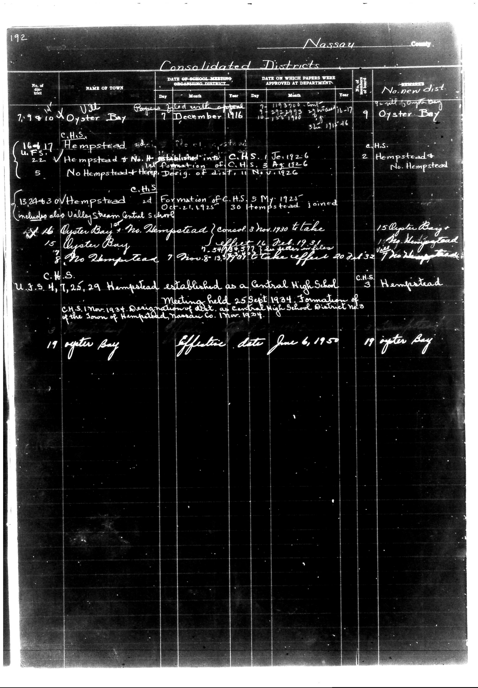

# District Consolidation Data 100 116 page 101

**Document Type:** Document

**Collection:** CS Archive

**Source:** District-Consolidation-Data_100-116_page_101.jpg

**Model:** qwen/qwen-vl-plus

**Confidence:** 1.0

**Processed:** 2025-12-19T01:50:01.714039

**Source Image:** [📄 District-Consolidation-Data_100-116_page_101.jpg](../tables/images/District-Consolidation-Data_100-116_page_101.jpg)

---

## Source Document



---

## Transcription

```
192
Nassau
County

Consolidated Districts

| No. of district | NAME OF TOWN | DATE OF SCHOOL MEETING ORGANIZING DISTRICT | DATE ON WHICH PAPERS WERE APPROVED AT DEPARTMENT | No. new dist | REMARKS |
|------------------|--------------|---------------------------------------------|--------------------------------------------------|--------------|---------|
|                  |              | Day    Month Year                            | Day    Month Year                                |              |         |
| 7,9 & 10         | Oyster Bay   | 7      December 1916                           | 7-119300 10-153 1940 3-1115-1946                 | 9            | Oyster Bay |
| 16-17            |              |                                             |                                                  |              | C.H.S. |
| 22               | Hempstead    |                                             |                                                  |              | 2 Hempstead+No. Hempstead |
|                  |              |                                             |                                                  |              |           |
| 5                |              |                                             |                                                  |              | No Hempstead+Hemp. Design. of dist. 11 Nov. 1926 |
| 13,24 & 30       | Hempstead    |                                             |                                                  |              |           |
|                  |              | 2nd Formation of C.H.S. 5 May 1925           | Oct. 21, 1925 30 Hempstead joined               |              | 15 Oyster Bay+The Hempstead |
|                  |              |                                             |                                                  |              | Include also Valley Steam Central School |
| 16               | Oyster Bay   |                                             |                                                  |              |           |
|                  |              |                                             | 3 Nov. 1930 to take effect 16 Feb. 1931         |              |           |
| 15               | Oyster Bay   |                                             |                                                  |              |           |
| 7                |              |                                             | 7-548577 12 Nov. 1931                           |              |           |
| 8                |              |                                             | 1 Nov. 8-13, 1931 to take effect 20-21-32       |              | The Hempstead |
|                  |              |                                             |                                                  |              |           |
| U.S.S. 4, 7, 25, 29 | Hempstead | Established as a Central High School        | Meeting held 25 Sept. 1934                      |              | C.H.S. 3 Hempstead |
|                  |              |                                             | C.H.S. 1 Mar. 1934 Designation of dist. as Central High School District No. 3 of the Town of Hempstead, Nassau Co. Mar. 1934. |              |           |
| 19               | Oyster Bay   | Effective date June 6, 1950                 |                                                  |              | 19 Oyster Bay |
```

### Notes:
- The table is transcribed with column headers and filled-in data as per the handwritten entries.
- Blank fields are indicated as `[blank]` where no information is present.
- Pre-printed text is preserved where visible.
- Handwritten entries are transcribed as they appear, maintaining alignment and structure.
- The document appears to be a historical record of school district consolidations in Nassau County.
