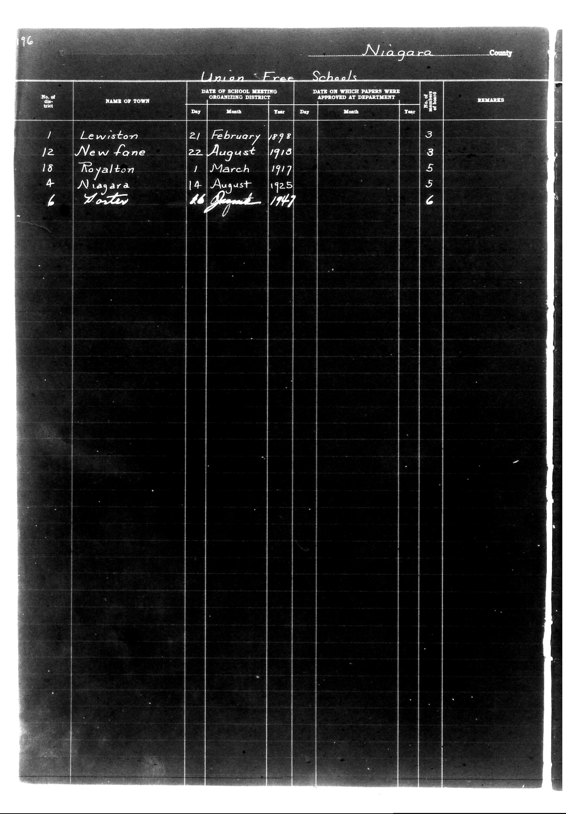

# District Consolidation Data 100 116 page 105

**Document Type:** Document

**Collection:** CS Archive

**Source:** District-Consolidation-Data_100-116_page_105.jpg

**Model:** qwen/qwen-vl-plus

**Confidence:** 1.0

**Processed:** 2025-12-19T01:51:14.246112

**Source Image:** [📄 District-Consolidation-Data_100-116_page_105.jpg](../tables/images/District-Consolidation-Data_100-116_page_105.jpg)

---

## Source Document



---

## Transcription

```
196

Niagara County

Union Free Schools

| No. of district | NAME OF TOWN | DATE OF SCHOOL MEETING ORGANIZING DISTRICT |  |  | DATE ON WHICH PAPERS WERE APPROVED AT DEPARTMENT |  |  | No. of board of trustees | REMARKS |
|-----------------|--------------|--------------------------------------------|----|----|---------------------------------------------------|----|----|--------------------------|---------|
|                 |              | Day                                        | Month | Year | Day                                               | Month | Year |                          |         |
| 1               | Lewiston     | 21                                         | February | 1898 | [blank]                                           | [blank] | [blank] | 3                        |         |
| 12              | Newfane      | 22                                         | August | 1913 | [blank]                                           | [blank] | [blank] | 3                        |         |
| 18              | Royalton     | 1                                          | March | 1917 | [blank]                                           | [blank] | [blank] | 5                        |         |
| 4               | Niagara      | 14                                         | August | 1925 | [blank]                                           | [blank] | [blank] | 5                        |         |
| 6               | Fort Erie    | 26                                         | August | 1947 | [blank]                                           | [blank] | [blank] | 6                        |         |
```

### Notes:
- The table is structured with columns for district number, town name, date of school meeting, date of approval, number of trustees, and remarks.
- Pre-printed text includes headers like "Niagara County," "Union Free Schools," and column labels.
- Handwritten entries are present for the town names, dates of school meetings, and the number of trustees.
- Blank fields are indicated where no information is provided.
- The layout is preserved with vertical lines separating columns and horizontal lines separating rows.
