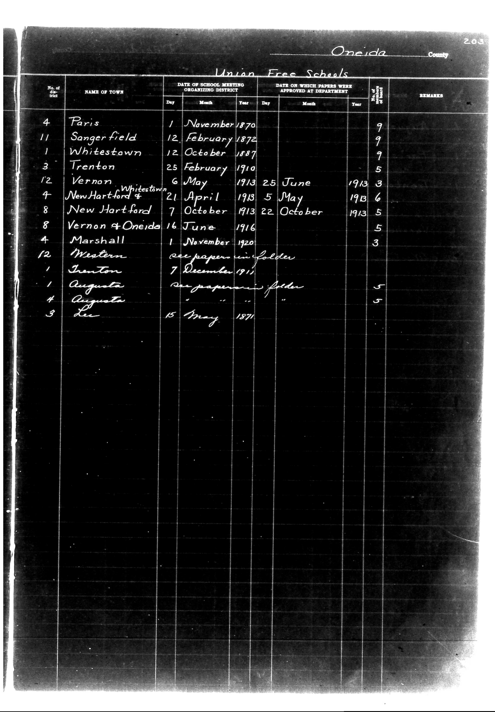

# Oneida County

**Document Type:** Document

**Collection:** CS Archive

**Source:** District-Consolidation-Data_100-116_page_107.jpg

**Model:** qwen/qwen-vl-plus

**Confidence:** 1.0

**Processed:** 2025-12-19T01:51:42.009948

**Source Image:** [📄 District-Consolidation-Data_100-116_page_107.jpg](../tables/images/District-Consolidation-Data_100-116_page_107.jpg)

---

## Source Document

---

## Transcription

Oneida County

Union Free Schools

| No. of District | NAME OF TOWN         | DATE OF SCHOOL MEETING ORGANIZING DISTRICT | DATE ON WHICH PAPERS WERE APPROVED AT DEPARTMENT | No. of 6 months of school | REMARKS |
|-----------------|----------------------|--------------------------------------------|--------------------------------------------------|---------------------------|---------|
|                 |                      | Day   Month   Year                         | Day   Month   Year                               |                           |         |
| 4               | Paris                | 1     November 1870                        |                                                  | 9                         |         |
| 11              | Sangerfield          | 12    February 1872                        |                                                  | 9                         |         |
| 1               | Whitestown           | 12    October 1887                         |                                                  | 9                         |         |
| 3               | Trenton              | 25    February 1910                        |                                                  | 5                         |         |
| 12              | Vernon Whitestown    | 6     May 1913                             | 25    June 1913                                  | 3                         |         |
| 4               | New Hartford         | 21    April 1913                             | 5     May 1913                                   | 6                         |         |
| 8               | New Hartford         | 7     October 1913                           | 22    October 1913                               | 5                         |         |
| 8               | Vernon & Oneida      | 16    June 1916                              |                                                  | 5                         |         |
| 4               | Marshall             | 1     November 1920                          |                                                  | 3                         |         |
| 12              | Western              | see papers in folder                       |                                                  |                           |         |
| 1               | Trenton              | 7     December 1911                          |                                                  |                           |         |
| 1               | Augusta              | see papers in folder                       |                                                  | 5                         |         |
| 4               | Augusta              |                                            |                                                  | 5                         |         |
| 3               | Lee                  | 15    May 1871                               |                                                  |                           |         |
