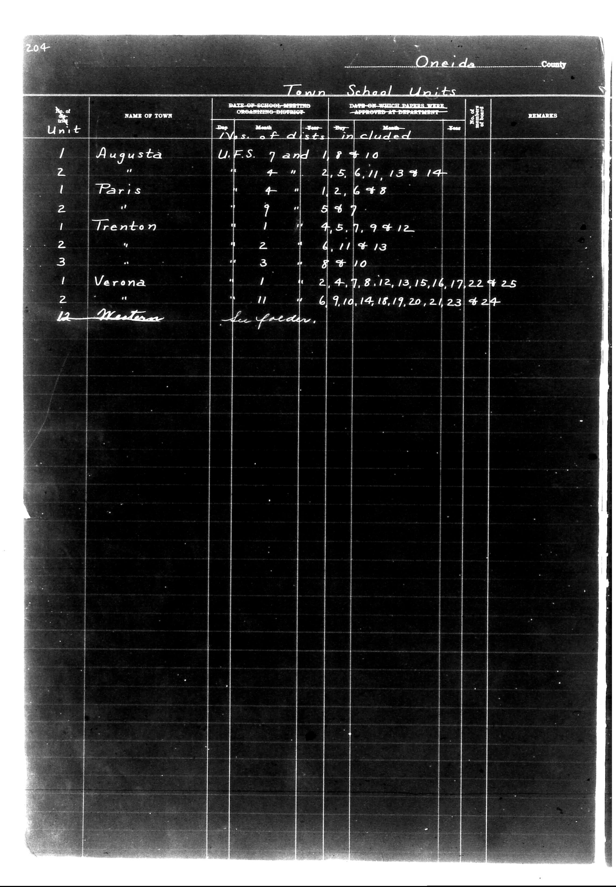

# District Consolidation Data 100 116 page 108

**Document Type:** Document

**Collection:** CS Archive

**Source:** District-Consolidation-Data_100-116_page_108.jpg

**Model:** qwen/qwen-vl-plus

**Confidence:** 1.0

**Processed:** 2025-12-19T01:51:51.239176

**Source Image:** [📄 District-Consolidation-Data_100-116_page_108.jpg](../tables/images/District-Consolidation-Data_100-116_page_108.jpg)

---

## Source Document

---

## Transcription

204
Oneida County

Town School Units

| Unit | NAME OF TOWN | DATE OF SCHOOL-MEETING ORGANIZING-DISTRICT | DATE-ON WHICH PAPERS WERE APPROVED AT DEPARTMENT | REMARKS |
|------|--------------|---------------------------------------------|--------------------------------------------------|---------|
|      |              | Day Month Year                              | Day Month Year                                   |         |
| 1    | Augusta      | U.F.S. 7 and 18410                          |                                                |         |
| 2    | "            | 4 2,5,6,11,13 & 14                          |                                                |         |
| 1    | Paris        | 4 1,2,6 & 8                                 |                                                |         |
| 2    | "            | 9 5 & 7                                     |                                                |         |
| 1    | Trenton      | 1 4,5,7,9 & 12                              |                                                |         |
| 2    | "            | 2 6,11 & 13                                 |                                                |         |
| 3    | "            | 3 8 & 10                                    |                                                |         |
| 1    | Verona       | 1 2,4,7,8,12,13,15,16,17,22 & 25            |                                                |         |
| 2    | "            | 11 6,9,10,14,18,19,20,21,23 & 24            |                                                |         |
| 12   | Western      |                                             | See Folder.                                      |         |
