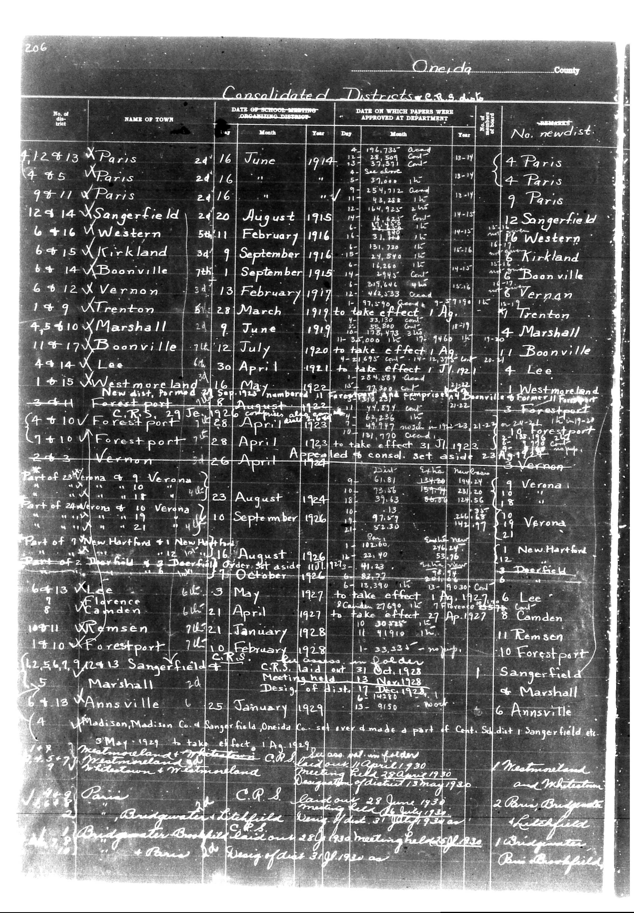

# Below is the transcription of the tabular data from the provided document, maint

**Document Type:** Document

**Collection:** CS Archive

**Source:** District-Consolidation-Data_100-116_page_109.jpg

**Model:** qwen/qwen-vl-plus

**Confidence:** 1.0

**Processed:** 2025-12-19T01:52:12.229214

**Source Image:** [📄 District-Consolidation-Data_100-116_page_109.jpg](../tables/images/District-Consolidation-Data_100-116_page_109.jpg)

---

## Source Document

---

## Transcription

Below is the transcription of the tabular data from the provided document, maintaining the structure and formatting as requested:

---

**Oneida County**

**Consolidated Districts**

| No. of District | NAME OF TOWN | DATE OF SCHOOL-MONTH ORGANIZING MEETING | DATE ON WHICH PAPERS WERE APPROVED AT DEPARTMENT | REMARKS | No. new dist. |
|-----------------|--------------|----------------------------------------|--------------------------------------------------|---------|---------------|
| 4,128,13        | X Paris      | 24 June 1914                           | 28, 509, 37, 900, 13-14                           | 4 Paris |               |
| 4,85            | X Paris      | 24 June 1914                           | 5, 39, 712, 13-14                                 | 4 Paris |               |
| 9,11            | X Paris      | 24 June 1914                           | 13, 28, 14, 925, 13-14                            | 9 Paris |               |
| 12,14           | X Sangerfield| 20 August 1915                         | 254, 712, 13-14                                   | 12 Sangerfield |               |
| 6,16            | X Western    | 5 November 1915                        | 31, 133, 13-14                                    | 16 Western |               |
| 6,15            | X Kirkland   | 34 September 1916                      | 13, 51, 720, 13-14                                | 6 Kirkland |               |
| 6,14            | X Boonville  | 7 September 1915                       | 16, 260, 37, 900, 13-14                           | 6 Boonville |               |
| 6,12            | X Vernon     | 13 February 1917                       | to take effect 13 Ag. 1919                        | 6 Vernon |               |
| 17,9            | X Trenton    | 28 March 1919                          | 138, 473, 13-14                                   | 10 Trenton |               |
| 4,5,6,10        | X Marshall   | 9 June 1919                            | 4-25, 55, 960, 13-14                              | 4 Marshall |               |
| 11,17           | X Boonville  | 12 July 1920                           | to take effect 13 J. 1921                         | 11 Boonville |               |
| 4,9,14          | X Lee        | 30 April 1921                          | 264, 580, 13-14                                   | 4 Lee |               |
| 1,15            | X Westmoreland | 16 May 1922                          | 3, 473, 13-14                                     | 1 Westmoreland |               |
| 3,4,11          | Forestport   | 28 September 1923                      | 63, 263, 13-14                                    | 3 Forestport |               |
| (4,10)          | Forestport   | 28 April 1923                          | 197, 777, 13-14                                   | 10 Forestport |               |
| 24,3            | Vernon       | 26 April 1924                          | 61, 8, 13-14                                      | 3 Vernon |               |
| Part of Verona & 9 | Verona     | 23 August 1924                         | 61, 8, 13-14                                      | 9 Verona |               |
| 23,8,10         | Verona       | 16 September 1926                      | 97, 13, 13-14                                     | 10 Verona |               |
| Part of 7 New Hartford & 1 | New Hartford | 16 August 1926 | 100, 260, 13-14 | 1 New Hartford |               |
| 2,3,4,5,6       | Deerfield    | 17 October 1926                        | 13, 33, 13-14                                     | 6 Deerfield |               |
| 64,13           | X Lee        | 3 May 1927                             | 29, 690, 13-14                                    | 6 Lee |               |
| 6,11            | Florence     | 21 April 1927                          | 10, 30, 13-14                                     | 8 Camden |               |
| 10,11           | Remsen       | 21 January 1928                        | 9, 49, 13-14                                      | 11 Remsen |               |
| 14,10           | Forestport   | 2 February 1928                        | 33, 33, 13-14                                     | 10 Forestport |               |
| (12,54,1)       | Sangerfield  | 13 October 1928                        | CRIS laid out 28 Oct. 1928                        | 1 Sangerfield |               |
| 6,4,13          | Marshall     | 20 January 1929                        | Design of dist. 17 Dec. 1928                      | 1 Marshall |               |
| 6,4,13          | Annsville    | 25 January 1929                        | 6, 915, 13-14                                     | 6 Annsville |               |
| (4)             | Madison      | 1 May 1929                             | to take effect 13 Ag. 1929                        | 1 Mettensland |               |
| 6,4,13          | Madison      | 1 May 1929                             | to take
