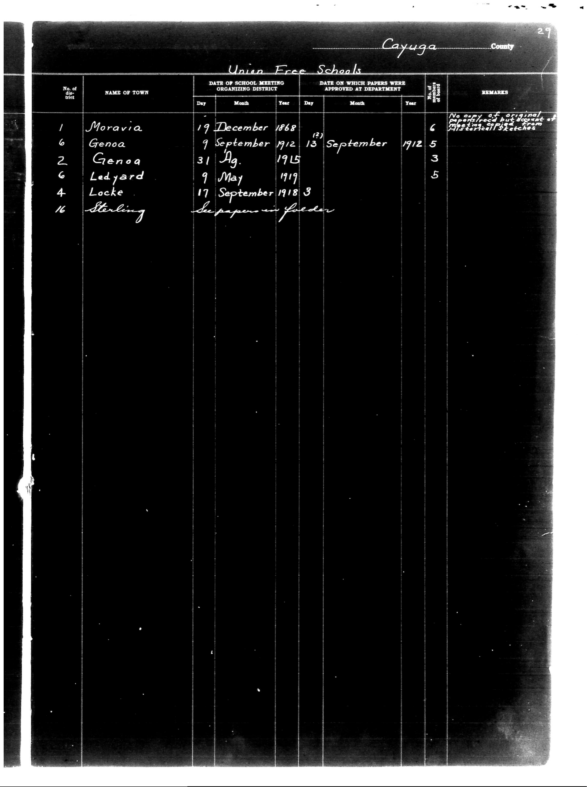

# Cayuga County

**Document Type:** Document

**Collection:** CS Archive

**Source:** District-Consolidation-Data_100-116_page_11.jpg

**Model:** qwen/qwen-vl-plus

**Confidence:** 1.0

**Processed:** 2025-12-19T01:30:05.079458

**Source Image:** [📄 District-Consolidation-Data_100-116_page_11.jpg](../tables/images/District-Consolidation-Data_100-116_page_11.jpg)

---

## Source Document



---

## Transcription

```
Cayuga County
Union Free Schools

| No. of District | NAME OF TOWN | DATE OF SCHOOL MEETING ORGANIZING DISTRICT |  |  | DATE ON WHICH PAPERS WERE APPROVED AT DEPARTMENT |  |  | No. of Members in District | REMARKS |
|-----------------|--------------|---------------------------------------------|----|----|---------------------------------------------------|----|----|---------------------------|------------------------------------------------------------------------------------------------------------------|
|                 |              | Day                                         | Month | Year | Day                                               | Month | Year |                           |                                                                                                                  |
| 1               | Moravia      | 19                                          | December | 1868 | (12)                                              |       |      | 6                         | No copy of original papers filed but account of meeting entered from Historical Sketches                      |
| 6               | Genoa        | 9                                           | September | 1912 | 13                                                | September | 1912 | 5                         |                                                                                                                  |
| 2               | Genoa        | 31                                          | Ag. | 1915 |                                                   |       |      | 3                         |                                                                                                                  |
| 6               | Ledyard      | 9                                           | May | 1919 |                                                   |       |      | 5                         |                                                                                                                  |
| 4               | Locke        | 17                                          | September | 1918 | 3                                                 |       |      |                           |                                                                                                                  |
| 16              | Sterling     |                                             |       |      |                                                   |       |      |                           | The papers on fileder                                                                                           |
```

### Notes:
- The table is structured with columns for district number, town name, dates of school meetings, approval dates, number of members, and remarks.
- Handwritten entries are preserved as they appear in the document.
- Blank fields are indicated where no data is present.
- Pre-printed text is maintained alongside handwritten entries.
- The layout is preserved using markdown formatting with appropriate alignment.
