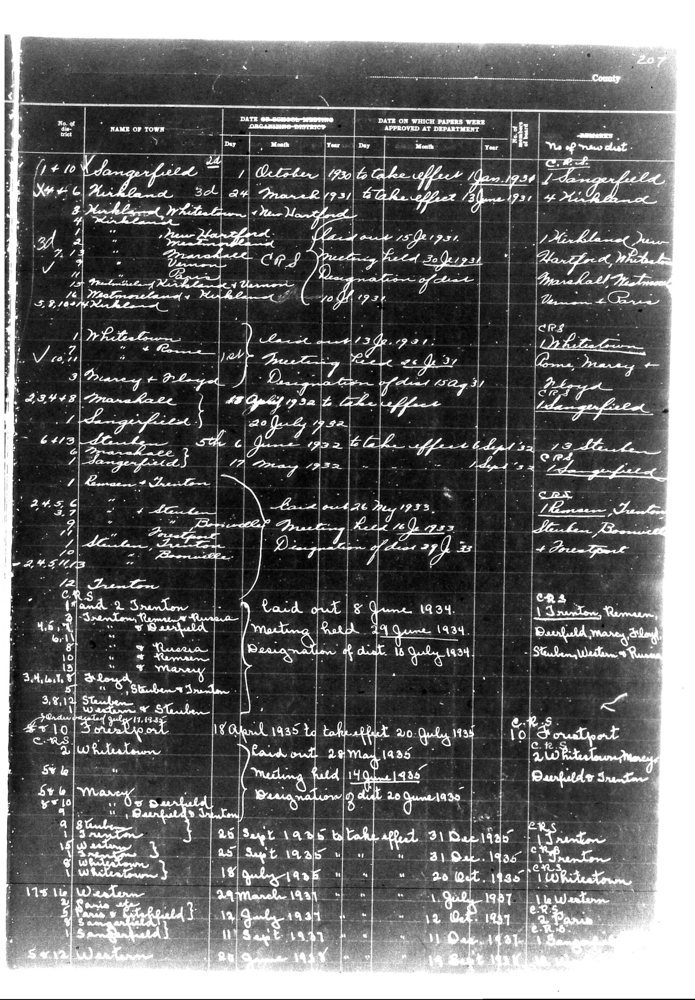

# Below is the transcription of the tabular data from the document, preserving the

**Document Type:** Document

**Collection:** CS Archive

**Source:** District-Consolidation-Data_100-116_page_110.jpg

**Model:** qwen/qwen-vl-plus

**Confidence:** 1.0

**Processed:** 2025-12-19T01:52:32.095558

**Source Image:** [📄 District-Consolidation-Data_100-116_page_110.jpg](../tables/images/District-Consolidation-Data_100-116_page_110.jpg)

---

## Source Document



---

## Transcription

Below is the transcription of the tabular data from the document, preserving the structure and formatting as requested:

```
| No. of | NAME OF TOWN | DATE OF SCHOOL-MASTERS | DATE ON WHICH PAPERS WERE | AMOUNT | No. of new |
|--------|--------------|------------------------|----------------------------|--------|------------|
|        |              | ARRANGING DISTRICT     | APPROVED AT DEPARTMENT     |        | dist.      |
|        |              | Day Month Year         | Day Month Year             |        |            |
| 1410   | Sangerfield  | 24 October 1930        | 1 January 1931             |        | 1 Sangerfield |
| X4+1   | Kirkland     | 3d 24 March 1931       | take effect 13 June 1931   |        | 4 Kirkland    |
| 3      | Kirkland     |                        |                            |        |               |
|        | Whitestown   |                        |                            |        |               |
|        | New Hartford | 15 September 1931      |                            |        | 1 Kirkland, New |
|        |              |                        |                            |        | Hartford, White |
|        |              |                        |                            |        | Marshall, Vernon |
|        |              |                        |                            |        | & Burrane     |
| 37     |              |                        |                            |        |               |
|        |              |                        |                            |        |               |
| 5,8,100|              |                        |                            |        |               |
|        |              |                        |                            |        |               |
| 1      | Whitestown   |                        |                            |        | Whitestown    |
|        |              |                        |                            |        | Rome, Marcy + |
|        |              |                        |                            |        | Plgyd         |
| 23448  | Marshall     |                        |                            |        |               |
| 1      | Sangerfield  |                        |                            |        | Sangerfield   |
| 6413   | Sterling     | 5 June 1932            | take effect 6 June 1932    |        | 13 Sterling   |
|        | Sangerfield  | 11 May 1932            |                            |        |               |
| 1      | Rome & Janton|                        |                            |        | Sangerfield   |
| 245    |              |                        |                            |        |               |
| 24.5   |              |                        |                            |        |               |
| 12     | Trenton      |                        |                            |        |               |
|        |              |                        |                            |        |               |
| 3.4.10.18|            |                        |                            |        |               |
| 3.8.12  |              |                        |                            |        |               |
| $10    |              |                        |                            |        |               |
| 546    |              |                        |                            |        |               |
| 8      |              |                        |                            |        |               |
| 17516  |              |                        |                            |        |               |
| 5      |              |                        |                            |        |               |
| 5      |              |                        |                            |        |               |
| 5      |              |                        |                            |        |               |
| 5      |              |                        |                            |        |               |
| 5      |              |                        |                            |        |               |
| 5      |              |                        |                            |        |               |
| 5      |              |                        |                            |        |               |
| 5      |              |                        |                            |        |               |
| 5      |              |                        |                            |        |               |
| 5      |              |                        |                            |        |               |
| 5      |              |                        |                            |        |               |
| 5      |              |                        |                            |        |               |
| 5      |              |                        |                            |        |               |
| 5      |              |                        |                            |        |               |
| 5      |              |                        |                            |        |               |
| 5      |              |                        |                            |        |               |
| 5      |              |                        |                            |        |               |
| 5      |              |                        |                            |        |               |
| 5      |              |                        |                            |        |               |
| 5      |              |                        |                            |        |               |
| 5      |              |                        |                            |        |               |
| 5      |              |                        |                            |        |               |
| 5      |              |                        |                            |        |               |
| 5      |              |                        |                            |        |               |
| 5      |              |                        |                            |        |               |
| 5      |              |                        |                            |        |               |
| 5      |              |                        |                            |        |               |
| 5      |              |                        |                            |        |               |
| 5      |              |                        |                            |        |               |
| 5      |              |                        |                            |        |               |
| 5      |              |                        |                            |        |               |
| 5      |              |                        |                            |        |               |
| 5      |              |                        |                            |        |               |
| 5      |              |                        |                            |        |               |
| 5      |              |                        |                            |        |               |
| 5      |              |                        |                            |        |               |
| 5      |              |                        |                            |        |               |
| 5      |              |                        |                            |        |               |
| 5      |              |                        |                            |        |               |
| 5      |              |                        |                            |        |               |
| 5      |              |                        |                            |        |               |
| 5      |              |                        |                            |        |               |
| 5      |              |                        |                            |        |               |
| 5      |              |                        |                            |        |               |
| 5      |              |                        |                            |        |               |
| 5      |              |                        |                            |        |               |
| 5      |              |                        |                            |        |               |
| 5      |              |                        |                            |        |               |
| 5      |              |                        |                            |        |               |
| 5      |              |                        |                            |        |               |
| 5      |              |                        |                            |        |               |
| 5      |
