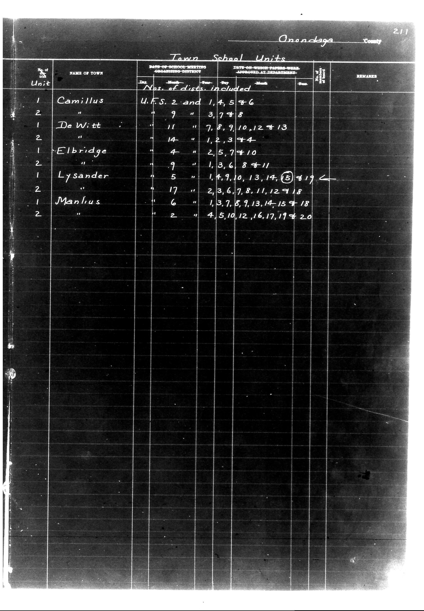

# Onondaga County

**Document Type:** Document

**Collection:** CS Archive

**Source:** District-Consolidation-Data_100-116_page_113.jpg

**Model:** qwen/qwen-vl-plus

**Confidence:** 1.0

**Processed:** 2025-12-19T01:53:12.127011

**Source Image:** [📄 District-Consolidation-Data_100-116_page_113.jpg](../tables/images/District-Consolidation-Data_100-116_page_113.jpg)

---

## Source Document

---

## Transcription

Onondaga County
211

Town School Units

| Unit | NAME OF TOWN | DATE OF SCHOOL MEETING ORGANIZING DISTRICT | Nos. of dists. included | DATE ON WHICH PAPERS WERE APPROVED AT DEPARTMENT | REMARKS |
|------|--------------|--------------------------------------------|--------------------------|---------------------------------------------------|---------|
| 1    | Camillus     | U.F.S. 2 and 1, 4, 5 + 6                   |                          |                                                   |         |
| 2    |              | 9                                          | 3, 7 + 8                 |                                                   |         |
| 1    | DeWitt       | 11                                         | 7, 8, 9, 10, 12 + 13    |                                                   |         |
| 2    |              | 14                                         | 1, 2, 3 + 4              |                                                   |         |
| 1    | Elbridge     | 4                                          | 2, 5, 7 + 10             |                                                   |         |
| 2    |              | 9                                          | 1, 3, 6, 8 + 11          |                                                   |         |
| 1    | Lysander     | 5                                          | 1, 4, 9, 10, 13, 14, 15 + 19 |                                                   |         |
| 2    |              | 17                                         | 2, 3, 6, 7, 8, 11, 12 + 18 |                                                   |         |
| 1    | Manlius      | 6                                          | 1, 3, 7, 8, 9, 13, 14, 15 + 18 |                                                   |         |
| 2    |              | 2                                          | 4, 5, 10, 12, 16, 17, 19 + 20 |                                                   |         |
