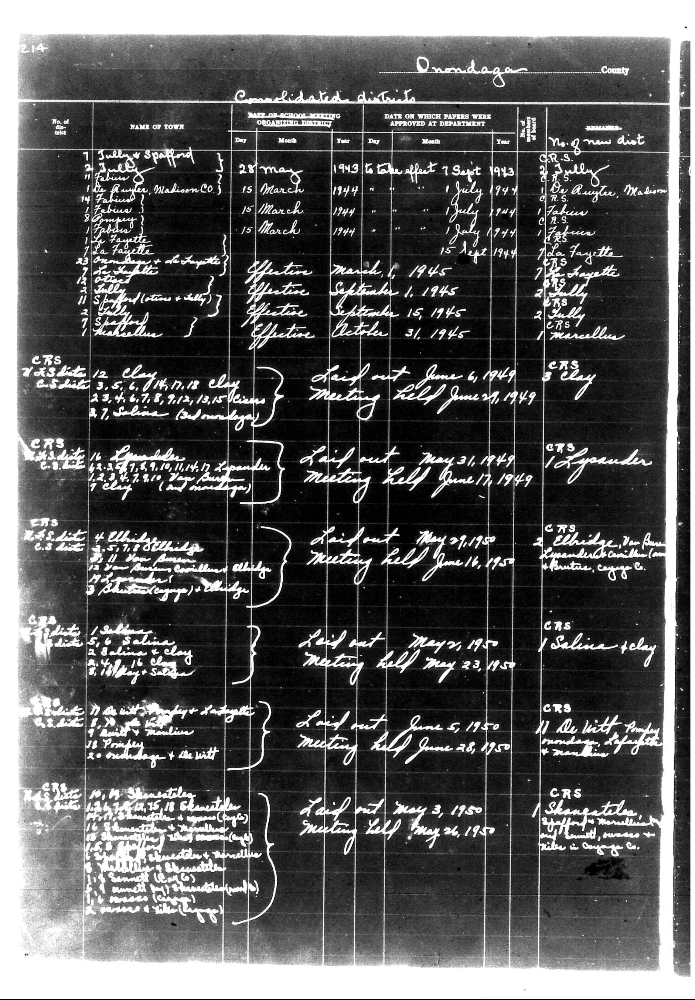

# Below is the transcription of the tabular data from the provided document, maint

**Document Type:** Document

**Collection:** CS Archive

**Source:** District-Consolidation-Data_100-116_page_115.jpg

**Model:** qwen/qwen-vl-plus

**Confidence:** 1.0

**Processed:** 2025-12-19T01:53:55.730158

**Source Image:** [📄 District-Consolidation-Data_100-116_page_115.jpg](../tables/images/District-Consolidation-Data_100-116_page_115.jpg)

---

## Source Document



---

## Transcription

Below is the transcription of the tabular data from the provided document, maintaining the structure and formatting as requested:

```
214

Onondaga County

Candidate Districts

| No. of District | NAME OF TOWN | DATE OF SCHOOL MEETING ORGANIZING DISTRICT | DATE ON WHICH PAPERS WERE APPROVED AT DEPARTMENT | REMARKS |
|------------------|--------------|---------------------------------------------|--------------------------------------------------|---------|
|                  |              | Day    | Month | Year | Day    | Month | Year | No. new dist |          |
| 1                | Tully        | 28     | May   | 1943 | 7      | Sept  | 1943 | CRS        | Sully    |
| 2                | Spafford     |        |       |      |        |       |      |            |          |
| 3                | Be Ruyser    | 15     | March | 1944 | 1      | July  | 1944 | CRS        | Be Ruyser, Madison Co. |
| 4                | Fabian       |        |       |      |        |       |      |            |          |
| 5                | Fabian       |        |       |      |        |       |      |            |          |
| 6                | Fabian       |        |       |      |        |       |      |            |          |
| 7                | La Fayette   |        |       |      |        |       |      |            |          |
| 8                | La Fayette   |        |       |      |        |       |      |            |          |
| 9                | La Fayette   |        |       |      |        |       |      |            |          |
| 10               | La Fayette   |        |       |      |        |       |      |            |          |
| 11               | La Fayette   |        |       |      |        |       |      |            |          |
| 12               | La Fayette   |        |       |      |        |       |      |            |          |
| 13               | La Fayette   |        |       |      |        |       |      |            |          |
| 14               | La Fayette   |        |       |      |        |       |      |            |          |
| 15               | La Fayette   |        |       |      |        |       |      |            |          |
| 16               | La Fayette   |        |       |      |        |       |      |            |          |
| 17               | La Fayette   |        |       |      |        |       |      |            |          |
| 18               | La Fayette   |        |       |      |        |       |      |            |          |
| 19               | La Fayette   |        |       |      |        |       |      |            |          |
| 20               | La Fayette   |        |       |      |        |       |      |            |          |
| 21               | La Fayette   |        |       |      |        |       |      |            |          |
| 22               | La Fayette   |        |       |      |        |       |      |            |          |
| 23               | La Fayette   |        |       |      |        |       |      |            |          |
| 24               | La Fayette   |        |       |      |        |       |      |            |          |
| 25               | La Fayette   |        |       |      |        |       |      |            |          |
| 26               | La Fayette   |        |       |      |        |       |      |            |          |
| 27               | La Fayette   |        |       |      |        |       |      |            |          |
| 28               | La Fayette   |        |       |      |        |       |      |            |          |
| 29               | La Fayette   |        |       |      |        |       |      |            |          |
| 30               | La Fayette   |        |       |      |        |       |      |            |          |
| 31               | La Fayette   |        |       |      |        |       |      |            |          |
| 32               | La Fayette   |        |       |      |        |       |      |            |          |
| 33               | La Fayette   |        |       |      |        |       |      |            |          |
| 34               | La Fayette   |        |       |      |        |       |      |            |          |
| 35               | La Fayette   |        |       |      |        |       |      |            |          |
| 36               | La Fayette   |        |       |      |        |       |      |            |          |
| 37               | La Fayette   |        |       |      |        |       |      |            |          |
| 38               | La Fayette   |        |       |      |        |       |      |            |          |
| 39               | La Fayette   |        |       |      |        |       |      |            |          |
| 40               | La Fayette   |        |       |      |        |       |      |            |          |
| 41               | La Fayette   |        |       |      |        |       |      |            |          |
| 42               | La Fayette   |        |       |      |        |       |      |            |          |
| 43               | La Fayette   |        |       |      |        |       |      |            |          |
| 44               | La Fayette   |        |       |      |        |       |      |            |          |
| 45               | La Fayette   |        |       |      |        |       |      |            |          |
| 46               | La Fayette   |        |       |      |        |       |      |            |          |
| 47               | La Fayette   |        |       |      |        |       |      |            |          |
| 48               | La Fayette   |        |       |      |        |       |      |            |          |
| 49               | La Fayette   |        |       |      |        |       |      |            |          |
| 50               | La Fayette   |        |       |      |        |       |      |            |          |
| 51               | La Fayette   |        |       |      |        |       |      |            |          |
| 52               | La Fayette   |        |       |      |        |       |      |
