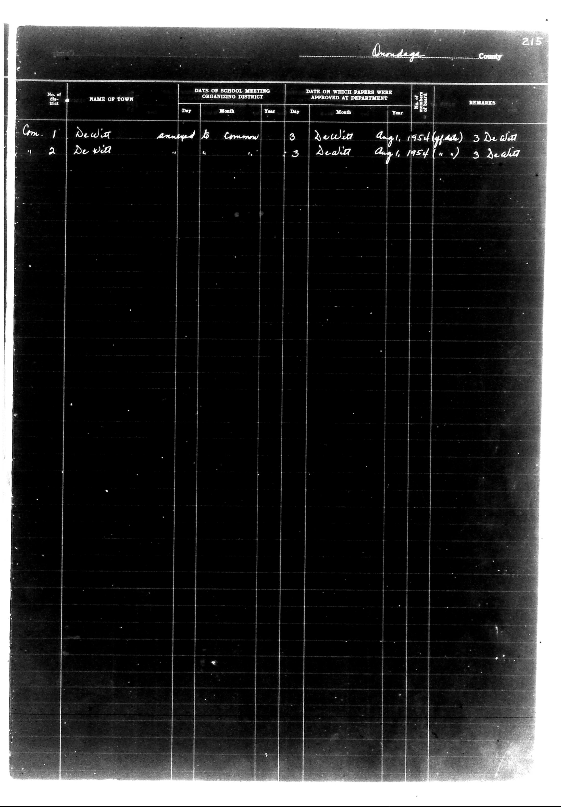

# Ouadaga County

**Document Type:** Document

**Collection:** CS Archive

**Source:** District-Consolidation-Data_100-116_page_116.jpg

**Model:** qwen/qwen-vl-plus

**Confidence:** 1.0

**Processed:** 2025-12-19T01:54:05.683999

**Source Image:** [📄 District-Consolidation-Data_100-116_page_116.jpg](../tables/images/District-Consolidation-Data_100-116_page_116.jpg)

---

## Source Document



---

## Transcription

```
Ouadaga County
215

| No. of district | NAME OF TOWN | DATE OF SCHOOL MEETING ORGANIZING DISTRICT |  |  | DATE ON WHICH PAPERS WERE APPROVED AT DEPARTMENT |  |  | REMARKS |
|------------------|--------------|--------------------------------------------|----|----|---------------------------------------------------|----|----|---------|
|                  |              | Day                                        | Month | Year | Day                                               | Month | Year |         |
| Com. 1           | Dewitt       | annned to Common                           | 3  |    | Dewitt                                            | Aug1 | 1954 (state) | 3 DeWitt |
| 2                | DeWitt       |                                            |    |    | 3                                               | DeCita | Aug1 1954 (a.) | 3 DeWitt |
```

**Notes:**

- The form is titled "Ouadaga County" with the number "215" in the top right corner.
- The table has six columns: "No. of district," "NAME OF TOWN," "DATE OF SCHOOL MEETING ORGANIZING DISTRICT" (with sub-columns for Day, Month, Year), "DATE ON WHICH PAPERS WERE APPROVED AT DEPARTMENT" (with sub-columns for Day, Month, Year), and "REMARKS."
- The "DATE OF SCHOOL MEETING ORGANIZING DISTRICT" for "Com. 1" is filled in as "annned to Common" with a Day of "3" and no Month or Year provided.
- The "DATE ON WHICH PAPERS WERE APPROVED AT DEPARTMENT" for "Com. 1" is filled in as "Dewitt" with a Day of "3," Month of "Aug1," and Year of "1954 (state)."
- The "REMARKS" for "Com. 1" is "3 DeWitt."
- The "DATE OF SCHOOL MEETING ORGANIZING DISTRICT" for "2" is blank for Day, Month, and Year.
- The "DATE ON WHICH PAPERS WERE APPROVED AT DEPARTMENT" for "2" is filled in as "3" with a Month of "DeCita" and Year of "Aug1 1954 (a.)."
- The "REMARKS" for "2" is "3 DeWitt."
- The rest of the table is blank.
