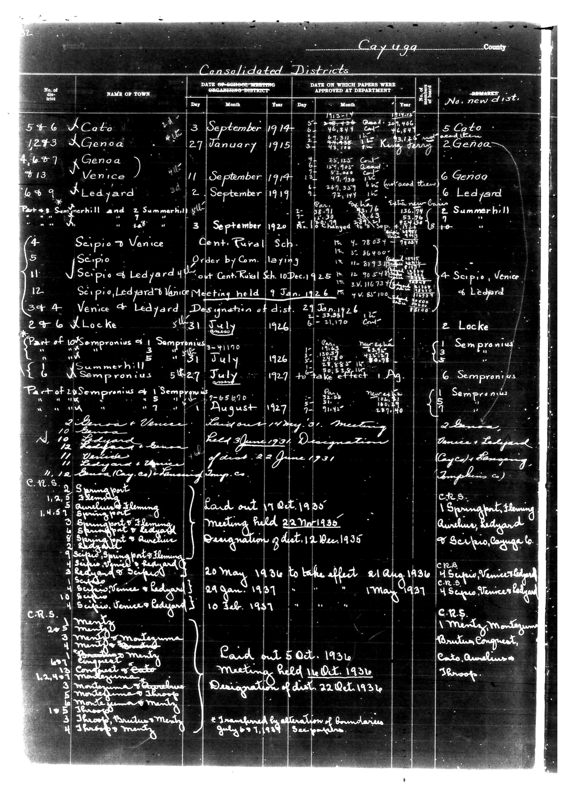

# Below is the transcription of the tabular data from the document, preserving the

**Document Type:** Document

**Collection:** CS Archive

**Source:** District-Consolidation-Data_100-116_page_13.jpg

**Model:** qwen/qwen-vl-plus

**Confidence:** 1.0

**Processed:** 2025-12-19T01:30:29.227519

**Source Image:** [📄 District-Consolidation-Data_100-116_page_13.jpg](../tables/images/District-Consolidation-Data_100-116_page_13.jpg)

---

## Source Document

---

## Transcription

Below is the transcription of the tabular data from the document, preserving the structure and formatting as requested:

---

**Cayuga County**  
**Consolidated Districts**

| No. of the list | NAME OF TOWN | DATE OF SCHOOL MEETING ORGANIZING DISTRICT | DATE ON WHICH PAPERS WERE APPROVED AT DEPARTMENT | REMARKS | No. new dist. |
|-----------------|--------------|---------------------------------------------|--------------------------------------------------|---------|---------------|
| 5+6             | Scato        | 3 September 1914                            | 15 September 1914                                | Scato   | 5 Scato       |
| 12+3            | Genoa        | 27 January 1915                              | 25 January 1915                                  | Genoa   | 2 Genoa       |
| 4,6+7           | Venice       | 11 September 1914                            | 25 September 1914                                | Venice  | 6 Venice      |
| 8+13            | Ledyard      | 2 September 1919                             | 25 September 1919                                | Ledyard | 6 Ledyard     |
|                 |              |                                              |                                                  |         | 2 Summerhill  |
| (4)             | Scipio       | 3 September 1920                             | 25 September 1920                                | Scipio  | 4 Scipio      |
| 11              | Scipio       | 4 September 1920                             | 25 September 1920                                | Scipio  | 4 Scipio      |
| 12              | Scipio, Ledyard | 10 December 1925                            | 25 December 1925                                 | Scipio, Ledyard | 4 Scipio, Venice & Ledyard |
| 34+4            | Venice & Ledyard | 9 January 1926                            | 29 January 1926                                  | Designation of dist. | 2 Locke |
| 24+6            | Locke        | 31 July 1926                                 | 6 August 1926                                    | Locke   | 2 Locke       |
| *Part of 10 Sempronius & 1 Sempronius |  |  |  |  |  |
| (n)             | Sempronius   | 31 July 1926                                 | 25 July 1926                                     | Sempronius | 6 Sempronius |
| 6               | Sempronius   | 27 July 1927                                 | 21 July 1927                                     | Sempronius | 6 Sempronius |
| Part of 20 Sempronius & 1 Sempronius |  |  |  |  |  |
| 2               | Sempronius   | 31 July 1927                                 | 25 July 1927                                     | Sempronius | 1 Sempronius |
| 9               | Sempronius   | 31 July 1927                                 | 25 July 1927                                     | Sempronius | 1 Sempronius |
| 10              | Sempronius   | 31 July 1927                                 | 25 July 1927                                     | Sempronius | 1 Sempronius |
| 11              | Sempronius   | 31 July 1927                                 | 25 July 1927                                     | Sempronius | 1 Sempronius |
| 12              | Sempronius   | 31 July 1927                                 | 25 July 1927                                     | Sempronius | 1 Sempronius |
| C.R.S.          | Springport   | 11 August 1927                               | 25 August 1927                                   | Springport | 1 Springport |
| 1.4.5           | Aulene & Fleming | 11 August 1927                            | 25 August 1927                                   | Aulene, Ledyard | 1 Aulene, Ledyard |
| 1.4.5           | Aulene & Ledyard | 11 August 1927                            | 25 August 1927                                   | Aulene, Ledyard | 1 Aulene, Ledyard |
| 1.4.5           | Aulene & Scipio | 11 August 1927                             | 25 August 1927                                   | Aulene, Scipio, Cayuga | 1 Aulene, Scipio, Cayuga |
| 1.4.5           | Aulene & Scipio | 11 August 1927                             | 25 August 1927                                   | Aulene, Scipio, Cayuga | 1 Aulene, Scipio, Cayuga |
| 1.4.5           | Aulene & Scipio | 11 August 1927                             | 25 August 1927                                   | Aulene, Scipio, Cayuga | 1 Aulene, Scipio, Cayuga |
| 1.4.5           | Aulene & Scipio | 11 August 1927                             | 25 August 1927                                   | Aulene, Scipio, Cayuga | 1 Aulene, Scipio, Cayuga |
| C.R.S.          | Mentz        | 11 August 1927                               | 25 August 1927                                   | Mentz   | 1 Mentz       |
| 24+3            | Montezuma    | 11 August 1927                               | 25 August 1927                                   | Montezuma | 1 Montezuma   |
| 10              | Montezuma    | 11 August 1927                               | 25 August 1927                                   | Montezuma | 1 Montezuma   |
| 67              | Montezuma    | 11 August 1927                               | 25 August 1927                                   | Montezuma | 1 Montezuma   |
| 12+4+10         | Montezuma    | 11 August 1927                               | 25 August 1927                                   | Montezuma | 1 Montezuma
