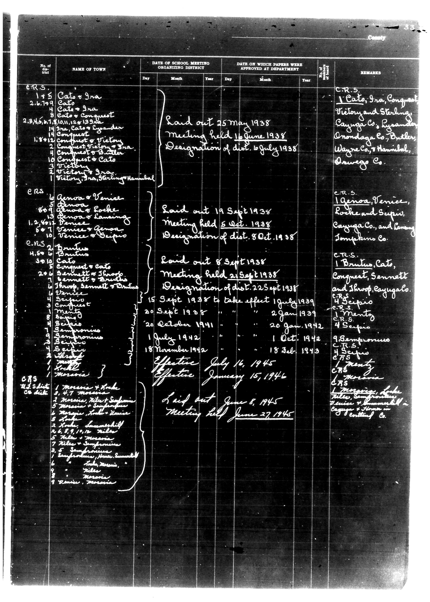

# Below is the transcription of the tabular data from the provided document, maint

**Document Type:** Document

**Collection:** CS Archive

**Source:** District-Consolidation-Data_100-116_page_14.jpg

**Model:** qwen/qwen-vl-plus

**Confidence:** 1.0

**Processed:** 2025-12-19T01:30:48.364816

**Source Image:** [📄 District-Consolidation-Data_100-116_page_14.jpg](../tables/images/District-Consolidation-Data_100-116_page_14.jpg)

---

## Source Document



---

## Transcription

Below is the transcription of the tabular data from the provided document, maintaining the structure and formatting as requested:

```
| No. of | NAME OF TOWN | DATE OF SCHOOL MEETING ORGANIZING DISTRICT | DATE ON WHICH PAPERS WERE APPROVED AT DEPARTMENT | REMARKS |
|--------|--------------|---------------------------------------------|--------------------------------------------------|---------|
|        |              | Day    | Month | Year | Day    | Month | Year |         |
| E.R.S. | 1 + 5        | Laid out 25 May 1938                        |                                                  | C.R.S. 1 Cato, Ira, Conquest, Victory and Sterling, Cayuga Co., Lynder, Onondaga Co., Butler, Wayne Co., Hamble, Oswego Co. |
|        | 2.6.799      | Meeting held 16 June 1938                    |                                                  |         |
|        | 4            | Designation of dist. 16 July 1938            |                                                  |         |
|        |              |                                             |                                                  |         |
|        | Cato + Conquest | 2.3.16/1938 (10,11,12,13,14,15)             |                                                  |         |
|        |              |                                             |                                                  |         |
|        | Cato + Ira   | 1.9.12                                      |                                                  |         |
|        |              |                                             |                                                  |         |
|        | Cato + Gander | 1.9.12                                      |                                                  |         |
|        |              |                                             |                                                  |         |
|        | Conquest + Ira | 1.9.12                                      |                                                  |         |
|        |              |                                             |                                                  |         |
|        | Conquest + Victory | 1.9.12                                  |                                                  |         |
|        |              |                                             |                                                  |         |
|        | Conquest + Butler | 1.9.12                                  |                                                  |         |
|        |              |                                             |                                                  |         |
|        | Conquest + Victory | 1.9.12                                  |                                                  |         |
|        |              |                                             |                                                  |         |
|        | Victory, Ira, Sterling, Hamble | 1.9.12                      |                                                  |         |
|        |              |                                             |                                                  |         |
| E.R.S. | Genova + Venice | Laid out 19 Sept 1938                      |                                                  | C.R.S. 1 Genova, Venice, Roche and Seipus, Cayuga Co., and Living Tompkins Co. |
|        | 6            | Meeting held 5 Oct. 1938                    |                                                  |         |
|        | 13           | Designation of dist. 8 Oct. 1938             |                                                  |         |
|        |              |                                             |                                                  |         |
|        | Genova + Locke | 1.9.12                                      |                                                  |         |
|        |              |                                             |                                                  |         |
|        | Genova + Lansing | 1.9.12                                    |                                                  |         |
|        |              |                                             |                                                  |         |
|        | Venice + Seipus | 1.9.12                                    |                                                  |         |
|        |              |                                             |                                                  |         |
|        | Venice + Genora | 1.9.12                                    |                                                  |         |
|        |              |                                             |                                                  |         |
| E.R.S. | 2            | Laid out 8 Sept 1938                        |                                                  | C.R.S. 1 Brusito, Cat, Conquest, Sennett and Shropio Cayuga Co. |
|        | H.5.5        | Meeting held 21 Sept 1938                   |                                                  |         |
|        | 30.19        | Designation of dist. 22 Sept 1938            |                                                  |         |
|        |              |                                             |                                                  |         |
|        | Cato + Conquest | 1.9.12                                      |                                                  |         |
|        |              |                                             |                                                  |         |
|        | Cato + Ira   | 1.9.12                                      |                                                  |         |
|        |              |                                             |                                                  |         |
|        | Cato + Gander | 1.9.12                                      |                                                  |         |
|        |              |                                             |                                                  |         |
|        | Cato + Ira   | 1.9.12                                      |                                                  |         |
|        |              |                                             |                                                  |         |
|        | Cato + Gander | 1.9.12                                      |                                                  |         |
|        |              |                                             |                                                  |         |
|        | Cato + Ira   | 1.9.12                                      |                                                  |         |
|        |              |                                             |                                                  |         |
|        | Cato + Gander | 1.9.12                                      |                                                  |         |
|        |              |                                             |                                                  |         |
|        | Cato + Ira   | 1.9.12                                      |                                                  |         |
|        |              |                                             |                                                  |         |
|        | Cato + Gander | 1.9.12                                      |                                                  |         |
|        |              |                                             |                                                  |         |
|        | Cato + Ira   | 1.9.12                                      |                                                  |         |
|        |              |                                             |                                                  |         |
|        | Cato + Gander | 1.9.12                                      |                                                  |         |
|        |              |                                             |                                                  |         |
|        | Cato + Ira   | 1.9.12                                      |                                                  |         |
|        |              |                                             |                                                  |         |
|        | Cato + Gander | 1.9.12                                      |                                                  |         |
|        |              |                                             |                                                  |         |
|        | Cato + Ira   | 1.9.12                                      |                                                  |         |
|        |              |                                             |                                                  |         |
|        | Cato + Gander | 1.9.12                                      |                                                  |         |
|        |              |                                             |                                                  |         |
|        | Cato + Ira   | 1.9.12                                      |                                                  |         |
|        |              |                                             |                                                  |         |
|        | Cato + Gander | 1.9.12                                      |                                                  |         |
|        |              |                                             |                                                  |         |
|        | Cato + Ira   | 1.9.12                                      |                                                  |         |
|        |              |                                             |
