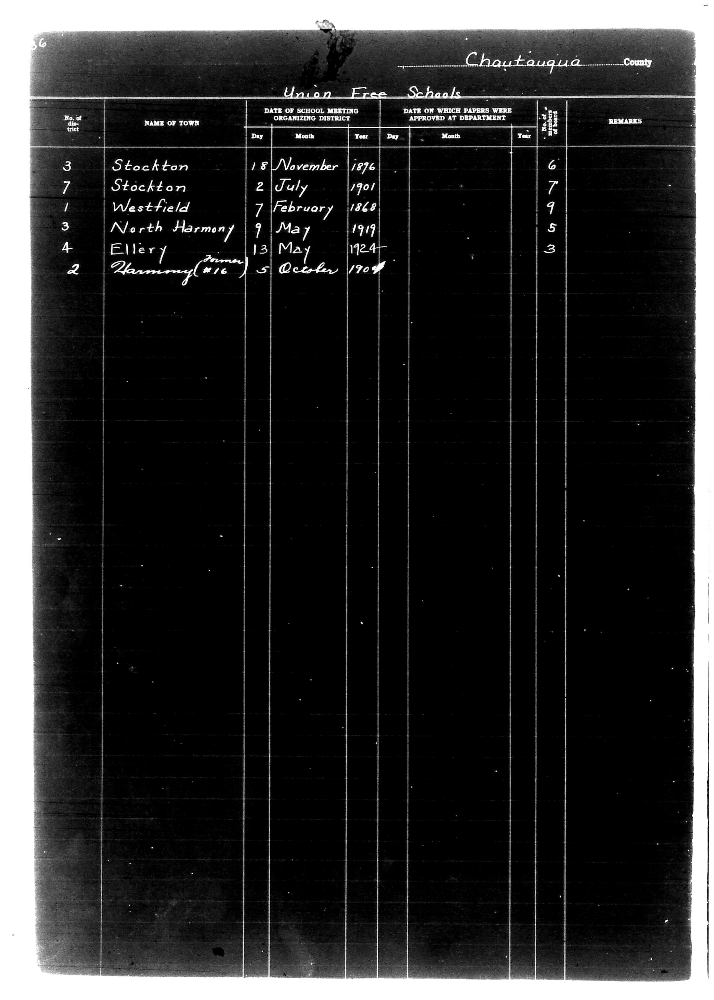

# Chautauqua County

**Document Type:** Document

**Collection:** CS Archive

**Source:** District-Consolidation-Data_100-116_page_15.jpg

**Model:** qwen/qwen-vl-plus

**Confidence:** 1.0

**Processed:** 2025-12-19T01:30:54.658585

**Source Image:** [📄 District-Consolidation-Data_100-116_page_15.jpg](../tables/images/District-Consolidation-Data_100-116_page_15.jpg)

---

## Source Document



---

## Transcription

```
Chautauqua County

Union Free Schools

| No. of District | NAME OF TOWN     | DATE OF SCHOOL MEETING ORGANIZING DISTRICT | DATE ON WHICH PAPERS WERE APPROVED AT DEPARTMENT | No. of Pupils | REMARKS |
|-----------------|------------------|--------------------------------------------|--------------------------------------------------|---------------|---------|
|                 |                  | Day   Month   Year                         | Day   Month   Year                               |               |         |
| 3               | Stockton         | 18    November 1876                        |                                                  | 6             |         |
| 7               | Stockton         | 2     July    1901                         |                                                  | 7             |         |
| 1               | Westfield        | 7     February 1868                        |                                                  | 9             |         |
| 3               | North Harmony    | 9     May     1919                         |                                                  | 5             |         |
| 4               | Ellery           | 13    May     1924                         |                                                  | 3             |         |
| 2               | Harmony (#16)    | 5     October 1704*                        |                                                  |               |         |
```

**Notes:**
- The handwritten entry for "Harmony (#16)" and the date "5 October 1704*" appears to be an anomaly or error, as it predates the other entries by over a century and is likely a mislabeling or unrelated entry.
- The "No. of Pupils" column is filled only for the first five entries; the last entry has no number.
- The "REMARKS" column is blank for all entries.
