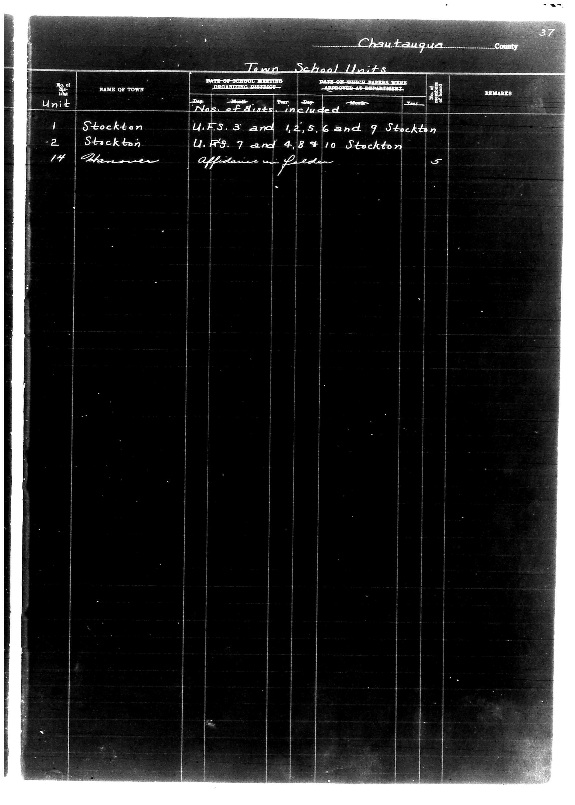

# Chautauqua County

**Document Type:** Document

**Collection:** CS Archive

**Source:** District-Consolidation-Data_100-116_page_16.jpg

**Model:** qwen/qwen-vl-plus

**Confidence:** 1.0

**Processed:** 2025-12-19T01:31:02.637282

**Source Image:** [📄 District-Consolidation-Data_100-116_page_16.jpg](../tables/images/District-Consolidation-Data_100-116_page_16.jpg)

---

## Source Document



---

## Transcription

```
Chautauqua County
Page 37

Town School Units

| No. of Unit | NAME OF TOWN | DATE OF SCHOOL MEETING ORGANIZING DISTRICT | DATE ON WHICH PAPERS WERE APPROVED AT DEPARTMENT | REMARKS |
|-------------|--------------|---------------------------------------------|--------------------------------------------------|---------|
|             |              | Day | Month | Year | Dep. | Month | Year |        |
| Unit        |              |     |       |      |      |       |      |        |
| 1           | Stockton     |     |       |      |      |       |      |        |
|             |              | U.F.S. 3 and 1,2,5,6 and 9 Stockton |                                    |        |
| 2           | Stockton     |     |       |      |      |       |      |        |
|             |              | U.F.S. 7 and 4,8,9,10 Stockton |                                    |        |
| 14          | Hannover     |     |       |      |      |       |      | 5      |
|             |              | Affidavit Fileder |                                    |        |
```

**Notes:**
- The table headers are preserved as per the original document.
- Handwritten entries are transcribed exactly as they appear.
- Blank fields are indicated with `[blank]` where no information is present.
- The layout maintains the alignment and structure of the original form.
