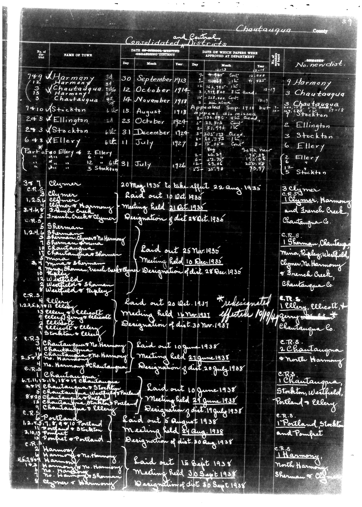

# Below is the transcription of the tabular data from the document, preserving the

**Document Type:** Document

**Collection:** CS Archive

**Source:** District-Consolidation-Data_100-116_page_17.jpg

**Model:** qwen/qwen-vl-plus

**Confidence:** 1.0

**Processed:** 2025-12-19T01:31:24.948280

**Source Image:** [📄 District-Consolidation-Data_100-116_page_17.jpg](../tables/images/District-Consolidation-Data_100-116_page_17.jpg)

---

## Source Document

---

## Transcription

Below is the transcription of the tabular data from the document, preserving the structure and formatting as requested:

---

**Chautauqua County**  
**and Central Consolidated Districts**

| No. of District | NAME OF TOWN | DATE OF SCHOOL MEETING (CONSOLIDATING DISTRICT) | DATE ON WHICH PAPERS WERE APPROVED AT DEPARTMENT | No. new dist. | DESCRIPTION |
|-----------------|--------------|--------------------------------------------------|--------------------------------------------------|---------------|-------------|
| 749             | Harmony      | 30 September 1913                                | 7 October 1913                                   | 9 Harmony     |             |
| (12)            |              |                                                  |                                                  | 3 Chautauqua  |             |
| (3)             |              |                                                  |                                                  | 3 Chautauqua  |             |
| (15)            |              |                                                  |                                                  | 3 Chautauqua  |             |
| 7410            | Stockton     | 15 August 1918                                   | 2 September 1918                                 | 7 Stockton    |             |
| 245             | Ellington    | 23 October 1924                                  | 8 December 1924                                  | 2 Ellington   |             |
| 243             | Stockton     | 31 December 1927                                 | 12 July 1927                                     | 3 Stockton    |             |
| 6+8             | Ellery       | 6 July 1926                                      | 5 July 1926                                      | 6 Ellery      |             |
|                 |              |                                                  |                                                  | 5 Stockton    |             |
| 3+7             | Clymer       | 20 May 1935                                      | 22 August 1935                                   | 3 Clymer      |             |
| C.R.S.          |              |                                                  |                                                  |               |             |
| 1,2,2,2,2,2,2   |              |                                                  |                                                  |               |             |
| 3,4,4,4,4,4,4   |              |                                                  |                                                  |               |             |
| 5               |              |                                                  |                                                  |               |             |
| 1,2,4,6         |              |                                                  |                                                  |               |             |
| 1,2,4,6         |              |                                                  |                                                  |               |             |
| 1,2,4,6         |              |                                                  |                                                  |               |             |
| 1,2,4,6         |              |                                                  |                                                  |               |             |
| 1,2,4,6         |              |                                                  |                                                  |               |             |
| 1,2,4,6         |              |                                                  |                                                  |               |             |
| 1,2,4,6         |              |                                                  |                                                  |               |             |
| 1,2,4,6         |              |                                                  |                                                  |               |             |
| 1,2,4,6         |              |                                                  |                                                  |               |             |
| 1,2,4,6         |              |                                                  |                                                  |               |             |
| 1,2,4,6         |              |                                                  |                                                  |               |             |
| 1,2,4,6         |              |                                                  |                                                  |               |             |
| 1,2,4,6         |              |                                                  |                                                  |               |             |
| 1,2,4,6         |              |                                                  |                                                  |               |             |
| 1,2,4,6         |              |                                                  |                                                  |               |             |
| 1,2,4,6         |              |                                                  |                                                  |               |             |
| 1,2,4,6         |              |                                                  |                                                  |               |             |
| 1,2,4,6         |              |                                                  |                                                  |               |             |
| 1,2,4,6         |              |                                                  |                                                  |               |             |
| 1,2,4,6         |              |                                                  |                                                  |               |             |
| 1,2,4,6         |              |                                                  |                                                  |               |             |
| 1,2,4,6         |              |                                                  |                                                  |               |             |
| 1,2,4,6         |              |                                                  |                                                  |               |             |
| 1,2,4,6         |              |                                                  |                                                  |               |             |
| 1,2,4,6         |              |                                                  |                                                  |               |             |
| 1,2,4,6         |              |                                                  |                                                  |               |             |
| 1,2,4,6         |              |                                                  |                                                  |               |             |
| 1,2,4,6         |              |                                                  |                                                  |               |             |
| 1,2,4,6         |              |                                                  |                                                  |               |             |
| 1,2,4,6         |              |                                                  |                                                  |               |             |
| 1,2,4,6         |              |                                                  |                                                  |               |             |
| 1,2,4,6         |              |                                                  |                                                  |               |             |
| 1,2,4,6         |              |                                                  |                                                  |               |             |
| 1,2,4,6         |              |                                                  |                                                  |               |             |
| 1,2,4,6         |              |                                                  |                                                  |               |             |
| 1,2,4,6         |              |                                                  |                                                  |               |             |
| 1,2,4,6         |              |                                                  |                                                  |               |             |
| 1,2,4,6         |              |                                                  |                                                  |               |             |
| 1,2,4,6         |              |                                                  |                                                  |               |             |
| 1,2,4,6         |              |                                                  |                                                  |               |             |
| 1,2,4,6         |              |                                                  |                                                  |               |             |
| 1,2,4,6         |              |                                                  |                                                  |               |             |
| 1,2,4,6         |              |                                                  |                                                  |               |             |
| 1,2,4,6         |              |                                                  |                                                  |               |             |
| 1,2,4,6         |              |                                                  |                                                  |               |             |
| 1,2,4,6         |              |                                                  |                                                  |               |             |
| 1,2,4,6         |              |                                                  |                                                  |               |             |
|
