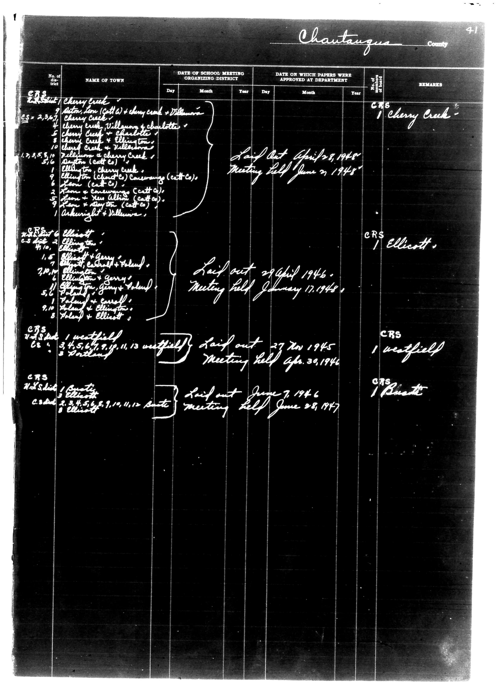

# Chautauqua County

**Document Type:** Document

**Collection:** CS Archive

**Source:** District-Consolidation-Data_100-116_page_19.jpg

**Model:** qwen/qwen-vl-plus

**Confidence:** 1.0

**Processed:** 2025-12-19T01:31:59.891325

**Source Image:** [📄 District-Consolidation-Data_100-116_page_19.jpg](../tables/images/District-Consolidation-Data_100-116_page_19.jpg)

---

## Source Document



---

## Transcription

```
Chautauqua County
Page 41

| No. of Dist | NAME OF TOWN | DATE OF SCHOOL MEETING ORGANIZING DISTRICT | DATE ON WHICH PAPERS WERE APPROVED AT DEPARTMENT | REMARKS |
|-------------|--------------|--------------------------------------------|--------------------------------------------------|---------|
|             |              | Day | Month | Year | Day | Month | Year |        |
| CRS 2 Ellicott | Cherry Creek |  |  |  | Laid out April 28, 1948 | Meeting held June 27, 1948 | CRS 1 Cherry Creek |
|             |              |  |  |  |  |  |  |        |
|             |              |  |  |  |  |  |  |        |
|             |              |  |  |  |  |  |  |        |
|             |              |  |  |  |  |  |  |        |
|             |              |  |  |  |  |  |  |        |
|             |              |  |  |  |  |  |  |        |
|             |              |  |  |  |  |  |  |        |
|             |              |  |  |  |  |  |  |        |
|             |              |  |  |  |  |  |  |        |
|             |              |  |  |  |  |  |  |        |
|             |              |  |  |  |  |  |  |        |
|             |              |  |  |  |  |  |  |        |
|             |              |  |  |  |  |  |  |        |
|             |              |  |  |  |  |  |  |        |
|             |              |  |  |  |  |  |  |        |
|             |              |  |  |  |  |  |  |        |
|             |              |  |  |  |  |  |  |        |
|             |              |  |  |  |  |  |  |        |
|             |              |  |  |  |  |  |  |        |
|             |              |  |  |  |  |  |  |        |
|             |              |  |  |  |  |  |  |        |
|             |              |  |  |  |  |  |  |        |
|             |              |  |  |  |  |  |  |        |
|             |              |  |  |  |  |  |  |        |
|             |              |  |  |  |  |  |  |        |
|             |              |  |  |  |  |  |  |        |
|             |              |  |  |  |  |  |  |        |
|             |              |  |  |  |  |  |  |        |
|             |              |  |  |  |  |  |  |        |
|             |              |  |  |  |  |  |  |        |
|             |              |  |  |  |  |  |  |        |
|             |              |  |  |  |  |  |  |        |
|             |              |  |  |  |  |  |  |        |
|             |              |  |  |  |  |  |  |        |
|             |              |  |  |  |  |  |  |        |
|             |              |  |  |  |  |  |  |        |
|             |              |  |  |  |  |  |  |        |
|             |              |  |  |  |  |  |  |        |
|             |              |  |  |  |  |  |  |        |
|             |              |  |  |  |  |  |  |        |
|             |              |  |  |  |  |  |  |        |
|             |              |  |  |  |  |  |  |        |
|             |              |  |  |  |  |  |  |        |
|             |              |  |  |  |  |  |  |        |
|             |              |  |  |  |  |  |  |        |
|             |              |  |  |  |  |  |  |        |
|             |              |  |  |  |  |  |  |        |
|             |              |  |  |  |  |  |  |        |
|             |              |  |  |  |  |  |  |        |
|             |              |  |  |  |  |  |  |        |
|             |              |  |  |  |  |  |  |        |
|             |              |  |  |  |  |  |  |        |
|             |              |  |  |  |  |  |  |        |
|             |              |  |  |  |  |  |  |        |
|             |              |  |  |  |  |  |  |        |
|             |              |  |  |  |  |  |  |        |
|             |              |  |  |  |  |  |  |        |
|             |              |  |  |  |  |  |  |        |
|             |              |  |  |  |  |  |  |        |
|             |              |  |  |  |  |  |  |        |
|             |              |  |  |  |  |  |  |        |
|             |              |  |  |  |  |  |  |        |
|             |              |  |  |  |  |  |  |        |
|             |              |  |  |  |  |  |  |        |
|             |              |  |  |  |  |  |  |        |
|             |              |  |  |  |  |  |  |        |
|             |              |  |  |  |  |  |  |        |
|             |              |  |  |  |  |  |  |        |
|             |              |  |  |  |  |  |  |        |
|             |              |  |  |  |  |  |  |        |
|             |              |  |  |  |  |  |  |        |
|             |              |  |  |  |  |  |
