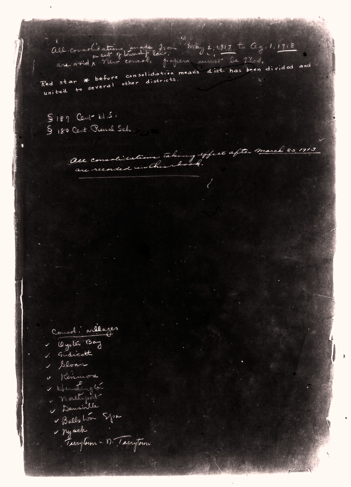

# All consolidations made from May 2, 1917 to Aug. 1, 1918 are void. New consolida

**Document Type:** Document

**Collection:** CS Archive

**Source:** District-Consolidation-Data_100-116_page_2.jpg

**Model:** qwen/qwen-vl-plus

**Confidence:** 1.0

**Processed:** 2025-12-19T01:27:46.244247

**Source Image:** [📄 District-Consolidation-Data_100-116_page_2.jpg](../tables/images/District-Consolidation-Data_100-116_page_2.jpg)

---

## Source Document

---

## Transcription

All consolidations made from May 2, 1917 to Aug. 1, 1918 are void. New consolidations must be filed.

Red star * before consolidation means dist. has been divided and united to several other districts.

§ 187 Cst. U.S.
§ 180 Cst. Rural Sch.

All consolidations taking effect after March 25, 1913 are recorded in this book.

Consolidated Villages
- Oyslet Bay
- Indicott
- Sloan
- Keimore
- Huntingt
- Nattypot
- Dansville
- Ballston Spa
- Pyach
Tarrytown - D. Tarrytown
