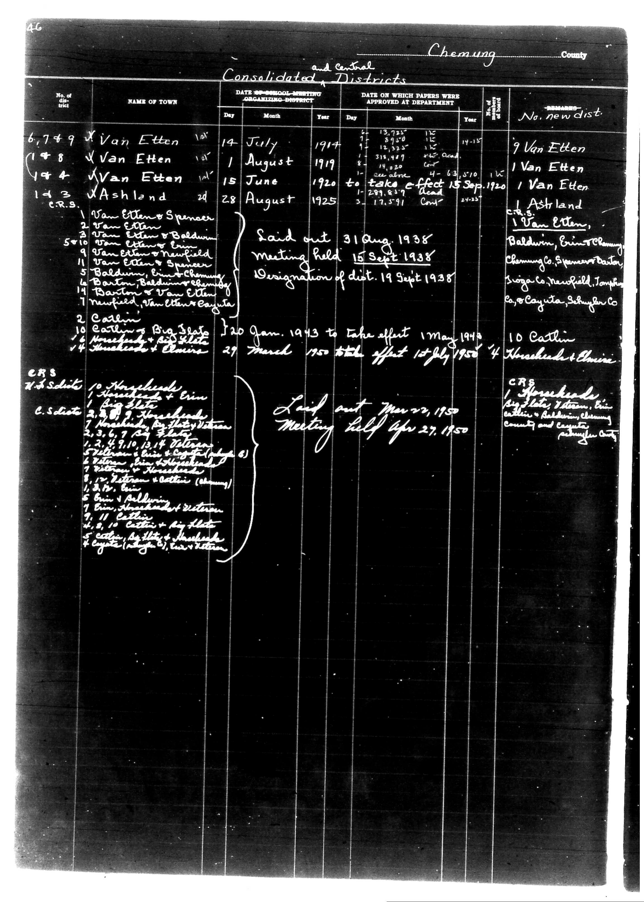

# District Consolidation Data 100 116 page 22

**Document Type:** Document

**Collection:** CS Archive

**Source:** District-Consolidation-Data_100-116_page_22.jpg

**Model:** qwen/qwen-vl-plus

**Confidence:** 1.0

**Processed:** 2025-12-19T01:32:44.889260

**Source Image:** [📄 District-Consolidation-Data_100-116_page_22.jpg](../tables/images/District-Consolidation-Data_100-116_page_22.jpg)

---

## Source Document



---

## Transcription

```
A6
Chemung County
and Central Consolidated Districts

| No. of dist. | NAME OF TOWN | DATE OF SCHOOL-MEETING ORGANIZING-DISTRICT | DATE ON WHICH PAPERS WERE APPROVED AT DEPARTMENT | No. of new dist. | REMARKS |
|--------------|--------------|---------------------------------------------|--------------------------------------------------|------------------|---------|
|              |              | Day Month Year                              | Day Month Year                                   |                  |         |
| 6,7,8,9      | Van Etten    | 14 July 1914                                | 6 13,725 1915                                    | 9 Van Etten    |         |
| (1) 8        | Van Etten    | 1 August 1919                               | 8 318,499 1919                                   | 1 Van Etten    |         |
| (1) 4        | Van Etten    | 15 June 1920 to take effect 15 Sep 1920     | 10 299,819 1920                                  | 1 Van Etten    |         |
| (1) 3        | Ashland      | 28 August 1925                              | 3 17,591 Cost                                    | 1 Ashland      |         |

CRS
W.S. Schist
10 Households
1 Big Slate
1 Households + Erin
1 Big Slate
7, 3, 6, 7, 4 Plates
10 Households
10 Households + Erin
10 Households + Big Slate
10 Households + Erin
10 Households + Big Slate
10 Households + Erin
10 Households + Big Slate
10 Households + Erin
10 Households + Big Slate
10 Households + Erin
10 Households + Big Slate
10 Households + Erin
10 Households + Big Slate
10 Households + Erin
10 Households + Big Slate
10 Households + Erin
10 Households + Big Slate
10 Households + Erin
10 Households + Big Slate
10 Households + Erin
10 Households + Big Slate
10 Households + Erin
10 Households + Big Slate
10 Households + Erin
10 Households + Big Slate
10 Households + Erin
10 Households + Big Slate
10 Households + Erin
10 Households + Big Slate
10 Households + Erin
10 Households + Big Slate
10 Households + Erin
10 Households + Big Slate
10 Households + Erin
10 Households + Big Slate
10 Households + Erin
10 Households + Big Slate
10 Households + Erin
10 Households + Big Slate
10 Households + Erin
10 Households + Big Slate
10 Households + Erin
10 Households + Big Slate
10 Households + Erin
10 Households + Big Slate
10 Households + Erin
10 Households + Big Slate
10 Households + Erin
10 Households + Big Slate
10 Households + Erin
10 Households + Big Slate
10 Households + Erin
10 Households + Big Slate
10 Households + Erin
10 Households + Big Slate
10 Households + Erin
10 Households + Big Slate
10 Households + Erin
10 Households + Big Slate
10 Households + Erin
10 Households + Big Slate
10 Households + Erin
10 Households + Big Slate
10 Households + Erin
10 Households + Big Slate
10 Households + Erin
10 Households + Big Slate
10 Households + Erin
10 Households + Big Slate
10 Households + Erin
10 Households + Big Slate
10 Households + Erin
10 Households + Big Slate
10 Households + Erin
10 Households + Big Slate
10 Households + Erin
10 Households + Big Slate
10 Households + Erin
10 Households + Big Slate
10 Households + Erin
10 Households + Big Slate
10 Households + Erin
10 Households + Big Slate
10 Households + Erin
10 Households + Big Slate
10 Households + Erin
10 Households + Big Slate
10 Households + Erin
10 Households + Big Slate
10 Households + Erin
10 Households + Big Slate
10 Households + Erin
10 Households + Big Slate
10 Households + Erin
10 Households + Big Slate
10 Households + Erin
10 Households + Big Slate
10 Households + Erin
10 Households + Big Slate
10 Households + Erin
10 Households + Big Slate
10 Households + Erin
10 Households + Big Slate
10 Households + Erin
10 Households + Big Slate
10 Households + Erin
10 Households + Big Slate
10 Households + Erin
10 Households + Big Slate
10 Households + Erin
10 Households + Big Slate
10 Households + Erin
10 Households + Big Slate
10 Households + Erin
10 Households + Big Slate
10 Households + Erin
10 Households + Big Slate
10 Households + Erin
10 Households + Big Slate
10 Households + Erin
10 Households + Big Slate
10 Households + Erin
10 Households + Big Slate
10 Households + Erin
10 Households + Big Slate
10 Households + Erin
10 Households + Big Slate
10 Households + Erin
10 Households + Big Slate
10 Households + Erin
10 Households + Big Slate
10 Households + Erin
10 Households + Big Slate
10 Households + Erin
10 Households + Big Slate
10 Households + Erin
10 Households + Big Slate
10 Households + Erin
10 Households + Big Slate
10 Households + Erin
10 Households + Big Slate
10 Households + Erin
10 Households + Big Slate
10 Households + Erin
10 Households + Big Slate
10 Households + Erin
10 Households + Big Slate
10 Households + Erin
10 Households + Big Slate
10 Households + Erin
10 Households + Big Slate
10 Households + Erin
10 Households + Big Slate
10 House
