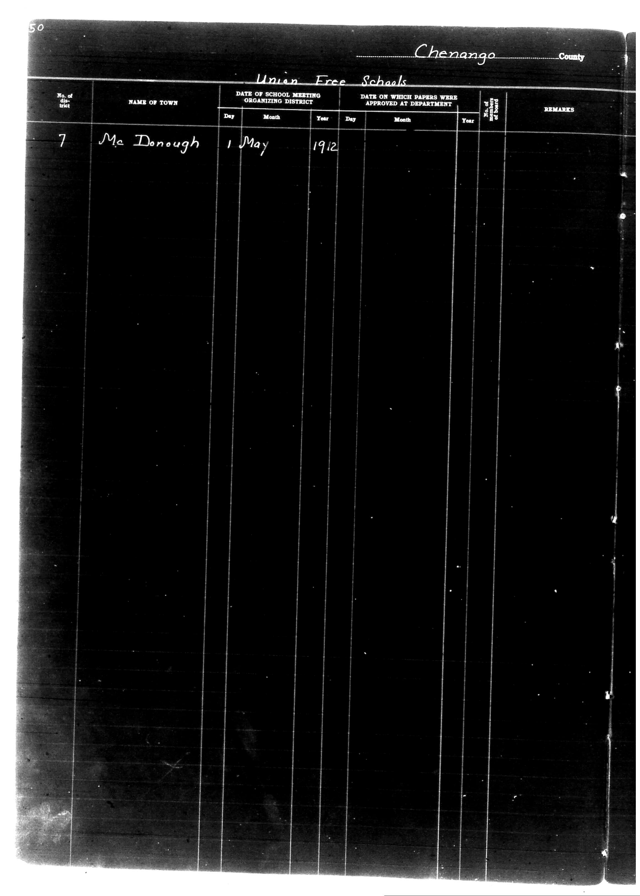

# Chenango County

**Document Type:** Document

**Collection:** CS Archive

**Source:** District-Consolidation-Data_100-116_page_23.jpg

**Model:** qwen/qwen-vl-plus

**Confidence:** 1.0

**Processed:** 2025-12-19T01:32:48.364209

**Source Image:** [📄 District-Consolidation-Data_100-116_page_23.jpg](../tables/images/District-Consolidation-Data_100-116_page_23.jpg)

---

## Source Document

---

## Transcription

Chenango County
Union Free Schools

| No. of District | NAME OF TOWN   | DATE OF SCHOOL MEETING ORGANIZING DISTRICT | DATE ON WHICH PAPERS WERE APPROVED AT DEPARTMENT | No. of Board of Trustees | REMARKS |
|-----------------|----------------|--------------------------------------------|--------------------------------------------------|--------------------------|---------|
| 7               | Mc Donough     | 1 May 1912                                 | [blank]                                          | [blank]                  | [blank] |
