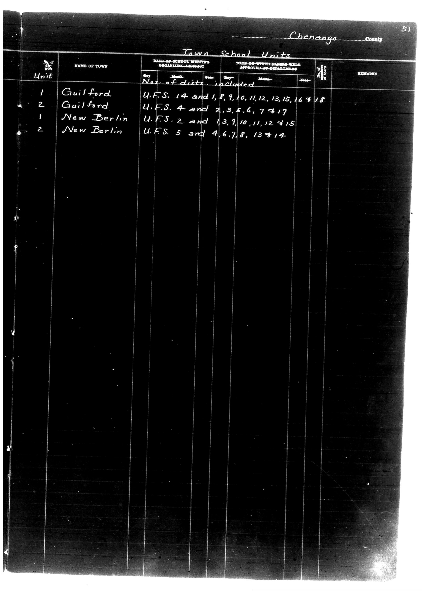

# Chenango County

**Document Type:** Document

**Collection:** CS Archive

**Source:** District-Consolidation-Data_100-116_page_24.jpg

**Model:** qwen/qwen-vl-plus

**Confidence:** 1.0

**Processed:** 2025-12-19T01:32:55.739605

**Source Image:** [📄 District-Consolidation-Data_100-116_page_24.jpg](../tables/images/District-Consolidation-Data_100-116_page_24.jpg)

---

## Source Document

---

## Transcription

Chenango County
Page 51

Town School Units

| No. of Unit | NAME OF TOWN   | DATE OF SCHOOL MEETING ORGANIZING DISTRICT | Nos. of dists. included | DATE ON WHICH PAPERS WERE APPROVED AT DEPARTMENT | No. of Board | REMARKS |
|-------------|----------------|---------------------------------------------|--------------------------|---------------------------------------------------|--------------|---------|
| 1           | Guilford       |                                             | U.F.S. 14 and 1,8,9,10,11,12,13,15,16,18 |                                                   |              |         |
| 2           | Guilford       |                                             | U.F.S. 4 and 2,3,5,6,7,17               |                                                   |              |         |
| 1           | New Berlin     |                                             | U.F.S. 2 and 13,9,10,11,12,15           |                                                   |              |         |
| 2           | New Berlin     |                                             | U.F.S. 5 and 4,6,7,8,13,14              |                                                   |              |         |
