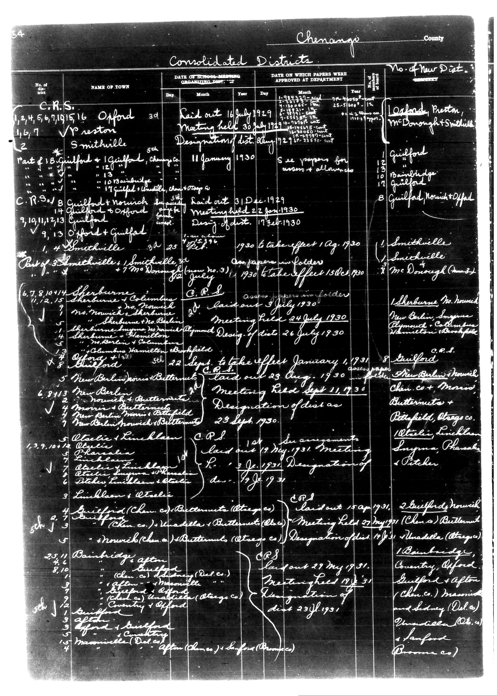

# Below is the transcription of the tabular data from the document, preserving the

**Document Type:** Document

**Collection:** CS Archive

**Source:** District-Consolidation-Data_100-116_page_26.jpg

**Model:** qwen/qwen-vl-plus

**Confidence:** 1.0

**Processed:** 2025-12-19T01:33:48.217595

**Source Image:** [📄 District-Consolidation-Data_100-116_page_26.jpg](../tables/images/District-Consolidation-Data_100-116_page_26.jpg)

---

## Source Document

---

## Transcription

Below is the transcription of the tabular data from the document, preserving the structure and formatting as requested:

---

**Chenango County**

**Consolidated Districts**

| No. of District | NAME OF TOWN | DATE OF SCHOOL MEETING ORGANIZING DIST. | DATE ON WHICH PAPERS WERE APPROVED AT DEPARTMENT | No. of New Dist. |
|-----------------|--------------|------------------------------------------|--------------------------------------------------|------------------|
| C.R.S. 1,2,4,5,6,7,10,15,16 | Oxford | Raid out 16 July 1929 | Meeting held 30 July 1929 | [blank] |
| V Preston |  |  |  | Oakland, Preston, McDorrough, Smithville |
| 2 | Smithville | 5th January 1930 |  |  |
| Part of B. Guilford + Guilford, Chemung Co. |  |  |  |  |
| 11 January 1930 |  |  |  |  |
| 17 Guilford + Butternut, Chemung Co. |  |  |  |  |
| 17 Guilford + Butternut, Chemung Co. |  |  |  |  |
| C.R.S. 8 | Guilford + Norwich Imp. District | Laid out 31 Dec. 1929 | Meeting held 22 Jan. 1930 | 8 |
| 9,13,13 | Guilford |  |  | Guilford, Norwich, Offield |
| 9,13 | Oxford + Guilford |  |  |  |
| 1930 to take effect 1 Aug. 1930 |  |  |  |  |
| Designation of dist. 17 April 1930 |  |  |  |  |
| Part of 3 Smithville + Smithville | 25 July 1926 | Companies in folder |  |  |
| 11 January 1930 |  |  |  |  |
| 1930 to take effect 15 Oct. 1930 |  |  |  |  |
| Smithville |  |  |  | Smithville |
| Mc Donough (now No. 3) |  |  |  | Mc Donough (now No. 3) |
| 6,7,8,10,14 | Sherburne | C.R.S. | Laid out 3 July 1930 | 8 |
| 11,12,15 | Sherburne + Columbiana |  |  | Sherburne No. 1, New Berlin, Ithaca, Pymouth, Catskill, Hamilton |
| 13 | Sherburne + Hamilton |  |  | Sherburne + Hamilton |
| 13 | Columbiana + Hamilton |  |  | Columbiana + Hamilton |
| 8 | Guilford | 22 Sept. to take effect January 1931 | C.R.S. | Guilford |
| 5 | New Berlin + Butternut | 23 Aug. 1930 | Meeting held 24 July 1930 | New Berlin, Norwich, Pymouth, Catskill, Hamilton |
| 6,8,14 | New Berlin + Butternut |  |  | New Berlin, Norwich, Pymouth, Catskill, Hamilton |
| 7 | New Berlin + Butternut |  |  | New Berlin, Norwich, Pymouth, Catskill, Hamilton |
| 5 | Atelia + Linchlan | C.R.S. | Laid out 19 July 1931 | 8 |
| 13,9,10,12 | Atelia + Linchlan |  |  | Atelia, Linchlan, Smyrna, Pharsalia, Patchen |
| 7 | Atelia + Linchlan |  |  | Atelia, Linchlan, Patchen |
| 6 | Atelia + Linchlan |  |  | Atelia, Linchlan, Patchen |
| 3 | Atelia + Linchlan |  |  | Atelia, Linchlan, Patchen |
| 4,5,7 | Guilford (Chen. Co.) + Butternut (Atage Co.) | Laid out 15 April 1931 | C.R.S. | Guilford, Norwich, Linchlan |
| 5 | Unadilla + Butternut (Ote.) | Meeting held 27 May 1931 | (Chen.) Butternut | Unadilla (Atage) |
| 5 | Norwich (Chen.) + Butternut (Atage Co.) | Designation of dist. 19 July 1931 |  |  |
| 25/11,8,10 | Bainbridge after Oxford | Raid out 27 May 1931 | Meeting held 17 July 1931 | 8 |
| 4,8,10 | Oxford |  |  | Coventry, Oxford, Guilford + After |
| 13,14 | Oxford |  |  | Oxford, Norwich, Middletown, Sidney (Del. Co.) |
| 23 July 1931 |  |  |  | Unadilla (Ote.) |
| 8th J | Oxford + Smithville |  |  | Oxford, Smithville (Penns.) |
| 15 | Oxford + Smithville |  |  | Oxford, Smithville (Penns.) |
| 14 | Oxford + Smithville |  |  | Oxford, Smithville (Penns.) |
| 15 | Oxford + Smithville |  |  | Oxford, Smithville (Penns.) |
| 14 | Oxford + Smithville |  |  | Oxford, Smithville (Penns.) |
| 15 | Oxford + Smithville |  |  | Oxford, Smithville (Penns.) |
| 14 | Oxford + Smithville |  |  | Oxford, Smithville (Penns.) |
| 15 | Oxford + Smithville |  |  | Oxford, Smithville (Penns.) |
| 14 | Oxford + Smithville |  |  | Oxford, Smithville (Penns.) |
| 15 | Oxford + Smithville |  |  | Oxford, Smithville (Penns.) |
| 14 | Oxford + Smithville |  |  | Oxford, Smithville (Penns.) |
| 15 | Oxford + Smithville |  |  | Oxford, Smithville (Penns.) |
| 14 |
