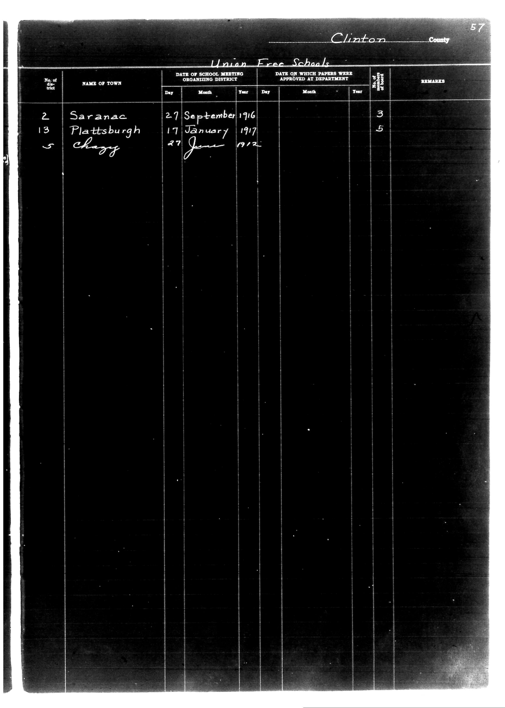

# Clinton County

**Document Type:** Document

**Collection:** CS Archive

**Source:** District-Consolidation-Data_100-116_page_29.jpg

**Model:** qwen/qwen-vl-plus

**Confidence:** 1.0

**Processed:** 2025-12-19T01:34:25.107305

**Source Image:** [📄 District-Consolidation-Data_100-116_page_29.jpg](../tables/images/District-Consolidation-Data_100-116_page_29.jpg)

---

## Source Document



---

## Transcription

```
Clinton County
Union Free Schools

| No. of District | NAME OF TOWN   | DATE OF SCHOOL MEETING ORGANIZING DISTRICT | DATE ON WHICH PAPERS WERE APPROVED AT DEPARTMENT | Term of School | REMARKS |
|-----------------|----------------|--------------------------------------------|--------------------------------------------------|----------------|---------|
|                 |                | Day   Month   Year                         | Day   Month   Year                               |                |         |
| 2               | Saranac        | 27    September 1916                       |                                                  | 3              |         |
| 13              | Plattsburgh    | 17    January  1917                        |                                                  | 5              |         |
| 5               | Chazy          | 27    June     1912                        |                                                  |                |         |
```

**Notes:**

* The table is structured with columns for "No. of District," "NAME OF TOWN," "DATE OF SCHOOL MEETING ORGANIZING DISTRICT," "DATE ON WHICH PAPERS WERE APPROVED AT DEPARTMENT," "Term of School," and "REMARKS."
* The "DATE OF SCHOOL MEETING ORGANIZING DISTRICT" and "DATE ON WHICH PAPERS WERE APPROVED AT DEPARTMENT" columns are further divided into "Day," "Month," and "Year."
* Handwritten entries are preserved as they appear in the original document.
* Blank fields are indicated as `[blank]` where no information is provided.
* The "Term of School" column contains numerical values for the respective districts.
* The "REMARKS" column is empty for all entries.
* The document header includes "Clinton County" and "Union Free Schools," with a page number "57" in the top right corner.
