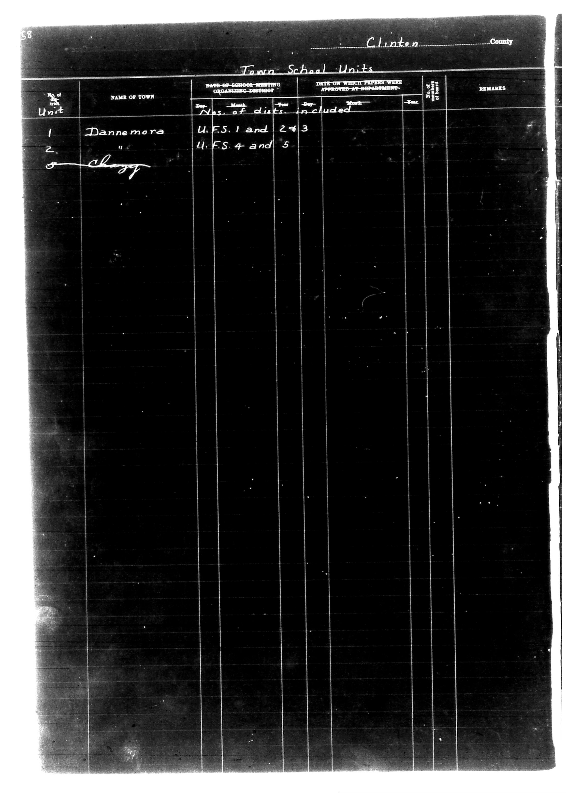

# 53                                                                 Clinton Count

**Document Type:** Document

**Collection:** CS Archive

**Source:** District-Consolidation-Data_100-116_page_30.jpg

**Model:** qwen/qwen-vl-plus

**Confidence:** 1.0

**Processed:** 2025-12-19T01:34:30.863748

**Source Image:** [📄 District-Consolidation-Data_100-116_page_30.jpg](../tables/images/District-Consolidation-Data_100-116_page_30.jpg)

---

## Source Document



---

## Transcription

```
53                                                                 Clinton County

Town School Units

| No. of Unit | NAME OF TOWN | DATE OF SCHOOL MEETING ORGANIZING DISTRICT | DATE ON WHICH PAPERS WERE APPROVED AT DEPARTMENT | REMARKS |
|-------------|--------------|--------------------------------------------|--------------------------------------------------|---------|
|             |              | Day    Month    Year                      | Day    Month    Year                            |         |
| 1           | Dannemora    | U.F.S. 1 and 243                           | [blank]                                          |         |
| 2           |              | U.F.S. 4 and 5                             | [blank]                                          |         |
```

**Notes:**

* The "No. of Unit" column has entries for 1 and 2.
* The "NAME OF TOWN" column has "Dannemora" for unit 1 and is blank for unit 2.
* The "DATE OF SCHOOL MEETING ORGANIZING DISTRICT" column lists "U.F.S. 1 and 243" for unit 1 and "U.F.S. 4 and 5" for unit 2.
* The "DATE ON WHICH PAPERS WERE APPROVED AT DEPARTMENT" column is blank for both units.
* The "REMARKS" column is blank for both units.
* There is a handwritten signature under unit 2, but it is not legible enough to transcribe accurately.
