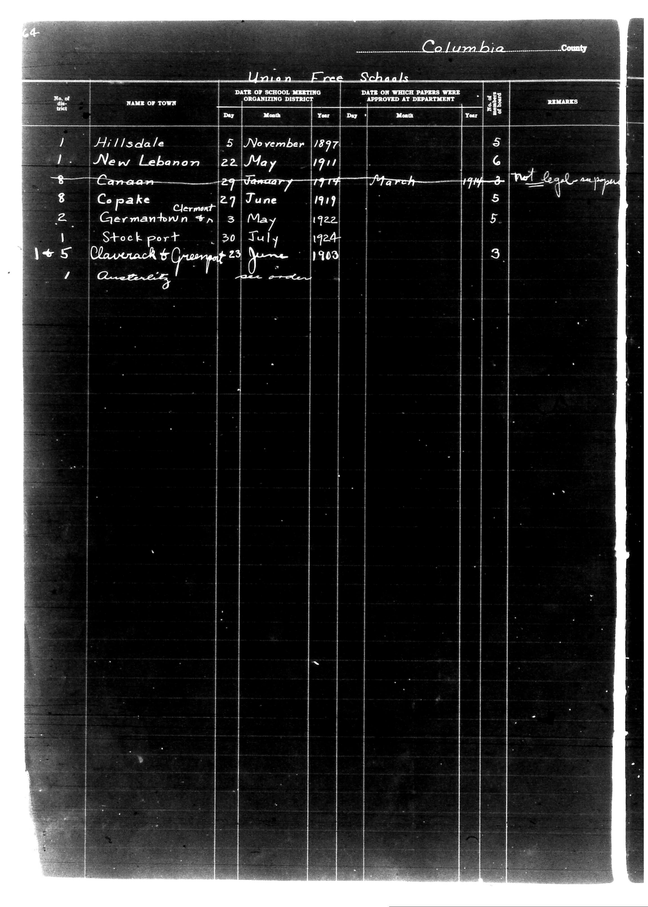

# Columbia County

**Document Type:** Document

**Collection:** CS Archive

**Source:** District-Consolidation-Data_100-116_page_34.jpg

**Model:** qwen/qwen-vl-plus

**Confidence:** 1.0

**Processed:** 2025-12-19T01:35:32.504159

**Source Image:** [📄 District-Consolidation-Data_100-116_page_34.jpg](../tables/images/District-Consolidation-Data_100-116_page_34.jpg)

---

## Source Document

---

## Transcription

Columbia County

Union Free Schools

| No. of District | NAME OF TOWN         | DATE OF SCHOOL MEETING ORGANIZING DISTRICT | DATE ON WHICH PAPERS WERE APPROVED AT DEPARTMENT | No. of Board Members | REMARKS              |
|-----------------|----------------------|--------------------------------------------|--------------------------------------------------|----------------------|----------------------|
| 1               | Hillsdale            | 5 November 1897                            |                                                  | 5                    |                      |
| 1               | New Lebanon          | 22 May 1911                                |                                                  | 6                    |                      |
| 8               | Canaan               | 29 January 1914                            | March 1914                                       | 5                    | Not legal support    |
| 8               | Copake (Clermont)    | 27 June 1919                               |                                                  | 5                    |                      |
| 2               | Germantown           | 3 May 1922                                 |                                                  | 5                    |                      |
| 1               | Stockport            | 30 July 1924                               |                                                  | 3                    |                      |
| 1 + 5           | Claverack & Grempot   | 23 June 1903                               |                                                  |                      |                      |
| 1               | Austerlitz           | See order                                  |                                                  |                      |                      |
