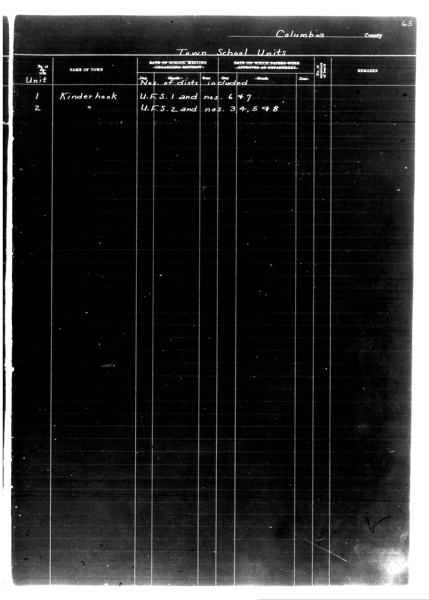

# Columbia County

**Document Type:** Document

**Collection:** CS Archive

**Source:** District-Consolidation-Data_100-116_page_35.jpg

**Model:** qwen/qwen-vl-plus

**Confidence:** 1.0

**Processed:** 2025-12-19T01:35:40.272664

**Source Image:** [📄 District-Consolidation-Data_100-116_page_35.jpg](../tables/images/District-Consolidation-Data_100-116_page_35.jpg)

---

## Source Document



---

## Transcription

Columbia County

Town School Units

| No. of Unit | NAME OF TOWN | DATE OF SCHOOL MEETING - ORGANIZING DISTRICT - | DATE ON WHICH PAPERS WERE APPROVED AT DEPARTMENT | No. of dists. included | REMARKS |
|-------------|--------------|------------------------------------------------|--------------------------------------------------|------------------------|---------|
|             |              | Day | Month | Year | Day | Month | Year |                      |         |
| 1           | Kinderhook   | U.F.S. 1 and nos. 6 + 7                        | [blank]                                          | [blank]                |         |
| 2           | "            | U.F.S. 2 and nos. 3, 4, 5 + 8                 | [blank]                                          | [blank]                |         |
```

**Notes:**

* The table is structured with columns for "No. of Unit," "NAME OF TOWN," "DATE OF SCHOOL MEETING - ORGANIZING DISTRICT -," "DATE ON WHICH PAPERS WERE APPROVED AT DEPARTMENT," "No. of dists. included," and "REMARKS."
* The "DATE OF SCHOOL MEETING" and "DATE ON WHICH PAPERS WERE APPROVED" columns are further divided into "Day," "Month," and "Year."
* The "No. of dists. included" column lists the specific districts included in each unit.
* The "REMARKS" column is blank for both entries.
* The document appears to be a form with pre-printed text and handwritten entries for the "NAME OF TOWN" and "No. of dists. included" columns.
* The page number "65" is visible in the top right corner.
