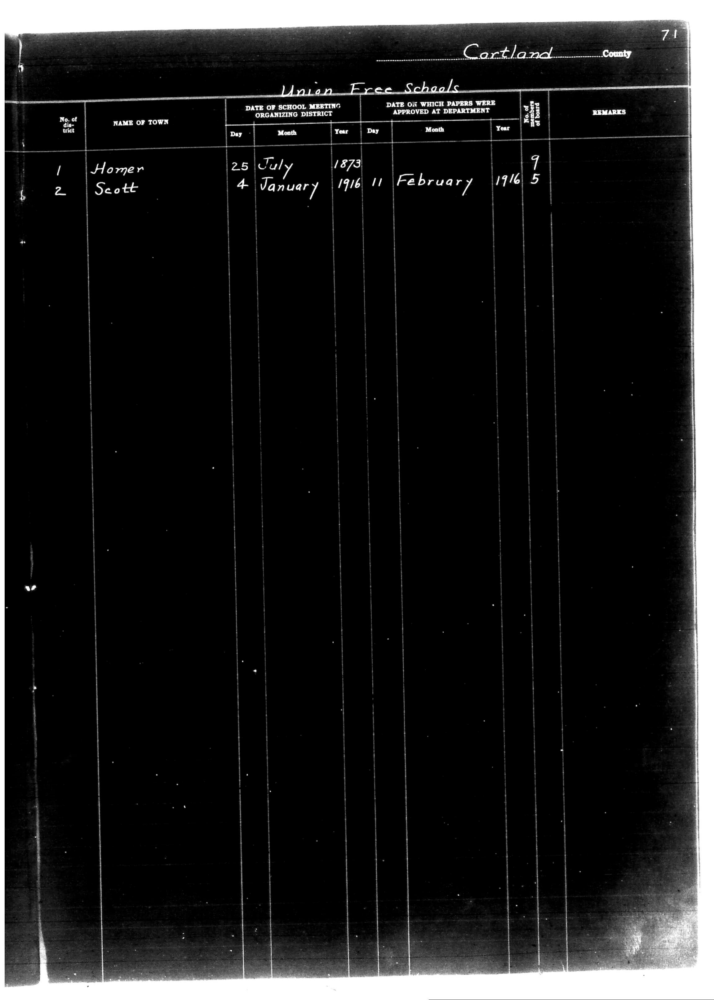

# Cartland County

**Document Type:** Document

**Collection:** CS Archive

**Source:** District-Consolidation-Data_100-116_page_37.jpg

**Model:** qwen/qwen-vl-plus

**Confidence:** 1.0

**Processed:** 2025-12-19T01:36:06.970801

**Source Image:** [📄 District-Consolidation-Data_100-116_page_37.jpg](../tables/images/District-Consolidation-Data_100-116_page_37.jpg)

---

## Source Document

---

## Transcription

Cartland County
Union Free Schools

| No. of District | NAME OF TOWN | DATE OF SCHOOL MEETING ORGANIZING DISTRICT |  |  | DATE ON WHICH PAPERS WERE APPROVED AT DEPARTMENT |  |  | No. of Board of Education Members | REMARKS |
|-----------------|--------------|---------------------------------------------|----|----|---------------------------------------------------|----|----|-----------------------------|---------|
|                 |              | Day                                         | Month | Year | Day                                               | Month | Year |                             |         |
| 1               | Homer        | 25                                          | July | 1873 | 11                                                | February | 1916 | 9                           |         |
| 2               | Scott        | 4                                           | January | 1916 | 11                                                | February | 1916 | 5                           |         |
