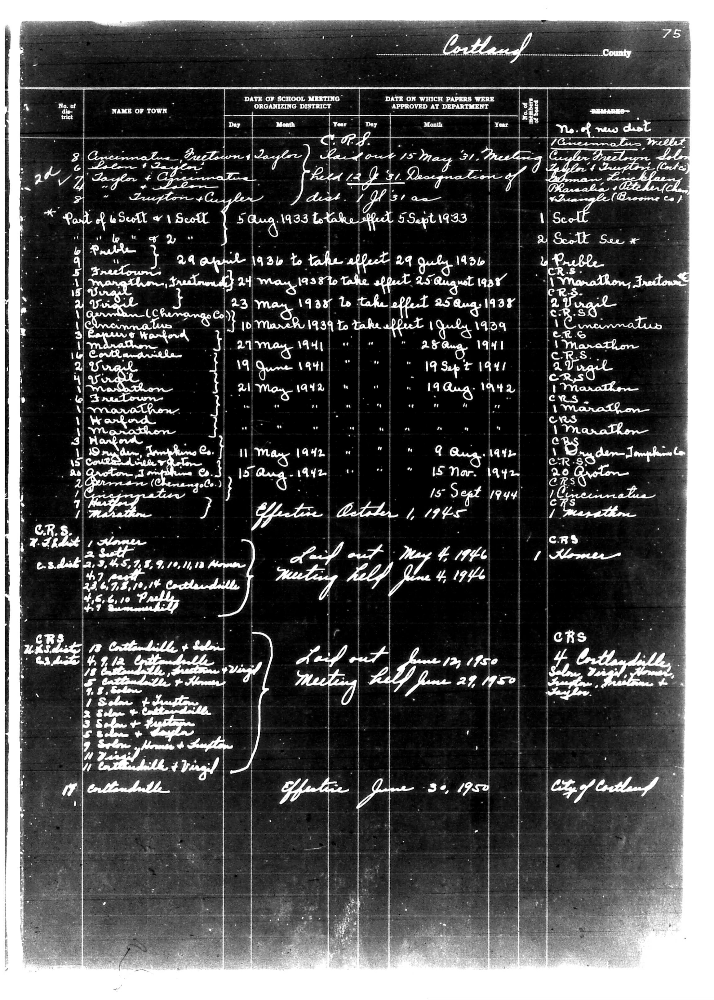

# Below is the transcription of the tabular data from the document, preserving the

**Document Type:** Document

**Collection:** CS Archive

**Source:** District-Consolidation-Data_100-116_page_39.jpg

**Model:** qwen/qwen-vl-plus

**Confidence:** 1.0

**Processed:** 2025-12-19T01:36:47.258151

**Source Image:** [📄 District-Consolidation-Data_100-116_page_39.jpg](../tables/images/District-Consolidation-Data_100-116_page_39.jpg)

---

## Source Document

---

## Transcription

Below is the transcription of the tabular data from the document, preserving the structure and formatting as requested:

---

**Cortland County**

| No. of Dist. | NAME OF TOWN | DATE OF SCHOOL MEETING ORGANIZING DISTRICT | DATE ON WHICH PAPERS WERE APPROVED AT DEPARTMENT | REMARKS |
|--------------|--------------|---------------------------------------------|--------------------------------------------------|---------|
|              |              | Day | Month | Year | Day | Month | Year | No. of new dist |
| 8            | Cincinnati (Bustown) | Taylor | 15 | May | 1933 | 31 | May | 1933 | 1. Cincinnati (Bustown) |
|              |              |            |            |            |            |            |            | 2. Taylor |
|              |              |            |            |            |            |            |            | 3. Cuyler |
|              |              |            |            |            |            |            |            | 4. Cuyler (Freetown) |
|              |              |            |            |            |            |            |            | 5. John |
|              |              |            |            |            |            |            |            | 6. Taylor |
|              |              |            |            |            |            |            |            | 7. Taylor (Cuyler) |
|              |              |            |            |            |            |            |            | 8. Cuyler (Changco) |
|              |              |            |            |            |            |            |            | 9. Triangle (Broome Co.) |
| 26           | Scott        | 5 | Aug | 1933 | 31 | Aug | 1933 | 1. Scott |
|              |              |            |            |            |            |            |            | 2. Scott See * |
| *Part of 6 Scott + 1 Scott | 29 | April | 1936 | 27 | July | 1936 | 3. Public |
|              |              |            |            |            |            |            |            | 4. Marathon |
|              |              |            |            |            |            |            |            | 5. Freetown |
|              |              |            |            |            |            |            |            | 6. Taylor |
|              |              |            |            |            |            |            |            | 7. Cuyler |
|              |              |            |            |            |            |            |            | 8. Cuyler (Changco) |
|              |              |            |            |            |            |            |            | 9. Triangle (Broome Co.) |
| 6            | Virgil       | 24 | May | 1938 | 25 | August | 1938 | 1. Virgil |
|              |              |            |            |            |            |            |            | 2. Virgil |
|              |              |            |            |            |            |            |            | 3. Cuyler |
|              |              |            |            |            |            |            |            | 4. Cuyler (Changco) |
|              |              |            |            |            |            |            |            | 5. Triangle (Broome Co.) |
| 10           | German (Changco) | 10 | March | 1939 | 1 | July | 1939 | 1. German (Changco) |
|              |              |            |            |            |            |            |            | 2. Cuyler |
|              |              |            |            |            |            |            |            | 3. Cuyler (Changco) |
|              |              |            |            |            |            |            |            | 4. Triangle (Broome Co.) |
| 13           | Churmanville | 21 | May | 1941 | 28 | August | 1941 | 1. Churmanville |
|              |              |            |            |            |            |            |            | 2. Cuyler |
|              |              |            |            |            |            |            |            | 3. Cuyler (Changco) |
|              |              |            |            |            |            |            |            | 4. Triangle (Broome Co.) |
| 19           | Virgil       | 19 | June | 1941 | 19 | September | 1941 | 1. Virgil |
|              |              |            |            |            |            |            |            | 2. Cuyler |
|              |              |            |            |            |            |            |            | 3. Cuyler (Changco) |
|              |              |            |            |            |            |            |            | 4. Triangle (Broome Co.) |
| 21           | Marathon     | 21 | May | 1942 | 19 | August | 1942 | 1. Marathon |
|              |              |            |            |            |            |            |            | 2. Cuyler |
|              |              |            |            |            |            |            |            | 3. Cuyler (Changco) |
|              |              |            |            |            |            |            |            | 4. Triangle (Broome Co.) |
| 11           | Harford      | 11 | May | 1942 | 9 | August | 1942 | 1. Harford |
|              |              |            |            |            |            |            |            | 2. Cuyler |
|              |              |            |            |            |            |            |            | 3. Cuyler (Changco) |
|              |              |            |            |            |            |            |            | 4. Triangle (Broome Co.) |
| 15           | German (Changco) | 15 | August | 1942 | 15 | November | 1942 | 1. German (Changco) |
|              |              |            |            |            |            |            |            | 2. Cuyler |
|              |              |            |            |            |            |            |            | 3. Cuyler (Changco) |
|              |              |            |            |            |            |            |            | 4. Triangle (Broome Co.) |
| 15           | German (Changco) | 15 | September |
