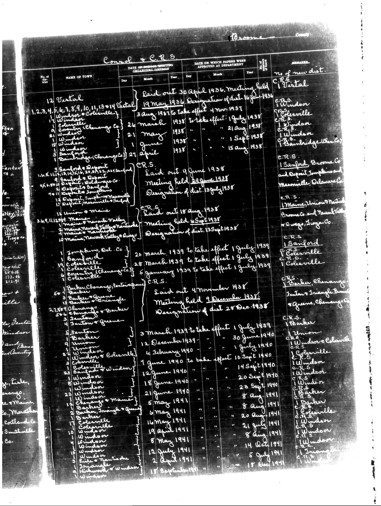

# Below is the transcription of the tabular data from the document, preserving the

**Document Type:** Document

**Collection:** CS Archive

**Source:** District-Consolidation-Data_100-116_page_4.jpg

**Model:** qwen/qwen-vl-plus

**Confidence:** 1.0

**Processed:** 2025-12-19T01:28:28.172382

**Source Image:** [📄 District-Consolidation-Data_100-116_page_4.jpg](../tables/images/District-Consolidation-Data_100-116_page_4.jpg)

---

## Source Document



---

## Transcription

Below is the transcription of the tabular data from the document, preserving the structure and formatting as requested:

```
| No. of Girt | NAME OF TOWN | DATE OF ORGANIZING MEETING | DATE ON WHICH PAPERS WERE APPROVED AT DEPARTMENT | REMARKS |
|-------------|--------------|-----------------------------|--------------------------------------------------|---------|
|             |              | Day Month Year              | Day Month Year                                   |         |
| 12          | Vortal       | Laid out 30 April 1936      | 19 May 1936                                      | No of new dist: C.R.S. 1 Vortal |
|             |              | Meeting held                | Designation of dist. 16 June 1936                |         |
|             |              |                             | 4 Nov 1937 to take effect 1 July 1938            |         |
|             |              |                             | 21 Aug 1938                                      |         |
|             |              |                             | 1 Sept 1938                                      |         |
|             |              |                             | 15 Aug 1938                                      |         |
|             |              |                             |                                                  | C.R.S. Windsor |
|             |              |                             |                                                  | C.R.S. Coleriville |
|             |              |                             |                                                  | C.R.S. Windsor |
|             |              |                             |                                                  | C.R.S. Bainbridge(Chenango Co.) |
|             |              |                             |                                                  | C.R.S. 1 Sanford, Broome Co. and Deposit, Jefferson and Madisonville, Delaware Co. |
|             |              |                             |                                                  | C.R.S. 1 Maine, Union, New York, Broome Co. and New York, Tioga, Wayne Co. |
|             |              |                             |                                                  | C.R.S. 1 Sanford |
|             |              |                             |                                                  | C.R.S. Coleriville |
|             |              |                             |                                                  | C.R.S. 1 Coleriville |
|             |              |                             |                                                  | C.R.S. Barker, Chenango |
|             |              |                             |                                                  | C.R.S. 1 Union, Windsor & Coleriville |
|             |              |                             |                                                  | C.R.S. Coleriville |
|             |              |                             |                                                  | C.R.S. Windsor |
|             |              |                             |                                                  | C.R.S. Barker |
|             |              |                             |                                                  | C.R.S. Coleriville |
|             |              |                             |                                                  | C.R.S. Windsor |
|             |              |                             |                                                  | C.R.S. Windsor |
|             |              |                             |                                                  | C.R.S. Triangle |
|             |              |                             |                                                  | C.R.S. Triangle |
|             |              |                             |                                                  | C.R.S. Triangle |
|             |              |                             |                                                  | C.R.S. Triangle |
|             |              |                             |                                                  | C.R.S. Triangle |
|             |              |                             |                                                  | C.R.S. Triangle |
|             |              |                             |                                                  | C.R.S. Triangle |
|             |              |                             |                                                  | C.R.S. Triangle |
|             |              |                             |                                                  | C.R.S. Triangle |
|             |              |                             |                                                  | C.R.S. Triangle |
|             |              |                             |                                                  | C.R.S. Triangle |
|             |              |                             |                                                  | C.R.S. Triangle |
|             |              |                             |                                                  | C.R.S. Triangle |
|             |              |                             |                                                  | C.R.S. Triangle |
|             |              |                             |                                                  | C.R.S. Triangle |
|             |              |                             |                                                  | C.R.S. Triangle |
|             |              |                             |                                                  | C.R.S. Triangle |
|             |              |                             |                                                  | C.R.S. Triangle |
|             |              |                             |                                                  | C.R.S. Triangle |
|             |              |                             |                                                  | C.R.S. Triangle |
|             |              |                             |                                                  | C.R.S. Triangle |
|             |              |                             |                                                  | C.R.S. Triangle |
|             |              |                             |                                                  | C.R.S. Triangle |
|             |              |                             |                                                  | C.R.S. Triangle |
|             |              |                             |                                                  | C.R.S. Triangle |
|             |              |                             |                                                  | C.R.S. Triangle |
|             |              |                             |                                                  | C.R.S. Triangle |
|             |              |                             |                                                  | C.R.S. Triangle |
|             |              |                             |                                                  | C.R.S. Triangle |
|             |              |                             |                                                  | C.R.S. Triangle |
|             |              |                             |                                                  | C.R.S. Triangle |
|             |              |                             |                                                  | C.R.S. Triangle |
|             |              |                             |                                                  | C.R.S. Triangle |
|             |              |                             |                                                  | C.R.S. Triangle |
|             |              |                             |                                                  | C.R.S. Triangle |
|             |              |                             |                                                  | C.R.S. Triangle |
|             |              |                             |                                                  | C.R.S. Triangle |
|             |              |                             |                                                  | C.R.S. Triangle |
|             |              |                             |                                                  | C.R.S. Triangle |
|             |              |                             |                                                  | C.R.S. Triangle |
|             |              |                             |                                                  | C.R.S. Triangle |
|             |              |                             |                                                  | C.R.S. Triangle |
|             |              |                             |                                                  | C.R.S. Triangle |
|             |              |                             |                                                  | C.R.S. Triangle |
|             |              |                             |                                                  | C.R.S. Triangle |
|             |              |                             |                                                  | C.R.S. Triangle |
|             |              |                             |                                                  | C.R.S. Triangle |
|             |              |                             |                                                  | C.R.S. Triangle |
|             |              |                             |                                                  | C.R.S. Triangle |
|             |              |                             |                                                  | C.R.S. Triangle |
|             |              |                             |                                                  | C.R.S. Triangle |
|             |              |                             |                                                  | C.R.S. Triangle |
|             |              |                             |                                                  | C.R.S. Triangle |
|             |              |                             |                                                  | C.R.S. Triangle |
|             |              |                             |                                                  | C.R.S. Triangle |
|             |              |                             |                                                  | C.R.S. Triangle |
|             |              |                             |                                                  | C.R.S. Triangle |
|             |              |                             |                                                  | C.R.S. Triangle |
|             |              |                             |                                                  | C.R.S. Triangle |
|             |              |                             |                                                  | C.R.S. Triangle |
|             |              |                             |                                                  | C
