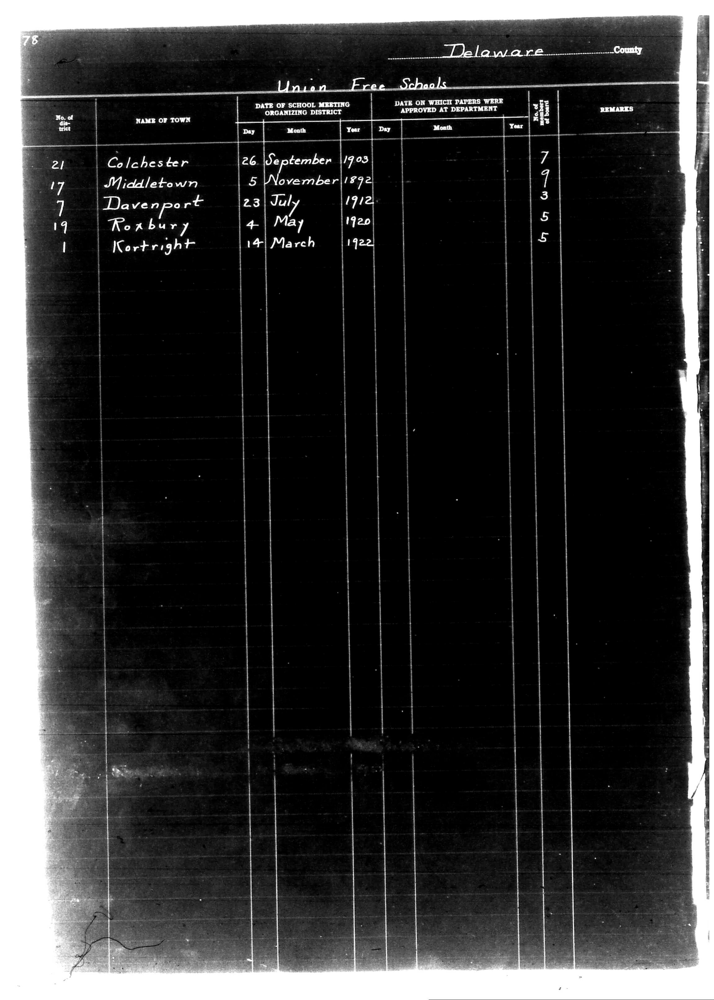

# Delaware County

**Document Type:** Document

**Collection:** CS Archive

**Source:** District-Consolidation-Data_100-116_page_40.jpg

**Model:** qwen/qwen-vl-plus

**Confidence:** 1.0

**Processed:** 2025-12-19T01:36:53.285512

**Source Image:** [📄 District-Consolidation-Data_100-116_page_40.jpg](../tables/images/District-Consolidation-Data_100-116_page_40.jpg)

---

## Source Document

---

## Transcription

Delaware County

Union Free Schools

| No. of District | NAME OF TOWN   | DATE OF SCHOOL MEETING ORGANIZING DISTRICT | DATE ON WHICH PAPERS WERE APPROVED AT DEPARTMENT | V. M. NUMBER OF PAPERS | REMARKS |
|-----------------|----------------|--------------------------------------------|--------------------------------------------------|------------------------|---------|
|                 |                | Day   Month   Year                         | Day   Month   Year                               |                        |         |
| 21              | Colchester     | 26    September 1903                       | [blank]                                          | 7                      |         |
| 17              | Middletown     | 5     November 1892                        | [blank]                                          | 9                      |         |
| 7               | Davenport      | 23    July    1912                       | [blank]                                          | 3                      |         |
| 19              | Roxbury        | 4     May     1920                       | [blank]                                          | 5                      |         |
| 1               | Kortright      | 14    March   1922                       | [blank]                                          | 5                      |         |
