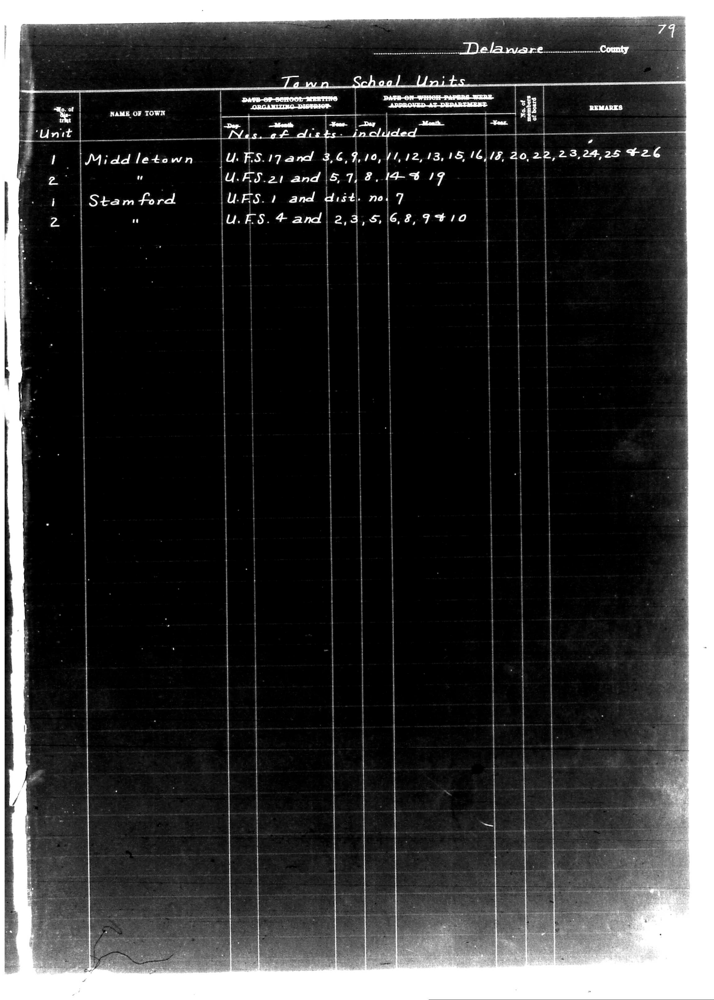

# Delaware County

**Document Type:** Document

**Collection:** CS Archive

**Source:** District-Consolidation-Data_100-116_page_41.jpg

**Model:** qwen/qwen-vl-plus

**Confidence:** 1.0

**Processed:** 2025-12-19T01:37:00.872770

**Source Image:** [📄 District-Consolidation-Data_100-116_page_41.jpg](../tables/images/District-Consolidation-Data_100-116_page_41.jpg)

---

## Source Document



---

## Transcription

```
Delaware County
Town School Units

| No. of Unit | NAME OF TOWN   | DATE OF SCHOOL MEETING ORGANIZING DISTRICT | END ON WHICH TALENTED AND LOVED AT DEPARTMENT | REMARKS |
|-------------|----------------|--------------------------------------------|-----------------------------------------------|---------|
|             |                | Day Month Year                             | Day Month Year                                |         |
| 1           | Middletown     | U.F.S. 17 and 3, 6, 9, 10, 11, 12, 13, 15, 16, 18, 20, 22, 23, 24, 25 + 26 | [blank] | [blank] |
| 2           | "              | U.F.S. 21 and 5, 7, 8, 14 + 19             | [blank] | [blank] |
| 1           | Stamford       | U.F.S. 1 and dist. no. 7                   | [blank] | [blank] |
| 2           | "              | U.F.S. 4 and 2, 3, 5, 6, 8, 9 + 10         | [blank] | [blank] |
```

**Notes:**

* The "No. of Unit" column indicates the unit number for each entry.
* "NAME OF TOWN" lists the towns for which the data is provided.
* "DATE OF SCHOOL MEETING ORGANIZING DISTRICT" and "END ON WHICH TALENTED AND LOVED AT DEPARTMENT" columns contain dates in the format "Day Month Year."
* "REMARKS" column is blank for all entries.
* "U.F.S." likely refers to a specific type of school district or unit.
* "+" indicates additional or supplementary information.
* "[blank]" is used to denote empty fields where no data is provided.
