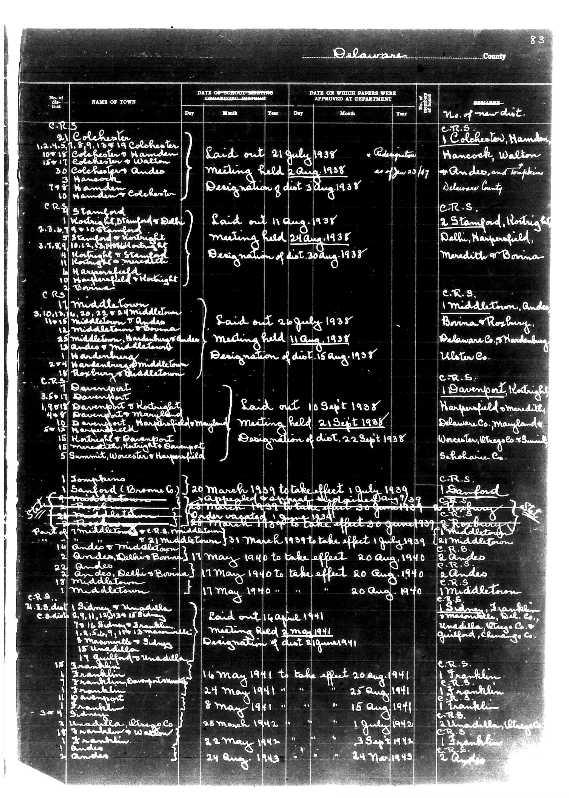

# Below is the transcription of the tabular data from the document, preserving the

**Document Type:** Document

**Collection:** CS Archive

**Source:** District-Consolidation-Data_100-116_page_44.jpg

**Model:** qwen/qwen-vl-plus

**Confidence:** 1.0

**Processed:** 2025-12-19T01:38:03.548010

**Source Image:** [📄 District-Consolidation-Data_100-116_page_44.jpg](../tables/images/District-Consolidation-Data_100-116_page_44.jpg)

---

## Source Document

---

## Transcription

Below is the transcription of the tabular data from the document, preserving the structure and formatting as requested:

---

**Delaware County**

| No. of Dist. | NAME OF TOWN | DATE OF SCHOOL MEETING ORGANIZING DISTRICT | DATE ON WHICH PAPERS WERE APPROVED AT DEPARTMENT | REMARKS |
|--------------|--------------|--------------------------------------------|--------------------------------------------------|---------|
|              |              | Day | Month | Year | Day | Month | Year | No. of new dist. |
| C.R.S.       | Colchester   | 21 July 1938 | *Laid out 21 July 1938 | 3 Aug 1938 | *Designation 3 Aug 1938 | C.R.S. 1. Colchester, Hanendon, Hancock, Walton, Andee, and Torphins Delaware County |
|              |              | 10 Aug 1938 | *Meeting held 2 Aug 1938 | 20 July 1938 | *Approved as of 20 July 1938 | C.R.S. 2. Stanford, Hotright, Delhi, Harperfield, Meredith & Bonina |
|              |              | 11 Aug 1938 | *Laid out 11 Aug 1938 | 24 May 1938 | *Meeting held 24 May 1938 | C.R.S. 2. Stanford, Hotright, Delhi, Harperfield, Meredith & Bonina |
|              |              | 30 Aug 1938 | *Designation of dist. 30 Aug 1938 | 15 Aug 1938 | *Designation of dist. 15 Aug 1938 | C.R.S. 1. Middletown, Andee, Bonina & Rosbury. Delaware Co., Mardenburg Ulster Co. |
|              |              | 20 July 1938 | *Laid out 20 July 1938 | 11 Aug 1938 | *Meeting held 11 Aug 1938 | C.R.S. 1. Davenport, Hotright, Harperfield, Meredith, Delaware Co., Maryland, Worcester, Wtngsle, Summit, Schoharie Co. |
|              |              | 10 Sept 1938 | *Laid out 10 Sept 1938 | 21 Sept 1938 | *Meeting held 21 Sept 1938 | C.R.S. 1. Davenport, Hotright, Harperfield, Meredith, Delaware Co., Maryland, Worcester, Wtngsle, Summit, Schoharie Co. |
|              |              | 22 Sept 1938 | *Designation of dist. 22 Sept 1938 | 15 Aug 1938 | *Designation of dist. 15 Aug 1938 | C.R.S. 1. Stanford, Harperfield, Meredith, Delaware Co., Maryland, Worcester, Wtngsle, Summit, Schoharie Co. |
|              |              | 20 March 1939 | *To take effect 1 July 1939 | 1 July 1939 | *Approved as of 1 July 1939 | C.R.S. 1. Stanford, Harperfield, Meredith, Delaware Co., Maryland, Worcester, Wtngsle, Summit, Schoharie Co. |
|              |              | 20 March 1939 | *To take effect 30 June 1939 | 30 June 1939 | *Approved as of 30 June 1939 | C.R.S. 1. Stanford, Harperfield, Meredith, Delaware Co., Maryland, Worcester, Wtngsle, Summit, Schoharie Co. |
|              |              | 1 March 1939 | *To take effect 1 July 1939 | 1 July 1939 | *Approved as of 1 July 1939 | C.R.S. 1. Stanford, Harperfield, Meredith, Delaware Co., Maryland, Worcester, Wtngsle, Summit, Schoharie Co. |
|              |              | 21 March 1939 | *To take effect 1 July 1939 | 1 July 1939 | *Approved as of 1 July 1939 | C.R.S. 1. Stanford, Harperfield, Meredith, Delaware Co., Maryland, Worcester, Wtngsle, Summit, Schoharie Co. |
|              |              | 11 May 1940 | *To take effect 20 Aug 1940 | 20 Aug 1940 | *Approved as of 20 Aug 1940 | C.R.S. 2. Andee, Delhi & Bonina |
|              |              | 17 May 1940 | *To take effect 20 Aug 1940 | 20 Aug 1940 | *Approved as of 20 Aug 1940 | C.R.S. 2. Andee, Delhi & Bonina |
|              |              | 17 May 1940 | *To take effect 20 Aug 1940 | 20 Aug 1940 | *Approved as of 20 Aug 1940 | C.R.S. 2. Andee, Delhi & Bonina |
|              |              | 14 April 1941 | *Laid out 14 April 1941 | 3 May 1941 | *Meeting held 3 May 1941 | C.R.S. 1. Franklin, Harperfield, Meredith, Delaware Co., Maryland, Worcester, Wtngsle, Summit, Schoharie Co. |
|              |              | 16 May 1941 | *To take effect 20 Aug 1941 | 25 Aug 1941 | *Approved as of 25 Aug 1941 | C.R.S. 1. Franklin, Harperfield, Meredith, Delaware Co., Maryland, Worcester, Wtngsle, Summit, Schoharie Co. |
|              |              | 24 May 1941 | *To take effect 15 Aug 1941 | 15 Aug 1941 | *Approved as of 15 Aug 1941 | C.R.S. 1. Franklin, Harperfield, Meredith, Delaware Co., Maryland, Worcester, Wtngsle, Summit, Scho
