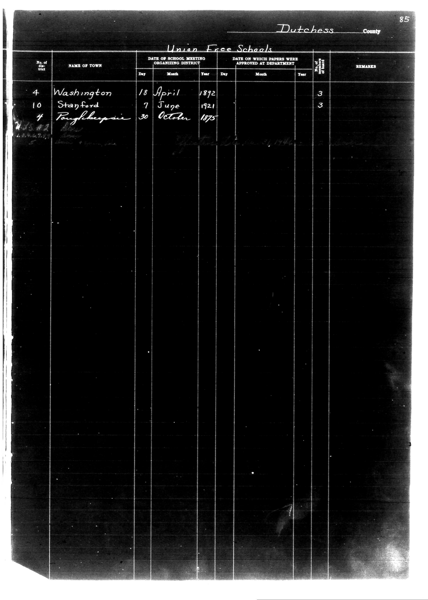

# Dutchess County

**Document Type:** Document

**Collection:** CS Archive

**Source:** District-Consolidation-Data_100-116_page_46.jpg

**Model:** qwen/qwen-vl-plus

**Confidence:** 1.0

**Processed:** 2025-12-19T01:38:29.257581

**Source Image:** [📄 District-Consolidation-Data_100-116_page_46.jpg](../tables/images/District-Consolidation-Data_100-116_page_46.jpg)

---

## Source Document



---

## Transcription

```
Dutchess County
Union Free Schools

| No. of district | NAME OF TOWN     | DATE OF SCHOOL MEETING ORGANIZING DISTRICT | DATE ON WHICH PAPERS WERE APPROVED AT DEPARTMENT | NUMBER OF BOARD | REMARKS |
|-----------------|------------------|--------------------------------------------|--------------------------------------------------|-----------------|---------|
|                 |                  | Day   Month   Year                         | Day   Month   Year                               |                 |         |
| 4               | Washington       | 18    April   1892                         | [blank]                                          | 3               | [blank] |
| 10              | Stanford         | 7     June    1921                         | [blank]                                          | 3               | [blank] |
| 4               | Poughkeepsie     | 30    October 1875                         | [blank]                                          | 3               | [blank] |
```

**Notes:**
- The handwritten notes on the left margin ("WDS #2" and "104271") are not included in the table as they are not part of the structured data.
- The "REMARKS" column is left blank for all entries as no specific remarks are provided in the document.
- The table preserves the original structure with clear column headers and aligned data.
