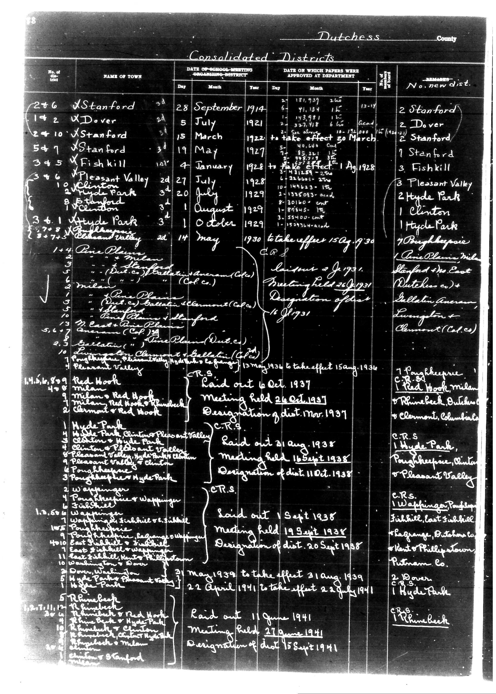

# Below is the transcription of the tabular data from the document, preserving the

**Document Type:** Document

**Collection:** CS Archive

**Source:** District-Consolidation-Data_100-116_page_48.jpg

**Model:** qwen/qwen-vl-plus

**Confidence:** 1.0

**Processed:** 2025-12-19T01:38:53.901678

**Source Image:** [📄 District-Consolidation-Data_100-116_page_48.jpg](../tables/images/District-Consolidation-Data_100-116_page_48.jpg)

---

## Source Document

---

## Transcription

Below is the transcription of the tabular data from the document, preserving the structure and formatting as requested:

---

**Dutchess County**  
**Consolidated Districts**

| No. of the Act | NAME OF TOWN | DATE OF SCHOOL-MEETING (SCHOOLING-DISTRICT) | DATE ON WHICH PAPERS WERE APPROVED AT DEPARTMENT | REMARKS | No. new dist. |
|----------------|--------------|---------------------------------------------|--------------------------------------------------|---------|---------------|
| 276            | Stanford     | 28 September 1914                           | 22 January 1915                                  | 2 Stanford |               |
| 142            | Dover        | 5 July 1921                                 | 11 January 1922                                   | 2 Dover  |               |
| 2410           | Stanford     | 15 March 1922                               | to take effect 30 March 1922                      | 2 Stanford |               |
| 547            | Stanford     | 19 May 1927                                 | 13 January 1928                                    | 1 Stanford |               |
| 345            | Fishkill     | 4 January 1928                               | to take effect 1 August 1928                       | 3 Fishkill |               |
| 346            | Pleasant Valley | 27 July 1928                              | 10 January 1929                                    | 3 Pleasant Valley |               |
| 10             | Clinton      | 20 July 1928                                | 8 January 1929                                     | 2 Hyde Park |               |
| 8              | Hyde Park    | 1 August 1929                               | 3 January 1930                                     | 1 Clinton |               |
| 361            | Hyde Park    | 1 October 1929                              | [blank]                                            | 1 Hyde Park |               |
| 373            | Pleasant Valley | 14 May 1930                               | to take effect 15 August 1930                      | 7 Pleasant Valley |               |
| 14             | Pine Plains  | [blank]                                     | [blank]                                            | [blank] |               |
| 14             | Pine Plains  | [blank]                                     | [blank]                                            | [blank] |               |
| 5              | Milan        | [blank]                                     | [blank]                                            | [blank] |               |
| 6              | Milan        | [blank]                                     | [blank]                                            | [blank] |               |
| 10             | East Fishkill | [blank]                                    | [blank]                                            | [blank] |               |
| 5.6            | Fishkill     | [blank]                                     | [blank]                                            | [blank] |               |
| 3              | Fishkill     | [blank]                                     | [blank]                                            | [blank] |               |
| 14             | Fishkill     | [blank]                                     | [blank]                                            | [blank] |               |
| 1.4.5.6.8.9  | Red Hook     | Laid out 6 October 1937                      | Meeting held 26 October 1937                       | C.R.S.  |               |
| 4              | Red Hook     | Laid out 21 August 1938                     | Meeting held 11 September 1938                     | C.R.S.  |               |
| 1              | Hyde Park    | Laid out 1 September 1938                   | Meeting held 19 September 1938                     | C.R.S.  |               |
| 1              | Wappingers   | Laid out 11 June 1941                       | Meeting held 21 June 1941                          | C.R.S.  |               |

---

### Notes:
- **Pre-printed Text:** The headers and column labels are pre-printed and remain consistent throughout the table.
- **Filled-in Text:** Handwritten entries are present in the "NAME OF TOWN," "DATE OF SCHOOL-MEETING," "DATE ON WHICH PAPERS WERE APPROVED AT DEPARTMENT," and "REMARKS" columns.
- **Blank Fields:** Entries marked as `[blank]` indicate missing or unfilled information.
- **Alignment:** The table is aligned to maintain readability, with each column clearly separated by vertical lines (`|`).
- **Structure:** The structure of the table is preserved, with rows corresponding to individual entries and columns representing specific data points.

This transcription accurately reflects the content and layout of the original document.
