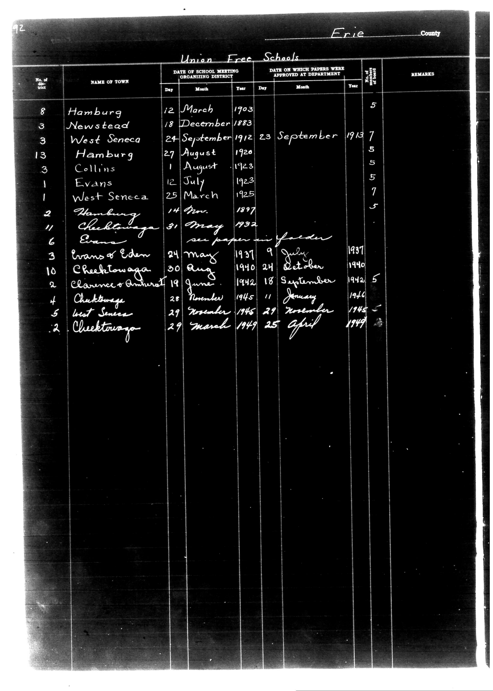

# Erie County

**Document Type:** Document

**Collection:** CS Archive

**Source:** District-Consolidation-Data_100-116_page_50.jpg

**Model:** qwen/qwen-vl-plus

**Confidence:** 1.0

**Processed:** 2025-12-19T01:39:11.531934

**Source Image:** [📄 District-Consolidation-Data_100-116_page_50.jpg](../tables/images/District-Consolidation-Data_100-116_page_50.jpg)

---

## Source Document



---

## Transcription

```
Erie County

Union Free Schools

| No. of District | NAME OF TOWN         | DATE OF SCHOOL MEETING ORGANIZING DISTRICT | DATE ON WHICH PAPERS WERE APPROVED AT DEPARTMENT | No. of Pupils | REMARKS |
|-----------------|----------------------|--------------------------------------------|--------------------------------------------------|---------------|---------|
|                 |                      | Day    Month    Year                      | Day    Month    Year                            |               |         |
| 8               | Hamburg              | 12     March    1903                      |                                                  | 5             |         |
| 3               | Newstead             | 18     December 1883                      |                                                  | 5             |         |
| 3               | West Seneca          | 24     September 1912                     | 23     September 1913                            | 7             |         |
| 13              | Hamburg              | 27     August   1920                     |                                                  | 5             |         |
| 3               | Collins              | 1      August   1923                     |                                                  | 5             |         |
| 1               | Evans                | 12     July     1923                     |                                                  | 7             |         |
| 1               | West Seneca          | 25     March    1925                     |                                                  | 5             |         |
| 2               | Hamburg              | 14     February 1897                      |                                                  |               |         |
| 11              | Cheektowaga          | 31     May      1932                     | see paper in folder                              |               |         |
| 6               | Evans                |                                            |                                                  |               |         |
| 3               | Evans & Eden         | 24     May      1937                     | 9      July      1937                            | 1937          |         |
| 10              | Cheektowaga          | 30     August   1940                     | 24     October   1940                            | 5             |         |
| 2               | Clarence Ambrose     | 19     June     1942                     | 18     September 1942                            | 5             |         |
| 4               | Cheektowaga          | 28     November 1945                     | 11     January   1946                            | 1946          |         |
| 5               | West Seneca          | 29     November 1945                     | 29     November 1945                             | 1945          |         |
| 2               | Cheektowaga          | 29     March    1949                     | 25     April    1949                            | 1949          |         |
```

**Notes:**

* The table is transcribed exactly as it appears in the image, preserving the column structure and alignment.
* Pre-printed text (e.g., column headers, "Erie County") is included as is.
* Handwritten entries are transcribed as written, including cursive and any annotations like "see paper in folder."
* Blank fields are indicated as `[blank]` where no information is present.
* The "No. of Pupils" column has some entries filled in (e.g., 5, 7, 1937, 1945, 1946, 1949), while others are left blank.
* The "REMARKS" column contains some handwritten notes, such as "see paper in folder."
