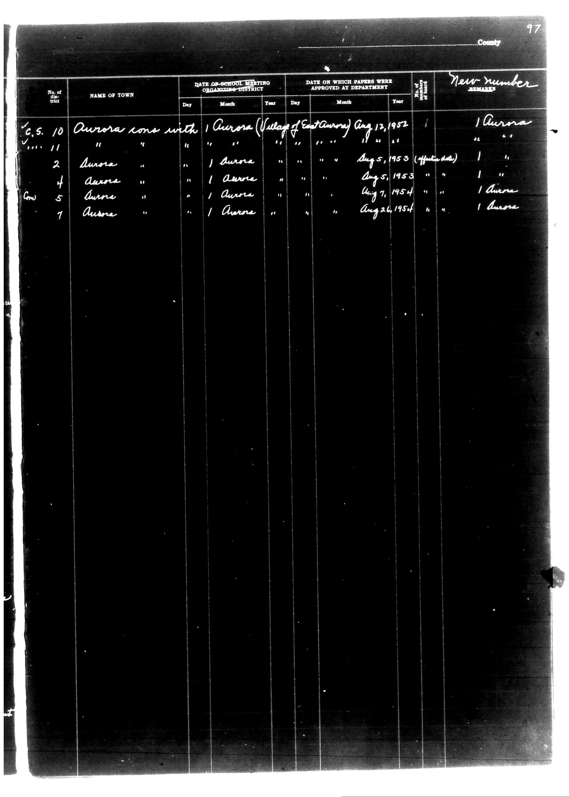

# | No. of district | NAME OF TOWN | DATE OF SCHOOL MEETING ORGANIZING DISTRICT | 

**Document Type:** Document

**Collection:** CS Archive

**Source:** District-Consolidation-Data_100-116_page_53.jpg

**Model:** qwen/qwen-vl-plus

**Confidence:** 1.0

**Processed:** 2025-12-19T01:39:51.757263

**Source Image:** [📄 District-Consolidation-Data_100-116_page_53.jpg](../tables/images/District-Consolidation-Data_100-116_page_53.jpg)

---

## Source Document



---

## Transcription

```
| No. of district | NAME OF TOWN | DATE OF SCHOOL MEETING ORGANIZING DISTRICT | DATE ON WHICH PAPERS WERE APPROVED AT DEPARTMENT | No. of new district | New number | REMARKS |
|-----------------|--------------|--------------------------------------------|--------------------------------------------------|---------------------|------------|---------|
|                 |              | Day | Month | Year | Day | Month | Year |                     |            |         |
| 10              | Aurora cons with |  |  |  |  |  |  | 1 | Aurora |         |
| 11              | "            |  |  |  |  |  |  | 1 | "      |         |
| 2               | Aurora       |  |  |  |  | Aug 5, 1953 (affidavit) |  | 1 | "      |         |
| 4               | Aurora       |  |  |  |  | Aug 5, 1953 |  | 1 | "      |         |
| 5               | Aurora       |  |  |  |  | Aug 7, 1954 |  | 1 | "      |         |
| 7               | Aurora       |  |  |  |  | Aug 26, 1954 |  | 1 | "      |         |
```

**Notes:**

* The table is structured with columns separated by vertical lines (`|`).
* Pre-printed text is in the header row.
* Handwritten entries are filled in under the appropriate columns.
* Blank fields are represented by `[blank]` where no information is provided.
* The "REMARKS" column contains repeated entries of "Aurora" for all rows.
* The page number "97" is visible in the top right corner of the document.
