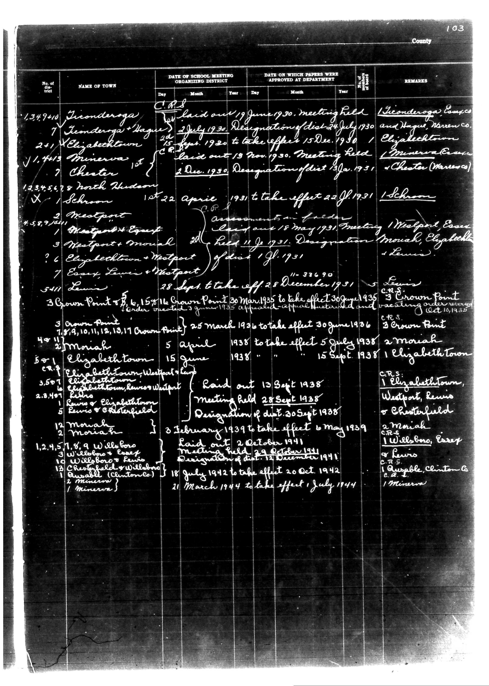

# District Consolidation Data 100 116 page 57

**Document Type:** Document

**Collection:** CS Archive

**Source:** District-Consolidation-Data_100-116_page_57.jpg

**Model:** qwen/qwen-vl-plus

**Confidence:** 1.0

**Processed:** 2025-12-19T01:40:40.548593

**Source Image:** [📄 District-Consolidation-Data_100-116_page_57.jpg](../tables/images/District-Consolidation-Data_100-116_page_57.jpg)

---

## Source Document

---

## Transcription

103
County

| No. of District | NAME OF TOWN | DATE OF SCHOOL MEETING ORGANIZING DISTRICT | DATE ON WHICH PAPERS WERE APPROVED AT DEPARTMENT | REMARKS |
|-----------------|--------------|--------------------------------------------|--------------------------------------------------|---------|
|                 |              | Day    Month Year                           | Day    Month Year                                |         |
| 1,347410        | Tionderoga   | C.R. 1 laid out 19 June 1930. Meeting held | Designation of dist. 24 July 1930               | Tionderoga Compso and Huguen, Warren Co. |
| 7               | Tionderoga + Hague | 2 July 1930 | 15 Dec. 1930 |  |
| 241             | Elizabethtown | 25 Aprs. 1930 to take effect 15 Dec. 1930 |  | Elizabethtown |
| 1,4613          | Minerva 1st  | C.R. 1 laid out 13 Nov. 1930. Meeting held | Designation of dist. 3 Jan. 1931 | Minerva Exem. + Chester (Warren) |
| 7               | Chester      | 2 Dec. 1930 | 22 Jan. 1931 |  |
| 1,34,54,578     | North Hudson | 1st 22 April 1931 to take effect 22 Jan. 1931 |  | Schron |
| X               | Schron       |  |  |  |
| 4,589,701       | Westport     | Assumption Fielder Court and 18 May 1931. Meeting held | Westport Exem. |  |
| 1               | Westport + Exempt |  |  |  |
| 3               | Westport + Moriah | 20 Feb. 1931 | Designation Moriah, Elizabeth |  |
| 6               | Elizabethtown + Westport of dist. 1st 1931 |  |  |  |
| 7               | Essex, Lewis + Westport | 11-37690 |  | Lewis |
| 5411            | Lewis        | 28 Sept. 1 to take off 28 December 1931 |  |  |
| 3               | Crown Point  | 15 Mar 1935 to take effect 30 June 1935 | Tender awarded 3 June 1935. Appeal-Histwild and vacating order reversed (Oct. 18, 1935) | 3 Crown Point |
| 7,9,10,11,12,13,19,11 Crown Point | 25 March 1936 to take effect 30 June 1936 |  |  |  |
| 44              | Moriah       | 5 April 1938 to take effect 5 July 1938 |  | Moriah |
| 50              | Elizabethtown | 15 June 1938 | Raid out 13 Sept. 1938. Meeting held 28 Sept. 1938 | Designation of dist. 30 Sept. 1938 | Elizabeth Town |
| C.R.S.          | Elizabethtown, Westport, Lewis, Elizabethtown, Lewis + Elizabethtown, Lewis + Elizabethtown, Lewis + Chesterfield, Moriah, Willsboro, Essex, Lewis, Willsboro + Lewis, Chesthfield + Willsboro, Essexable (Clinton) Co., Willsboro, Essexable (Clinton) Co., Minerva |  |  |  |
| 1,2,4,5,7,8,9   | Willsboro    | 3 February 1939 to take effect 16 May 1939 |  |  |
| 3               | Willsboro + Exempt | 2 October 1941 | Meeting held 29 October 1941 | Designation of dist. 12 December 1941 |  |
| 10              | Willsboro + Lewis | 18 July 1942 to take effect 20 Oct. 1942 |  |  |
| 13              | Essexable (Clinton) Co. | 21 March 1944 to take effect 1 July 1944 |  |  |
| 1               | Minerva       |  |  |  |
