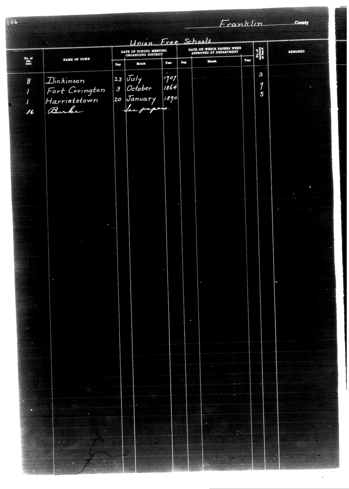

# District Consolidation Data 100 116 page 58

**Document Type:** Document

**Collection:** CS Archive

**Source:** District-Consolidation-Data_100-116_page_58.jpg

**Model:** qwen/qwen-vl-plus

**Confidence:** 1.0

**Processed:** 2025-12-19T01:40:48.527881

**Source Image:** [📄 District-Consolidation-Data_100-116_page_58.jpg](../tables/images/District-Consolidation-Data_100-116_page_58.jpg)

---

## Source Document



---

## Transcription

```
106
Franklin County

Union Free Schools

| No. of district | NAME OF TOWN     | DATE OF SCHOOL MEETING ORGANIZING DISTRICT | DATE ON WHICH PAPERS WERE APPROVED AT DEPARTMENT | REMARKS |
|-----------------|------------------|---------------------------------------------|--------------------------------------------------|---------|
|                 |                  | Day    | Month | Year | Day    | Month | Year |         |         |
| 8               | Dickinson        | 23     | July  | 1907 |        |       |      | 3       |         |
| 1               | Fort Covington   | 3      | October | 1864 |        |       |      | 9       |         |
| 1               | Harrietstown     | 20     | January | 1890 |        |       |      | 5       |         |
| 16              | Burke            |        |       |      |        |       |      |         | In papers |
```

**Notes:**

* The table is structured with columns for district number, town name, meeting date, approval date, and remarks.
* Handwritten entries are preserved as-is.
* Blank fields are indicated with `[blank]` where applicable.
* The document header and footer are included for context.
* The table is aligned according to the original layout.
