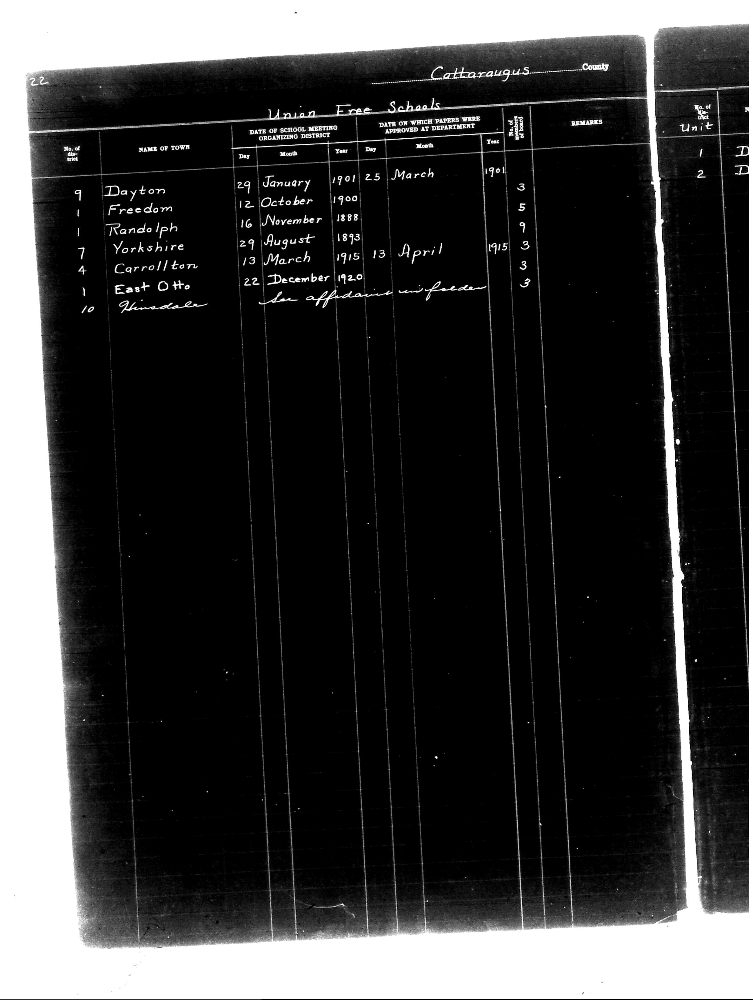

# Cattaraugus County

**Document Type:** Document

**Collection:** CS Archive

**Source:** District-Consolidation-Data_100-116_page_6.jpg

**Model:** qwen/qwen-vl-plus

**Confidence:** 1.0

**Processed:** 2025-12-19T01:28:52.347863

**Source Image:** [📄 District-Consolidation-Data_100-116_page_6.jpg](../tables/images/District-Consolidation-Data_100-116_page_6.jpg)

---

## Source Document

---

## Transcription

Cattaraugus County

Union Free Schools

| No. of District | NAME OF TOWN     | DATE OF SCHOOL MEETING ORGANIZING DISTRICT | DATE ON WHICH PAPERS WERE APPROVED AT DEPARTMENT | REMARKS |
|-----------------|------------------|--------------------------------------------|--------------------------------------------------|---------|
|                 |                  | Day   Month   Year                         | Day   Month   Year                               |         |
| 9               | Dayton           | 29    January 1901                           | 25    March   1901                               | 3       |
| 1               | Freedom          | 12    October 1900                           | [blank]                                          | 5       |
| 1               | Randolph         | 16    November 1888                          | [blank]                                          | 9       |
| 7               | Yorkshire        | 29    August  1893                           | 13    April   1915                               | 3       |
| 4               | Carrollton       | 13    March   1915                           | 13    April   1915                               | 3       |
| 1               | East Otto        | 22    December 1920                          | [blank]                                          | 3       |
| 10              | Glensdale        | [blank]                                    | [blank]                                          | [blank] |

No. of Unit
1 D
2 D
