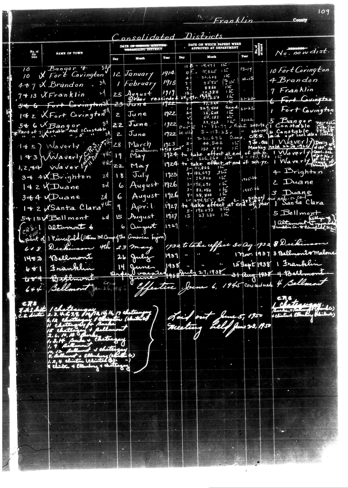

# Below is the transcription of the tabular data from the document, preserving the

**Document Type:** Document

**Collection:** CS Archive

**Source:** District-Consolidation-Data_100-116_page_60.jpg

**Model:** qwen/qwen-vl-plus

**Confidence:** 1.0

**Processed:** 2025-12-19T01:41:17.164481

**Source Image:** [📄 District-Consolidation-Data_100-116_page_60.jpg](../tables/images/District-Consolidation-Data_100-116_page_60.jpg)

---

## Source Document

---

## Transcription

Below is the transcription of the tabular data from the document, preserving the structure and formatting as requested:

---

**Franklin County**

**Consolidated Districts**

| No. of dist. | NAME OF TOWN | DATE OF SCHOOL MEETING ORGANIZING DISTRICT | DATE ON WHICH PAPERS WERE APPROVED AT DEPARTMENT | No. new dist. |
|--------------|--------------|---------------------------------------------|--------------------------------------------------|----------------|
|              |              | Day Month Year                              | Day Month Year                                   |                |
| 10           | Bangor       | 12 January 1914                             | 10 January 1914                                  | 10 Fort Covington |
| 447          | Brandon      | 1 February 1915                             | 4 February 1915                                  | 4 Brandon       |
| 7413         | Franklin     | 25 August 1919                              | 15 August 1919                                   | 7 Franklin      |
| 566          | Fort Covington | 23 June 1922                              | 11 June 1922                                     | 1 Fort Covington |
| 142          | Fort Covington | 2 June 1922                               | 11 June 1922                                     | 5 Bangor        |
| 546          | Bangor       | 22 June 1922                                | 11 June 1922                                     | 1 Bangor        |
| 145          | Waverly      | 28 March 1923                               | 11 March 1923                                    | 1 Waverly       |
| 143          | Waverly      | 19 May 1924                                 | 22 May 1924                                      | 1 Waverly       |
| 1284         | Waverly      | 22 May 1924                                 | 22 May 1924                                      | 1 Waverly       |
| 344          | Brighton     | 18 July 1925                                | 20 July 1925                                     | 4 Brighton      |
| 142          | Duane        | 6 August 1926                               | 10 August 1926                                   | 2 Duane         |
| 344          | Duane        | 6 August 1926                               | 10 August 1926                                   | 3 Duane         |
| 142          | Santa Clara  | 21 April 1927                               | 27 April 1927                                    | 1 Santa Clara   |
| 5415         | Bellmont     | 20 August 1927                              | 27 August 1927                                   | 5 Bellmont      |
| 6+8          | Dickinson    | 23 May 1932                                 | 30 August 1932                                   | 8 Dickinson     |
| 1473         | Bellmont     | 26 July 1937                                | 17 November 1937                                 | 3 Bellmont      |
| 6+1          | Franklin     | 14 June 1938                                | 15 September 1938                                | 1 Franklin      |
| 604          | Bellmont     | 27 June 1938                                | 31 August 1938                                   | 4 Bellmont      |
| 644          | Bellmont     | 27 June 1945                                | 6 June 1945                                      | 4 Bellmont      |

**CRS 1 part of Plainsfield (Vt. Camp of the American Legion)**

**CRS 7 T.H. dist.**

**CRS 7 T.H. dist. C.S. dist.**

**CRS 7 T.H. dist. C.S. dist. Chatingay**

**CRS 7 T.H. dist. C.S. dist. Chatingay (Chatingay)**

**CRS 7 T.H. dist. C.S. dist. Chatingay (Chatingay)**

**CRS 7 T.H. dist. C.S. dist. Chatingay (Chatingay)**

**CRS 7 T.H. dist. C.S. dist. Chatingay (Chatingay)**

**CRS 7 T.H. dist. C.S. dist. Chatingay (Chatingay)**

**CRS 7 T.H. dist. C.S. dist. Chatingay (Chatingay)**

**CRS 7 T.H. dist. C.S. dist. Chatingay (Chatingay)**

**CRS 7 T.H. dist. C.S. dist. Chatingay (Chatingay)**

**CRS 7 T.H. dist. C.S. dist. Chatingay (Chatingay)**

**CRS 7 T.H. dist. C.S. dist. Chatingay (Chatingay)**

**CRS 7 T.H. dist. C.S. dist. Chatingay (Chatingay)**

**CRS 7 T.H. dist. C.S. dist. Chatingay (Chatingay)**

**CRS 7 T.H. dist. C.S. dist. Chatingay (Chatingay)**

**CRS 7 T.H. dist. C.S. dist. Chatingay (Chatingay)**

**CRS 7 T.H. dist. C.S. dist. Chatingay (Chatingay)**

**CRS 7 T.H. dist. C.S. dist. Chatingay (Chatingay)**

**CRS 7 T.H. dist. C.S. dist. Chatingay (Chatingay)**

**CRS 7 T.H. dist. C.S. dist. Chatingay (Chatingay)**

**CRS 7 T.H. dist. C.S. dist. Chatingay (Chatingay)**

**CRS 7 T.H. dist. C.S. dist. Chatingay (Chatingay)**

**CRS 7 T.H. dist. C.S. dist. Chatingay (Chatingay)**

**CRS 7 T.H. dist. C.S. dist. Chatingay (Chatingay)**

**CRS 7 T.H. dist. C.S. dist. Chatingay (Chatingay)**

**CRS 7 T.H. dist. C.S. dist. Chatingay (Chatingay)**

**CRS 7 T.H. dist. C.S. dist.
