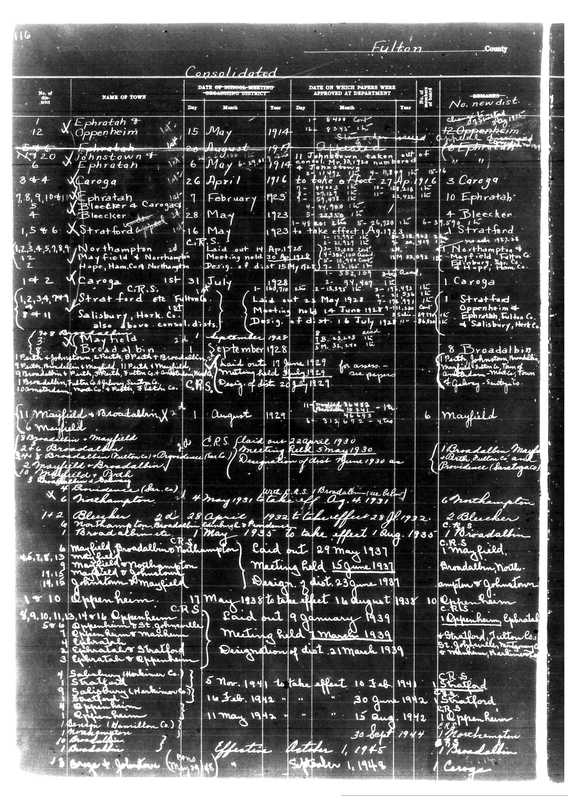

# Below is the transcription of the tabular data from the provided document, maint

**Document Type:** Document

**Collection:** CS Archive

**Source:** District-Consolidation-Data_100-116_page_61.jpg

**Model:** qwen/qwen-vl-plus

**Confidence:** 1.0

**Processed:** 2025-12-19T01:41:41.056223

**Source Image:** [📄 District-Consolidation-Data_100-116_page_61.jpg](../tables/images/District-Consolidation-Data_100-116_page_61.jpg)

---

## Source Document

---

## Transcription

Below is the transcription of the tabular data from the provided document, maintaining the structure and formatting as requested:

---

**Fulton County**

**Consolidated**

| No. of dist. | NAME OF TOWN | DATE OF SCHOOL MEETING CONCERNING DISTRICT | DATE ON WHICH PAPERS WERE APPROVED AT DEPARTMENT | REMARKS |
|--------------|--------------|---------------------------------------------|--------------------------------------------------|---------|
|              |              | Day Month Year                              | Day Month Year                                   |         |
| 12           | Ephrata & Oppenheim | 15 May 1914 | 12 August 1914 | No. newdist. 1 Oppenheim 12 Ephrata |
| 20           | Johnstown & Ephrata | 6 May 1914 | 21 April 1916 | Johnstown taken out of dist. number 11 Oppenheim renamed dist. 11 |
| 6            | Caroga         | 26 April 1916 | 26 April 1916 | 3 Caroga 10 Ephrata |
| 4            | Bleecker       | 28 May 1923 | 28 May 1923 | 4 Bleecker 1 Stratford |
| 1,5,6        | Stratford      | 16 May 1923 | 16 May 1923 | 1 Stratford 12 Oppenheim 10 Ephrata |
| 7,8,9,10,11  | Northampton    | 2d May 1923 | 14 April 1926 | Laid out 14 April 1926 Meeting held 30 May 1928 Design 15 May 1929 |
| 12           | Hope, Ham. Co. Northampton | 2d May 1923 | 14 April 1926 | Laid out 14 April 1926 Meeting held 30 May 1928 Design 15 May 1929 |
| 1,2          | Caroga C.R.S.  | 1st July 1928 | 1st July 1928 | 1 Caroga 12 Oppenheim 10 Ephrata |
| 11           | Stratford etc. Filling | 1st July 1928 | 14 June 1928 | Meeting held 14 June 1928 Design 6 July 1928 |
| 3            | Salisbury, Herk. Co. | 1st July 1928 | 14 June 1928 | 8 Broadalbin North Johnstown 1 Broadalbin 12 Oppenheim 10 Ephrata |
| 6            | Mayfield       | 1st August 1929 | 11 June 1929 | 6 Mayfield |
| 1,2,3,4,5,6  | Broadalbin     | 22 April 1930 | 22 April 1930 | 1 Broadalbin Mayfield 12 Oppenheim 10 Ephrata |
| 6            | Mayfield       | 5 May 1930 | 5 May 1930 | 6 Mayfield |
| 1,2,3,4,5,6  | Broadalbin     | 22 April 1930 | 22 April 1930 | 1 Broadalbin Mayfield 12 Oppenheim 10 Ephrata |
| 6            | Mayfield       | 5 May 1930 | 5 May 1930 | 6 Mayfield |
| 1,2,3,4,5,6  | Broadalbin     | 22 April 1930 | 22 April 1930 | 1 Broadalbin Mayfield 12 Oppenheim 10 Ephrata |
| 6            | Mayfield       | 5 May 1930 | 5 May 1930 | 6 Mayfield |
| 1,2,3,4,5,6  | Broadalbin     | 22 April 1930 | 22 April 1930 | 1 Broadalbin Mayfield 12 Oppenheim 10 Ephrata |
| 6            | Mayfield       | 5 May 1930 | 5 May 1930 | 6 Mayfield |
| 1,2,3,4,5,6  | Broadalbin     | 22 April 1930 | 22 April 1930 | 1 Broadalbin Mayfield 12 Oppenheim 10 Ephrata |
| 6            | Mayfield       | 5 May 1930 | 5 May 1930 | 6 Mayfield |
| 1,2,3,4,5,6  | Broadalbin     | 22 April 1930 | 22 April 1930 | 1 Broadalbin Mayfield 12 Oppenheim 10 Ephrata |
| 6            | Mayfield       | 5 May 1930 | 5 May 1930 | 6 Mayfield |
| 1,2,3,4,5,6  | Broadalbin     | 22 April 1930 | 22 April 1930 | 1 Broadalbin Mayfield 12 Oppenheim 10 Ephrata |
| 6            | Mayfield       | 5 May 1930 | 5 May 1930 | 6 Mayfield |
| 1,2,3,4,5,6  | Broadalbin     | 22 April 1930 | 22 April 1930 | 1 Broadalbin Mayfield 12 Oppenheim 10 Ephrata |
| 6            | Mayfield       | 5 May 1930 | 5 May 1930 | 6 Mayfield |
| 1,2,3,4,5,6  | Broadalbin     | 22 April 1930 | 22 April 1930 | 1 Broadalbin Mayfield 12 Oppenheim 10 Ephrata |
| 6            | Mayfield       | 5 May 1930 | 5 May 1930 | 6 Mayfield |
| 1,2,3
