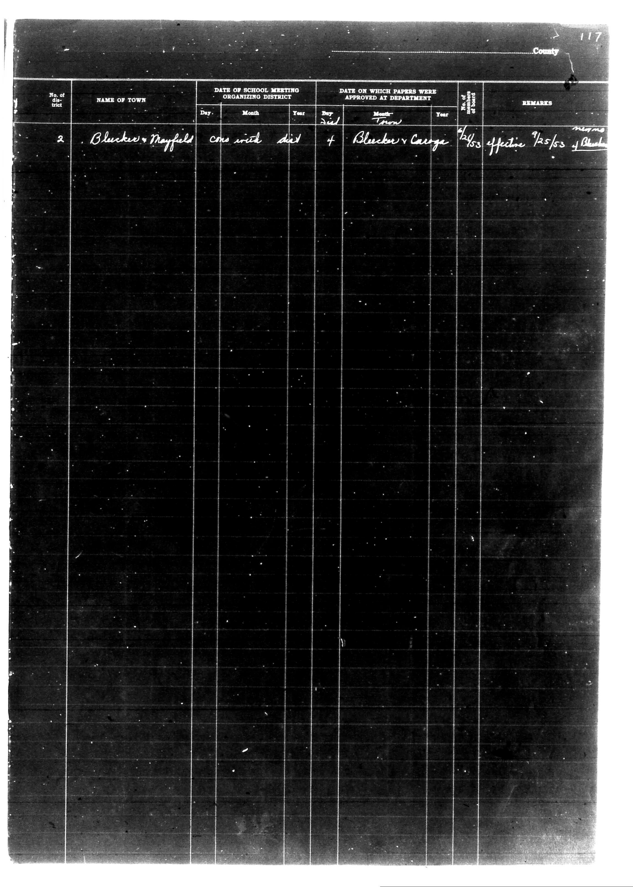

# |No. of District|NAME OF TOWN|DATE OF SCHOOL MEETING ORGANIZING DISTRICT|DATE ON

**Document Type:** Document

**Collection:** CS Archive

**Source:** District-Consolidation-Data_100-116_page_62.jpg

**Model:** qwen/qwen-vl-plus

**Confidence:** 1.0

**Processed:** 2025-12-19T01:41:46.754697

**Source Image:** [📄 District-Consolidation-Data_100-116_page_62.jpg](../tables/images/District-Consolidation-Data_100-116_page_62.jpg)

---

## Source Document

---

## Transcription

|No. of District|NAME OF TOWN|DATE OF SCHOOL MEETING ORGANIZING DISTRICT|DATE ON WHICH PAPERS WERE APPROVED AT DEPARTMENT|No. of Members Organized|REMARKS|
|---|---|---|---|---|---|
| | |Day|Month|Year|Day|Month|Year| | |
|2|Bleeker Mayfield Cons with dist|4|Bleeker George|7/53|effective 7/25/53| | |
