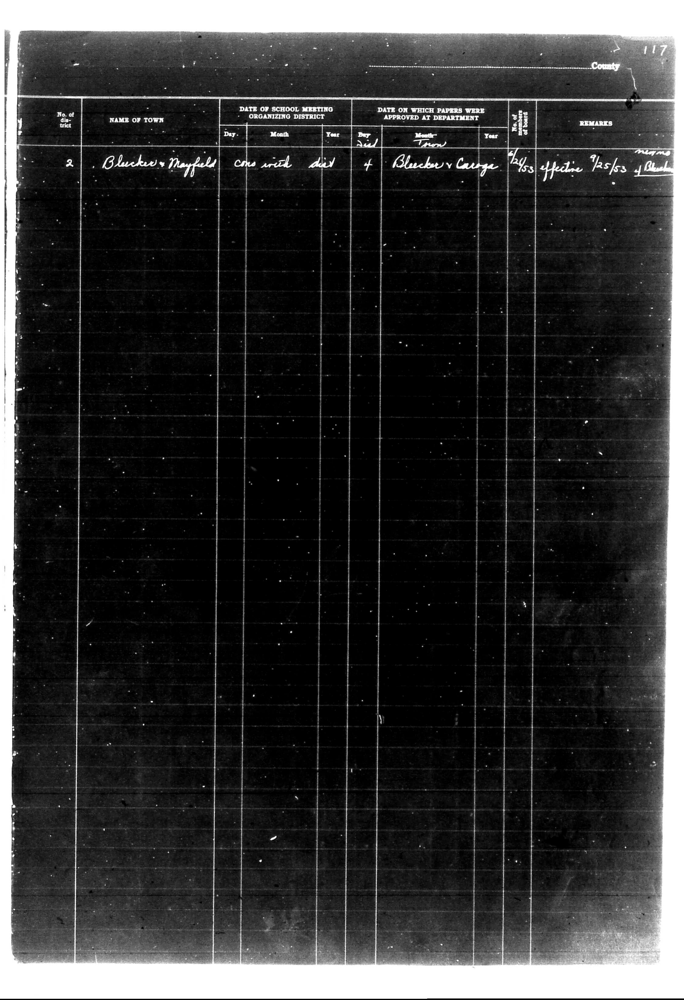

# | No. of district | NAME OF TOWN     | DATE OF SCHOOL MEETING ORGANIZING DISTRIC

**Document Type:** Document

**Collection:** CS Archive

**Source:** District-Consolidation-Data_100-116_page_63.jpg

**Model:** qwen/qwen-vl-plus

**Confidence:** 1.0

**Processed:** 2025-12-19T01:41:53.415234

**Source Image:** [📄 District-Consolidation-Data_100-116_page_63.jpg](../tables/images/District-Consolidation-Data_100-116_page_63.jpg)

---

## Source Document

---

## Transcription

| No. of district | NAME OF TOWN     | DATE OF SCHOOL MEETING ORGANIZING DISTRICT | DATE ON WHICH PAPERS WERE APPROVED AT DEPARTMENT | No. of cert. | REMARKS              |
|-----------------|------------------|--------------------------------------------|--------------------------------------------------|--------------|----------------------|
|                 |                  | Day   Month   Year                         | Day   Month   Year                               |              |                      |
| 2               | Bleecker Mayfield| One with dist                              | Bleecker Caroga                                  | 155          | Effective 9/25/53    |
