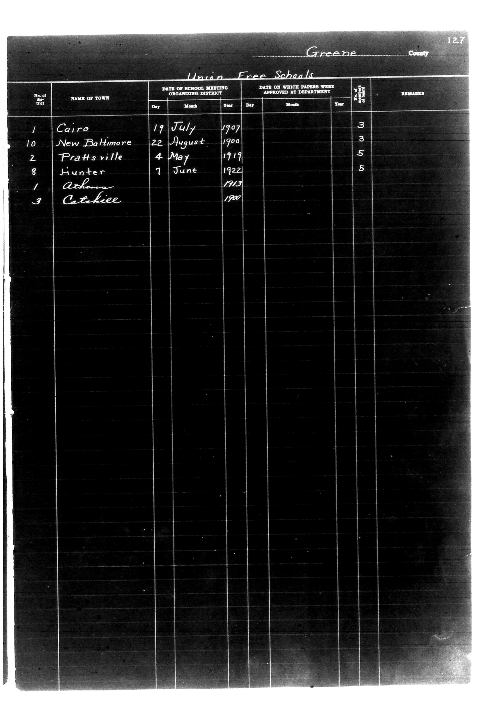

# Greene County

**Document Type:** Document

**Collection:** CS Archive

**Source:** District-Consolidation-Data_100-116_page_65.jpg

**Model:** qwen/qwen-vl-plus

**Confidence:** 1.0

**Processed:** 2025-12-19T01:42:20.241002

**Source Image:** [📄 District-Consolidation-Data_100-116_page_65.jpg](../tables/images/District-Consolidation-Data_100-116_page_65.jpg)

---

## Source Document



---

## Transcription

```
Greene County
127
Union Free Schools

| No. of District | NAME OF TOWN     | DATE OF SCHOOL MEETING ORGANIZING DISTRICT | DATE ON WHICH PAPERS WERE APPROVED AT DEPARTMENT | No. of Teachers | REMARKS |
|-----------------|------------------|--------------------------------------------|--------------------------------------------------|-----------------|---------|
|                 |                  | Day   Month   Year                         | Day   Month   Year                               |                 |         |
| 1               | Cairo            | 19    July    1907                          |                                                  | 3               |         |
| 10              | New Baltimore    | 22    August  1900                          |                                                  | 3               |         |
| 2               | Pratts ville     | 4     May     1919                          |                                                  | 5               |         |
| 8               | Hunter           | 7     June    1922                          |                                                  | 5               |         |
| 1               | Athens           | 1913                                       |                                                  | 1               |         |
| 3               | Catahooee        | 1900                                       |                                                  | 3               |         |
```

**Notes:**

* The "DATE OF SCHOOL MEETING ORGANIZING DISTRICT" and "DATE ON WHICH PAPERS WERE APPROVED AT DEPARTMENT" columns are split into "Day," "Month," and "Year" for clarity.
* The "No. of Teachers" column contains numerical values filled in by hand.
* The "REMARKS" column is blank for all entries.
* The handwritten entries for "NAME OF TOWN" are clearly legible.
* The form is pre-printed with labels, and the handwritten entries are filled in accordingly.
