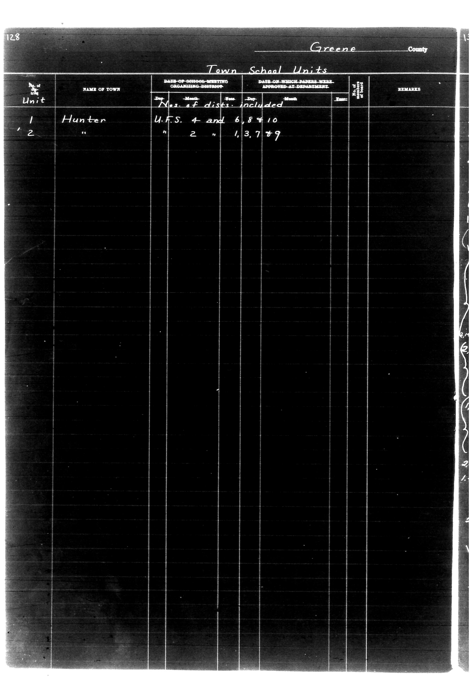

# 128                                                                 Greene Count

**Document Type:** Document

**Collection:** CS Archive

**Source:** District-Consolidation-Data_100-116_page_66.jpg

**Model:** qwen/qwen-vl-plus

**Confidence:** 1.0

**Processed:** 2025-12-19T01:42:27.463852

**Source Image:** [📄 District-Consolidation-Data_100-116_page_66.jpg](../tables/images/District-Consolidation-Data_100-116_page_66.jpg)

---

## Source Document

---

## Transcription

128                                                                 Greene County

Town School Units

| Unit | NAME OF TOWN | DATE OF SCHOOL MEETING ORGANIZING DISTRICT | Nos. of dists. included | DATE OF WHICH PAPERS WERE APPROVED AT DEPARTMENT | No. of Board | REMARKS |
|------|--------------|--------------------------------------------|--------------------------|--------------------------------------------------|--------------|---------|
|      |              | Dep. Month Year                            |                          | Dep. Month Year                                  |              |         |
| 1    | Hunter       | U.F.S. 4 and 6, 8 + 10                     |                          |                                                  |              |         |
| '2   | "            | " 2                                        | 1, 3, 7 + 9              |                                                  |              |         |
