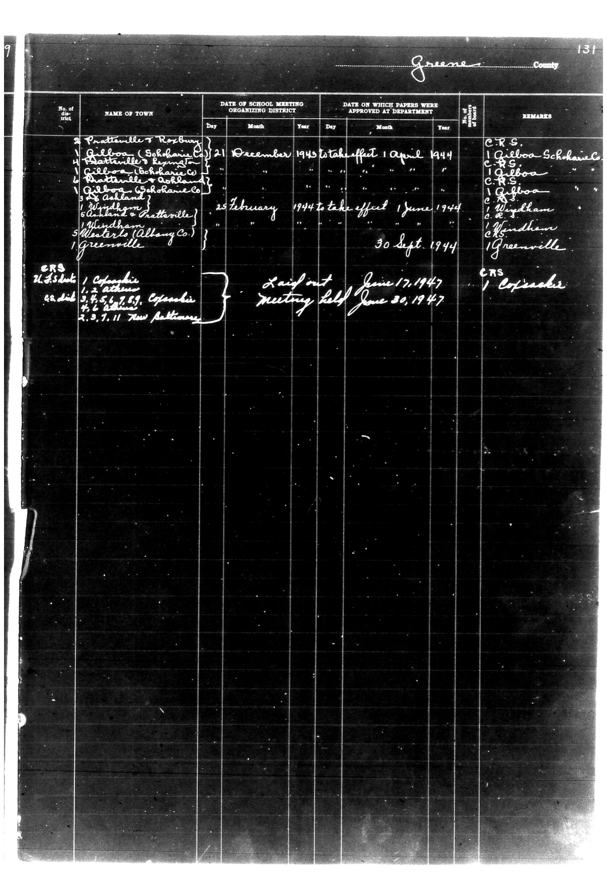

# Greene County

**Document Type:** Document

**Collection:** CS Archive

**Source:** District-Consolidation-Data_100-116_page_68.jpg

**Model:** qwen/qwen-vl-plus

**Confidence:** 1.0

**Processed:** 2025-12-19T01:42:52.857567

**Source Image:** [📄 District-Consolidation-Data_100-116_page_68.jpg](../tables/images/District-Consolidation-Data_100-116_page_68.jpg)

---

## Source Document

---

## Transcription

Greene County
Page 131

| No. of District | NAME OF TOWN | DATE OF SCHOOL MEETING ORGANIZING DISTRICT | DATE ON WHICH PAPERS WERE APPROVED AT DEPARTMENT | No. of Members of Board | REMARKS |
|-----------------|--------------|--------------------------------------------|--------------------------------------------------|-------------------------|---------|
|                 | Prattville F. Rosburg | 21 December 1943 to take effect 1 April 1944 | [blank] | [blank] | CRS. Gilboo-Schoharie Co. |
|                 | Gilboa (Schoharie) | [blank] | [blank] | [blank] | CRS. Gilboa |
|                 | Matterville (Schoharie) | [blank] | [blank] | [blank] | CRS. Gilboa |
|                 | Gilboa (Schoharie Co.) | [blank] | [blank] | [blank] | CRS. Gilboa |
|                 | Matterville & Ashland | [blank] | [blank] | [blank] | CRS. Gilboa |
|                 | 3rd Ashland | [blank] | [blank] | [blank] | CRS. Gilboa |
|                 | Windham & Prattville | [blank] | [blank] | [blank] | CRS. Windham |
|                 | Waterlo (Albany Co.) | [blank] | [blank] | [blank] | CRS. Windham |
|                 | Greenville | [blank] | [blank] | [blank] | CRS. Greenville |
|                 |              | 25 February 1944 to take effect 1 June 1944 | 30 Sept. 1944 | [blank] |         |
|                 |              | Laid out June 17, 1947 | Meeting held June 30, 1947 | [blank] | CRS. Copseck |
|                 | U.S. Sub. | Columbia | [blank] | [blank] | CRS. Copseck |
|                 | C.C. Sub. | 1859. Copseck | [blank] | [blank] | CRS. Copseck |
|                 | 2.2.7.11. New Baltimore | [blank] | [blank] | [blank] |         |
