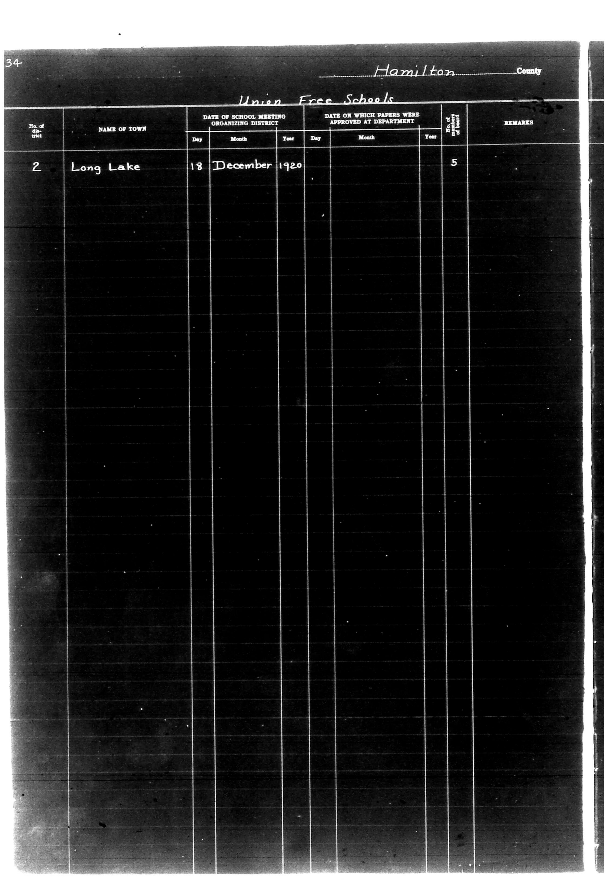

# 34                                                                 Hamilton Coun

**Document Type:** Document

**Collection:** CS Archive

**Source:** District-Consolidation-Data_100-116_page_69.jpg

**Model:** qwen/qwen-vl-plus

**Confidence:** 1.0

**Processed:** 2025-12-19T01:42:59.152901

**Source Image:** [📄 District-Consolidation-Data_100-116_page_69.jpg](../tables/images/District-Consolidation-Data_100-116_page_69.jpg)

---

## Source Document



---

## Transcription

```
34                                                                 Hamilton County
Union Free Schools

| No. of District | NAME OF TOWN | DATE OF SCHOOL MEETING ORGANIZING DISTRICT |  |  | DATE ON WHICH PAPERS WERE APPROVED AT DEPARTMENT |  |  | No. of Students | REMARKS |
|-----------------|--------------|--------------------------------------------|----|----|----------------------------------------------------|----|----|-----------------|---------|
|                 |              | Day                                        | Month | Year | Day                                                | Month | Year |                 |         |
| 2               | Long Lake    | 18                                         | December | 1920 | [blank]                                            | [blank] | 5  | [blank]         | [blank] |
```

### Notes:
- The table is structured with clear column headers.
- Pre-printed text includes "Hamilton County," "Union Free Schools," and column labels.
- Filled-in data includes "2," "Long Lake," "18," "December," "1920," and "5."
- Blank fields are indicated as `[blank]`.
- The layout is preserved with proper alignment and spacing.
