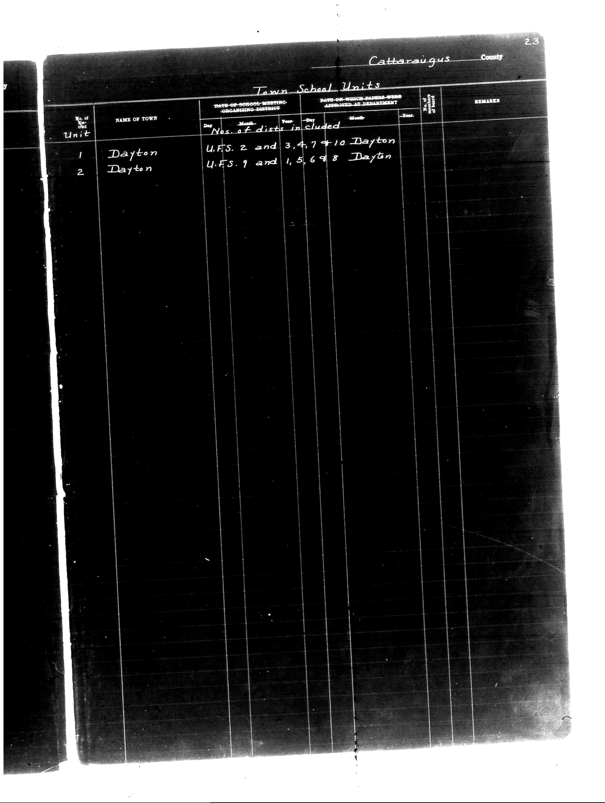

# Cattaraugus County

**Document Type:** Document

**Collection:** CS Archive

**Source:** District-Consolidation-Data_100-116_page_7.jpg

**Model:** qwen/qwen-vl-plus

**Confidence:** 1.0

**Processed:** 2025-12-19T01:28:59.662912

**Source Image:** [📄 District-Consolidation-Data_100-116_page_7.jpg](../tables/images/District-Consolidation-Data_100-116_page_7.jpg)

---

## Source Document



---

## Transcription

```
Cattaraugus County
Town School Units

| No. of Unit | NAME OF TOWN | DATE OF SCHOOL MEETING ORGANIZING DISTRICT | Nos. of dists included | DATE OF WHICH PAPERS WERE APPROVED AT DEPARTMENT | No. of pupils | REMARKS |
|-------------|--------------|--------------------------------------------|------------------------|--------------------------------------------------|---------------|---------|
| 1           | Dayton       |                                            | U.F.S. 2 and 3,4,7 + 10 Dayton        |                                                  |               |         |
| 2           | Dayton       |                                            | U.F.S. 9 and 1,5,6,8 Dayton           |                                                  |               |         |
```

**Notes:**
- The "DATE OF SCHOOL MEETING ORGANIZING DISTRICT" and "DATE OF WHICH PAPERS WERE APPROVED AT DEPARTMENT" columns are blank in the provided image.
- The "No. of pupils" column is also blank.
- The "REMARKS" column is blank.
- The handwritten entries for "Nos. of dists included" are preserved as-is.
- The page number "23" is visible in the top right corner of the document.
