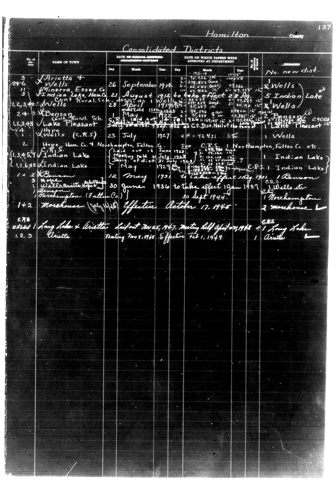

# Hamilton County

**Document Type:** Document

**Collection:** CS Archive

**Source:** District-Consolidation-Data_100-116_page_70.jpg

**Model:** qwen/qwen-vl-plus

**Confidence:** 1.0

**Processed:** 2025-12-19T01:43:13.185534

**Source Image:** [📄 District-Consolidation-Data_100-116_page_70.jpg](../tables/images/District-Consolidation-Data_100-116_page_70.jpg)

---

## Source Document



---

## Transcription

```
Hamilton County
137

Consolidated Districts

| No. of District | NAME OF TOWN | DATE OF SCHOOL-MEETING ORGANIZING DISTRICT | DATE ON WHICH PAPERS WERE APPROVED AT DEPARTMENT | No. new dist. | REMARKS |
|-----------------|--------------|--------------------------------------------|--------------------------------------------------|----------------|---------|
| 3               | Arietta & Wells | 26 September 1914                          | 3 May 1915                                       | 2 Wells        |         |
| 246             | Minerra, Essex Co. | 21 August 1915 to take effect 28 August 1915 | 28 April 1915                                    | 5 Indian Lake  |         |
| 11              | Indian Lake, Ham. Co. Cent Rural Sch. design as 1 Wells | [blank] | 13 May 1915                                      | 1 Benson       |         |
| 1,2,3,4,5       | W. Benson | C.R.S. laid out 1922                        | 1922                                             | 1 Lake Pleasant|         |
| 4               | Hope (C.R.S.) | 23 July 1927                                | 4 July 1927                                      | 1 Wells        |         |
| 1,3,4,5,7       | Indian Lake | Laid out 16 June 1928                       | 21 July 1928                                     | 1 Indian Lake  |         |
| 1,2,6,8         | Indian Lake | Meeting held 21 July 1928                   | 31 July 1928                                     | 1 Indian Lake  |         |
| 1+2             | X Benson | 12 May 1931 to take effect 11 May 1931     | 1931                                             | 1 Benson       |         |
| 3               | Wells, Arietta Report | 30 June 1936 to take effect 19 Jan 1937 | 30 Sept 1944                                     | 1 Northampton  |         |
| 1+2             | Morehouse (Fulton Co.) | Effective October 17, 1945              | [blank]                                          | 2 Morehouse    |         |
| C.R.S.          | Long Lake x Arietta District 7025, 1947, Meeting held April 27, 1948 | 1 Long Lake | [blank]                                          | 1 Arietta      |         |
| 1,2,3           | Arietta | Meeting Nov. 1948 Effective Feb. 1, 1949 | [blank]                                          | 1 Arietta      |         |
```

**Notes:**

* The table is transcribed as-is, preserving the original layout and alignment.
* Handwritten entries are transcribed exactly as they appear.
* Blank fields are indicated as `[blank]`.
* Pre-printed text (e.g., column headers, district numbers) is included as part of the table structure.
* The "REMARKS" column contains additional handwritten notes that are included in the transcription.
* The page number "137" is included at the top right of the document.
* The title "Hamilton County" is included at the top of the document.
